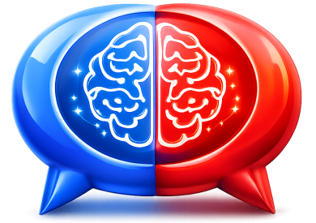

    

# Debate AI

AI-powered platform for competitive debaters in Public Forum (PF), Lincoln-Douglas (LD), Policy, and NDT. Combines crowdsourced research, video analytics, team rankings, and AI analysis into a single workspace.

**Live site:** [debate-ai.com](https://debate-ai.com/) · [Earlier prototype](https://alpha.debate-ai.com/)

---

## Features

### CARDS — Crowdsourced Annotated Research Dataset

A collaborative evidence library built by the debate community.

- **Full-text search** across a crowdsourced dataset of tagged and annotated evidence cards
- **Three-panel desktop layout** — search sidebar, card reader, and AI analysis panel — all resizable
- **Card content viewer** with three reading modes: plain read, highlight, and underline
- **AI analysis sidebar** — generate LLM summaries, warrant extensions, logic-flaw detection, and argument placement suggestions (TRUTH hierarchy)
- **Mobile-responsive overlays** — full-screen sidebars for search and AI on small screens
- **Cite maker, flow integration, and Chrome sidebar** for in-browser research tagging and sharing

The long-term goal is a decentralized AI knowledge graph — a tree-of-thought reasoning dataset trained on the best arguments from many perspectives, reducing hallucination and steering alignment with common social values.

---

### Videos — Debate Round Library

Browse and filter a curated library of competitive debate round recordings.

- **Infinite-scroll video grid** with responsive layout (1–4 columns)
- **Search and filter** by title, channel, year, and sort by recency or view count
- **Click any channel name** to instantly filter the grid to that channel's videos
- **Thumbnail previews** with inline YouTube playback (toggle on/off)
- **Favorites** — save videos with a star; filter to favorites-only view
- **Top Picks** — curated highlight reel toggle
- **Leaderboard / Rankings tab** — switch to the team rankings view directly from the dock

---

### Rankings — Competitive Team Leaderboard

Historical and current season standings across all four divisions.

- Divisions: **PF, LD, Policy (CX), NDT**
- Sortable columns: rank, state, bids, TOC score, Debate ELO
- Year selector spanning from 2001 to the current season
- **Season champion and topic** displayed for each division and year
- Rank change indicators (up/down chevrons) between seasons

---

### Lectures — Educational Video Library

A dedicated section for instructional and lecture-style debate videos.

- Same search, filter, and infinite-scroll interface as the round videos
- **Debate Dictionary** toggle — a searchable glossary of debate terminology with definitions, accessible directly from the lectures page

---

### Debate Workspace

Tools for building and managing arguments in-round.

- Create and organize debate topics, arguments, and rebuttals
- Rich text / markdown editing
- Built-in debate timers for structured speech management

---

### Docs — Document Editor

- Full markdown editor for writing and formatting evidence, blocks, and flows
- Accessible from the main navigation dock

---

## Navigation

A persistent **dock** provides one-click access to all sections:

| Icon | Section |
|------|---------|
| Shared | CARDS research search |
| Debate | Debate workspace |
| Docs | Document editor |
| Videos | Round video library |
| Lectures | Lecture library + dictionary |

On the Videos page, a **Rankings** icon is appended to the dock for instant access to the leaderboard without leaving the videos context.

The dock adapts to screen size: fixed top-left on desktop, fixed bottom bar on mobile.

---

## Tech Stack

- **Framework:** Next.js (App Router)
- **Styling:** Tailwind CSS with dynamic theme support (light/dark + color themes)
- **AI:** LLM integration for card analysis, warrant extension, and research recommendations
- **Data:** Crowdsourced evidence dataset, YouTube video index, rankings data synced from external sources

---

## External Links

- [AI Government Plan](docs/collective-consciousness-government.md)
- [Live Site](https://debate-ai.com/)
- [Earlier Prototype](https://alpha.debate-ai.com/)
