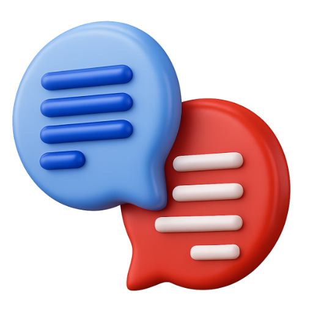

<h3 align="center">
    
</h3>
<p align="center">
    <b>Being is Becoming —</b><br>
    <b><i>Dream Emerges Destiny.</i></b><br>
    <b>Whatever Research Can Be —</b><br>
    <b>That is What It Must Become.</b><br>
    <b>If AI is Humanity's Last Invention —</b><br>
    <b>Collective Consciousness is the Final Frontier.</b>
    <br />
    </p>
<h3 align="center">
    <a href="https://debate.ai.com">🚀 App</a>
    <a href="https://github.com/debate/debate-ai.com/tree/master/docs">📑 Docs</a> <a href="https://debate-ai.com/api/api-docs">🎯 API</a> <a href="https://github.com/debate/debate-ai.com/blob/master/docs/debate-singularity-research-paper.md">📜 Paper</a> <a href="https://drive.google.com/drive/u/1/folders/1inxyWjAkPiyJ9BdspbhV20_-xRIc8RJn">⏯️  Slides</a> 
</h3>
<p align="center">
    <a href="https://discord.gg/SJdBqBz3tV">
        
    </a>
     <a href="https://github.com/debate/debate-ai.com/discussions">
     </a>
    <a href="https://github.com/debate/debate-ai.com/discussions">
    
    </a>
<br />
    <a href="https://github.com/debate/debate-ai.com/pulse" alt="Activity">
        
    </a>
    
<br />
    
    <a href="https://docs.github.com/en/pull-requests/collaborating-with-pull-requests/proposing-changes-to-your-work-with-pull-requests/creating-a-pull-request">
        
    </a>
    <a href="https://codespaces.new/debate/debate-ai.com">
    
    </a>
 </p>

---

<p align="center">
    
</p>

### 📚 CARDS: Crowdsourced Annotated Research for Debating Solutions

- 🖍️ **Auto-Highlight Agents:** agents highlight and underline as many words as needed on a slider, multiple options
- 🔎 **Full-text search:** across thousands of tagged, annotated evidence cards spanning policy, LD, PF, and college formats
- 🤖 **AI-powered annotation:** one-click summaries, warrant extensions, and logic-flaw detection per card
- 📖 **Three reading modes**: plain text, highlighted tags, and underline-only for fast cutting
- 📎 **Citation auto-formatter:** and one-click flow integration — paste directly into your speech doc
- 📱 **Mobile-responsive:** with full-screen card overlays for reading on the go
- 📝 **Auto-Research Outlines**: agents outline the topic to keyphrases and monitor for new quotes

<p align="center">
    
</p>

### ⚖️ FIAT: Forum for Issue Analysis on Topics

- 🧠 **Recommendation Agents**: AI assists with research, summarization, flaw detection, and comparative quote analysis
- 🧑‍⚖️ **Judge Decision**: agents prompts recommend multiple judge decision options, speech to flow, quote to response options
- 📊 **Multi-column flow spreadsheet**: format-specific speech columns for PF, LD, Policy, and NDT with inline editing
- 🔗 **Shareable round URLs**: every round gets a permanent link; share with judges or teammates instantly
- 🏆 **Round management**: tournament setup, team pairing, judge assignments, and round notes in one place
- 📄 **Speech docs**: full markdown editor per speech with email sharing to judges and coaches
- ⏱️ **Smart timers**: format-aware prep and speech timers with audio/visual alerts and auto-advance
- 👥 **Collaboration**: invite judges and spectators by email; view-only and edit roles supported
- 🗄️ **Archive system**: save, browse, and restore any past round with full flow history
- 📲 **Mobile-optimized**: responsive design with swipe navigation between speech columns

<p align="center">
    
</p>

### 🎥 LEARN: Lectures from Educators, Archive of Rounds & Notes

- 🎓 **~1,400 college NDT rounds**: dating back to 1995, averaging 50+ new rounds per year, including every recent TOC and NDT elimination round
- 🗣️ **~350 Public Forum rounds**: (2015–present), **~125 Policy rounds**: (2003–present), **~90 LD rounds** (2019–present)
- 📺 **~900 instructional videos**: across 20 categories: topic lectures, camp coaching, kritik theory, counterplans, impact calc, novice intro, speaking & delivery, and more
- ⭐ **~100 hand-curated top picks**: the highest-value rounds and lectures selected for study
- 🔍 Searchable grid with filter by title, channel, year, or view count; inline YouTube playback with thumbnails
- 📘 **200-term Debate Dictionary**: with plain-English definitions for theory, kritik, and procedural jargon
- 🏅 **26 years of national champion records**: (2000–2025) across NDT, Policy, LD, and PF
- 📈 **Team Rankings**: TOC bid list + DebateDrills Elo dual ranking system

<p align="center">
     
</p>

### 🔎 STREAM: Search with Top Result Extraction & Answer Model

- 🔍 **Web Search**: 70+ popular sites search across 10 categories: Web Search, Academic, Videos, Images, Files, News, etc
- 📝 **Article Preview**: Extract, format with APA cite, and summarize articles, PDFs, Youtube, and URLs before reading them
- 🤖 **User Choice of LLM**: OpenAI, Claude, Gemini, Groq, Ollama, Anthropic, etc
- 📄 **File Upload Support**: Ask questions about PDFs, URLs, DOCX, Google Docs, and Youtube
- 📚 **Search History**: All searches saved with memories, except for privacy mode
- ❓ **Follow-up Questions**: Generate follow-up questions to ask language models

<p align="center">
    
</p>

### 📝 REASON: Research Editor for Annotated Summaries in Outline Notation

- 📝 **Complex Rich Text Editor:** full featured alternative to Google Docs based on Meta's Lexical with core features and fast ease of use
- 📂 **Nested Document Tree**: organize research notes with a nested document organizer with drag-and-drop, tabs, and custom storage sources
- 🖱️ **Context Menu**: right-click to access quick actions for seamless document management
- 🔍 **Full-Text Search**: instantly find documents by title or content with full-text search
- ✨ **AI Rewriting**: leverage AI to rewrite and improve your text directly within the editor
- 👥 **Team Management**: collaborate with team members and manage access rights
- 🔄 **View Modes**: switch between Formatted, parsing HTML, and Markdown views for versatile editing
- 🛠️ **Find & Replace**: powerful search and replace functionality with match highlighting
- 📥 **Google Docs Integration**: seamless export, import, and sharing capabilities
- 💾 **Persistent Storage**: reliable SQLite storage ensures your data is safe and accessible
- ⌨️ **Keyboard Navigation**: efficient keyboard shortcuts for power users
- 💬 **Research Quotes**: capture and organize key quotes and insights from your research

## Reimagine the Internet as Self-Organizing Mind Map

1. **The Debate Singularity is Happening.** AI systems can already assist with research, summarization, flaw detection, and comparative argument analysis, and prior debate-focused systems have shown that computational tools can support live argumentative tasks (Lippi & Torroni, n.d.; Association for Computational Linguistics, 2023). In this paper, the “singularity” does not mean full automation of judgment; it means the rapid convergence of debate practice, knowledge organization, and machine-assisted reasoning into one workflow.
2. **Collective Thought Engine.** Crowdsourced research can be represented as a weighted argument space where claims gain influence through reuse, support, contestation, and contextual relevance (Bikakis et al., 2023). This turns debate from a sequence of isolated rounds into a shared reasoning substrate in which public arguments can be compared at scale.
3. **Transparent Reasoning.** Argumentative AI is most useful when users can inspect the exact sentences, citations, and inferential steps behind an output, a principle aligned with work on contestable human-AI decision-making and explainability (Xiao & Greer, 2023). A debate-native system should therefore expose not just conclusions, but the evidence path that produced them.
4. **Outcome Simulation Trees.** Users should be able to model likely responses, counterarguments, and downstream consequences across multiple branches of a controversy (Homer-Dixon & Karapin, 1989). This extends debate preparation into a formal simulation environment for testing which lines of reasoning remain persuasive across audiences and contexts.
5. **Outlines of Current News Issues.** The most practical use case is live news outlines. Each article, quote, or claim becomes part of a topic tree, allowing users to track how a story evolves, where the main disagreements are, and which warrants support each side.
6. **Solving Post-Self Alignment.** Modern discourse is fragmented by platform incentives, ideological sorting, and partial information environments. A shared debate outline can function as a corrective by placing opposed claims into one visible structure, making disagreement legible without reducing it to caricature.
7. **Topic Research Unified Tree Hierarchy (TRUTH).** We call the resulting structure the Topic Research Unified Tree Hierarchy, or TRUTH: a hierarchical representation of issues, claims, evidence, and value conflicts. TRUTH is designed to help models identify overstatement, missing warrants, and unsupported leaps while grounding outputs in a common research map.

## Contributing

Start developing locally, develop features, open ideas in discussions, and submit PR!

```
npx git0 debate/ai
```
