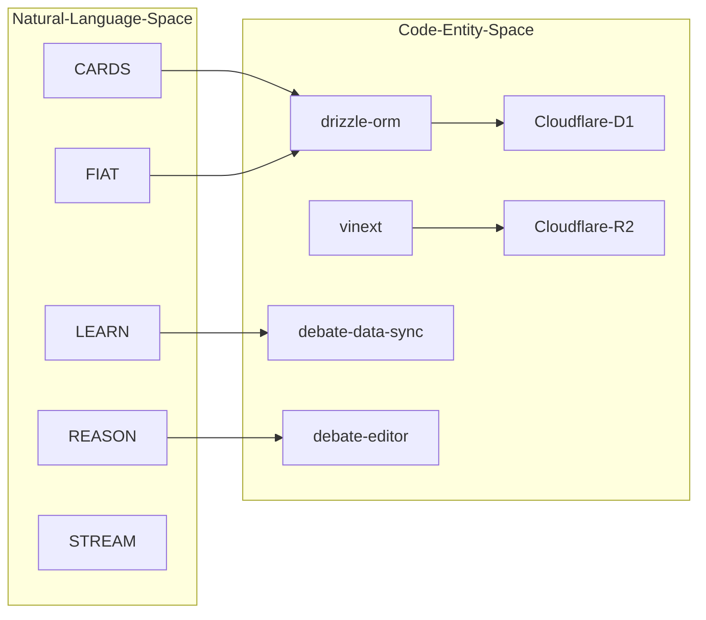
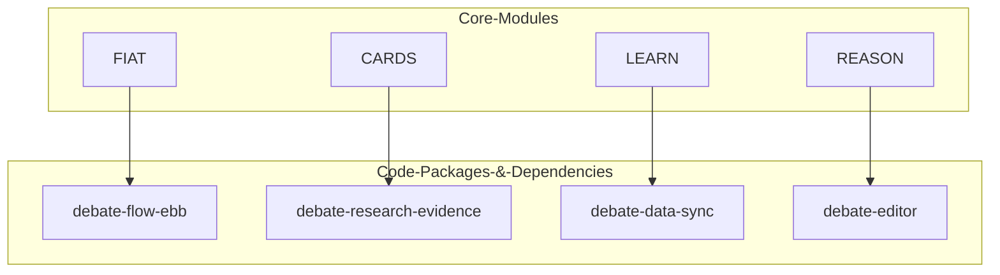

# Overview
Relevant source files
- [.gitignore](https://github.com/debate/debate-ai.com/blob/34937310/.gitignore)
- [CHANGELOG.md](https://github.com/debate/debate-ai.com/blob/34937310/CHANGELOG.md?plain=1)
- [README.md](https://github.com/debate/debate-ai.com/blob/34937310/README.md?plain=1)
- [TODO.md](https://github.com/debate/debate-ai.com/blob/34937310/TODO.md?plain=1)
- [apps/debate-ai.com/components/layout/CategoryDock.tsx](https://github.com/debate/debate-ai.com/blob/34937310/apps/debate-ai.com/components/layout/CategoryDock.tsx)
- [apps/debate-ai.com/lib/offline-sw/app-file-list.ts](https://github.com/debate/debate-ai.com/blob/34937310/apps/debate-ai.com/lib/offline-sw/app-file-list.ts)
- [apps/debate-ai.com/lib/offline-sw/version.ts](https://github.com/debate/debate-ai.com/blob/34937310/apps/debate-ai.com/lib/offline-sw/version.ts)
- [apps/debate-ai.com/lib/stubs/canvas.ts](https://github.com/debate/debate-ai.com/blob/34937310/apps/debate-ai.com/lib/stubs/canvas.ts)
- [apps/debate-ai.com/package.json](https://github.com/debate/debate-ai.com/blob/34937310/apps/debate-ai.com/package.json)
- [apps/debate-ai.com/public/service-worker.js](https://github.com/debate/debate-ai.com/blob/34937310/apps/debate-ai.com/public/service-worker.js)
- [apps/debate-ai.com/vite.config.ts](https://github.com/debate/debate-ai.com/blob/34937310/apps/debate-ai.com/vite.config.ts)
- [bun.lock](https://github.com/debate/debate-ai.com/blob/34937310/bun.lock)
- [package.json](https://github.com/debate/debate-ai.com/blob/34937310/package.json)
- [packages/README.md](https://github.com/debate/debate-ai.com/blob/34937310/packages/README.md?plain=1)
- [packages/debate-round/README.md](https://github.com/debate/debate-ai.com/blob/34937310/packages/debate-round/README.md?plain=1)
- [packages/debate-round/src/index.ts](https://github.com/debate/debate-ai.com/blob/34937310/packages/debate-round/src/index.ts)

Debate AI is a comprehensive platform designed to streamline competitive debate workflows through AI-assisted research, live round management, and a vast educational archive. The platform serves debaters across multiple formats including Public Forum (PF), Lincoln-Douglas (LD), Policy, and NDT/CEDA [apps/debate-ai.com/package.json2-3](https://github.com/debate/debate-ai.com/blob/34937310/apps/debate-ai.com/package.json#L2-L3)

The repository is a **Bun and Turborepo monorepo**[package.json5-9](https://github.com/debate/debate-ai.com/blob/34937310/package.json#L5-L9) containing primary web applications such as `apps/debate-ai.com` and companion packages under `packages/*`[package.json6-9](https://github.com/debate/debate-ai.com/blob/34937310/package.json#L6-L9)

Sources: [apps/debate-ai.com/package.json2-3](https://github.com/debate/debate-ai.com/blob/34937310/apps/debate-ai.com/package.json#L2-L3)[package.json5-9](https://github.com/debate/debate-ai.com/blob/34937310/package.json#L5-L9)

## Core Modules

The platform is organized into five core modules, collectively referred to by their acronyms. These modules represent the primary functional areas of the application:

| Module | Name | Purpose |
| --- | --- | --- |
| **CARDS** | Crowdsourced Annotated Research for Debating Solutions | Evidence search, automated highlighting agents, and AI-powered warrant analysis [README.md37-46](https://github.com/debate/debate-ai.com/blob/34937310/README.md?plain=1#L37-L46) |
| **FIAT** | Forum for Issue Analysis on Topics | Live round management, ag-Grid based flow spreadsheets, and format-aware speech timers [README.md51-61](https://github.com/debate/debate-ai.com/blob/34937310/README.md?plain=1#L51-L61) |
| **LEARN** | Lectures from Educators, Archive of Rounds & Notes | Video library of ~1,400 rounds, 200-term dictionary, and national Elo rankings [README.md68-78](https://github.com/debate/debate-ai.com/blob/34937310/README.md?plain=1#L68-L78) |
| **STREAM** | Search with Top Result Extraction & Answer Model | Multi-source web search across popular sites with LLM-powered summarization and document preview [README.md83-88](https://github.com/debate/debate-ai.com/blob/34937310/README.md?plain=1#L83-L88) |
| **REASON** | Research Editor for Annotated Summaries in Outline Notation | A rich-text editor built on ProseMirror using the custom **CardMirror** schema for lossless `.docx` round-trips [TODO.md113-122](https://github.com/debate/debate-ai.com/blob/34937310/TODO.md?plain=1#L113-L122)[packages/README.md27-36](https://github.com/debate/debate-ai.com/blob/34937310/packages/README.md?plain=1#L27-L36) |

For details on how these modules map to specific routes, components, and packages, see [Core Modules & Feature Map](/debate/debate-ai.com/1.2-core-modules-and-feature-map).

Sources: [README.md37-88](https://github.com/debate/debate-ai.com/blob/34937310/README.md?plain=1#L37-L88)[TODO.md113-122](https://github.com/debate/debate-ai.com/blob/34937310/TODO.md?plain=1#L113-L122)[packages/README.md27-36](https://github.com/debate/debate-ai.com/blob/34937310/packages/README.md?plain=1#L27-L36)

## System Architecture

The project utilizes **Next.js** and the **vinext** build wrapper for frontend and server-side logic, targeting deployment on **Cloudflare Workers**[package.json26-31](https://github.com/debate/debate-ai.com/blob/34937310/package.json#L26-L31)[apps/debate-ai.com/package.json9-114](https://github.com/debate/debate-ai.com/blob/34937310/apps/debate-ai.com/package.json#L9-L114)

### High-Level Data Flow

The following diagram illustrates how the core system modules interact with the underlying infrastructure and implementation packages, bridging natural language spaces to concrete code entities.

**System Logic to Infrastructure Bridge**

Sources: [package.json6-9](https://github.com/debate/debate-ai.com/blob/34937310/package.json#L6-L9)[package.json26](https://github.com/debate/debate-ai.com/blob/34937310/package.json#L26-L26)[apps/debate-ai.com/package.json69-102](https://github.com/debate/debate-ai.com/blob/34937310/apps/debate-ai.com/package.json#L69-L102)[packages/README.md22-36](https://github.com/debate/debate-ai.com/blob/34937310/packages/README.md?plain=1#L22-L36)

## Monorepo Structure & Key Architectural Decisions

The repository is structured as a Turborepo monorepo with workspace packages managed via Bun [package.json5-11](https://github.com/debate/debate-ai.com/blob/34937310/package.json#L5-L11) Key architectural decisions include:

1. **Edge-First Deployment**: Designed to run on Cloudflare's edge network using `vinext` to bridge Next.js patterns with Cloudflare Workers [package.json26-31](https://github.com/debate/debate-ai.com/blob/34937310/package.json#L26-L31)[apps/debate-ai.com/package.json9-13](https://github.com/debate/debate-ai.com/blob/34937310/apps/debate-ai.com/package.json#L9-L13)
2. **Hybrid Persistence**: Relational data and user sessions are managed via **Drizzle ORM** with **Cloudflare D1**, while large static or video datasets utilize `debate-data-sync` flat JSON files [packages/README.md22-26](https://github.com/debate/debate-ai.com/blob/34937310/packages/README.md?plain=1#L22-L26)
3. **Offline Support**: A custom service worker (`service-worker.js`) provides PWA caching for critical application bundles [apps/debate-ai.com/public/service-worker.js1](https://github.com/debate/debate-ai.com/blob/34937310/apps/debate-ai.com/public/service-worker.js#L1-L1)[apps/debate-ai.com/lib/offline-sw/app-file-list.ts1](https://github.com/debate/debate-ai.com/blob/34937310/apps/debate-ai.com/lib/offline-sw/app-file-list.ts#L1-L1)
4. **Cross-Tab Synchronization**: Real-time event propagation across tabs is handled via storage-event hooks and state predicates [Wiki TOCNaN-NaN](https://github.com/debate/debate-ai.com/blob/34937310/Wiki TOC#LNaN-LNaN)

### Module to Code Entity Mapping

Sources: [package.json6-9](https://github.com/debate/debate-ai.com/blob/34937310/package.json#L6-L9)[packages/README.md16-43](https://github.com/debate/debate-ai.com/blob/34937310/packages/README.md?plain=1#L16-L43)

## Child Navigation & Further Reading

For deep technical dives into specific sub-topics, refer to the platform child pages:

- **[Getting Started & Repository Structure](/debate/debate-ai.com/1.1-getting-started-and-repository-structure)** — Workspace scripts (`dev`, `build`, `typecheck`), monorepo layout (`apps/`, `packages/`), and local execution.
- **[Core Modules & Feature Map](/debate/debate-ai.com/1.2-core-modules-and-feature-map)** — Detailed mapping of CARDS, FIAT, LEARN, STREAM, and REASON to routes, packages, and components.

Sources: [package.json10-21](https://github.com/debate/debate-ai.com/blob/34937310/package.json#L10-L21)[packages/README.md1-79](https://github.com/debate/debate-ai.com/blob/34937310/packages/README.md?plain=1#L1-L79)