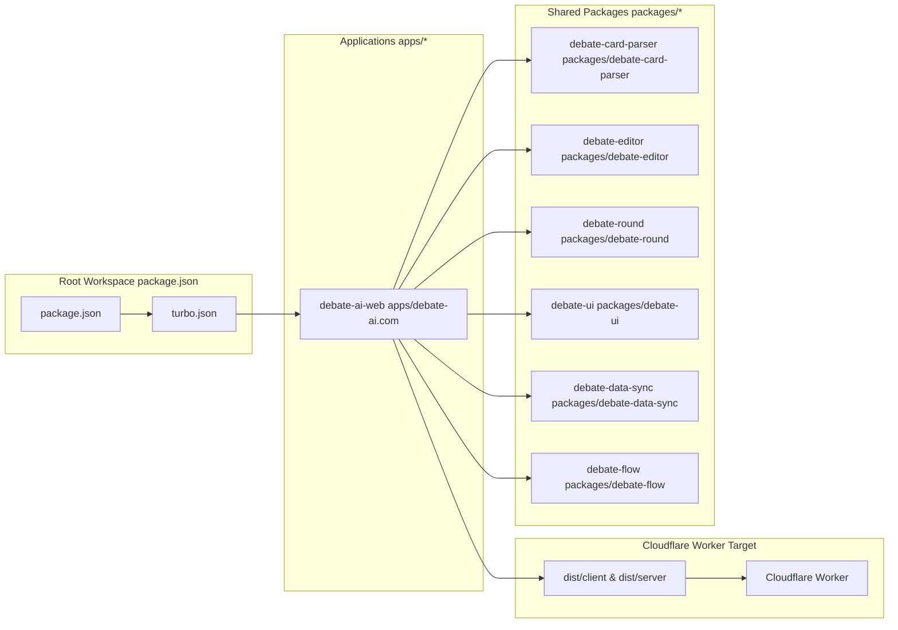
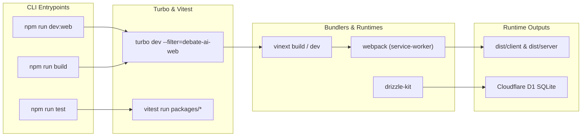

# Getting Started & Repository Structure
Relevant source files
- [.gitignore](https://github.com/debate/debate-ai.com/blob/34937310/.gitignore)
- [CHANGELOG.md](https://github.com/debate/debate-ai.com/blob/34937310/CHANGELOG.md?plain=1)
- [README.md](https://github.com/debate/debate-ai.com/blob/34937310/README.md?plain=1)
- [apps/debate-ai.com/lib/stubs/canvas.ts](https://github.com/debate/debate-ai.com/blob/34937310/apps/debate-ai.com/lib/stubs/canvas.ts)
- [apps/debate-ai.com/package.json](https://github.com/debate/debate-ai.com/blob/34937310/apps/debate-ai.com/package.json)
- [apps/debate-ai.com/vite.config.ts](https://github.com/debate/debate-ai.com/blob/34937310/apps/debate-ai.com/vite.config.ts)
- [bun.lock](https://github.com/debate/debate-ai.com/blob/34937310/bun.lock)
- [codecov.yml](https://github.com/debate/debate-ai.com/blob/34937310/codecov.yml)
- [package.json](https://github.com/debate/debate-ai.com/blob/34937310/package.json)
- [packages/README.md](https://github.com/debate/debate-ai.com/blob/34937310/packages/README.md?plain=1)
- [packages/debate-api-client/README.md](https://github.com/debate/debate-ai.com/blob/34937310/packages/debate-api-client/README.md?plain=1)
- [packages/debate-contributor-progress/README.md](https://github.com/debate/debate-ai.com/blob/34937310/packages/debate-contributor-progress/README.md?plain=1)
- [packages/debate-flow/README.md](https://github.com/debate/debate-ai.com/blob/34937310/packages/debate-flow/README.md?plain=1)
- [packages/debate-round-practice-ai/README.md](https://github.com/debate/debate-ai.com/blob/34937310/packages/debate-round-practice-ai/README.md?plain=1)
- [packages/debate-search-evidence/README.md](https://github.com/debate/debate-ai.com/blob/34937310/packages/debate-search-evidence/README.md?plain=1)

This page details the technical foundations of the Debate AI platform, covering the Bun and Turborepo monorepo layout, workspace scripts, environment variable configuration, build tooling (`vinext` and Vite), and local development bootstrapping procedures.

Sources: [package.json1-41](https://github.com/debate/debate-ai.com/blob/34937310/package.json#L1-L41)[apps/debate-ai.com/package.json1-160](https://github.com/debate/debate-ai.com/blob/34937310/apps/debate-ai.com/package.json#L1-L160)

---

## Monorepo Layout & Workspace Architecture

Debate AI is organized as a high-performance monorepo managed via **Bun workspaces** (`bun@1.3.11`) and orchestrated by **Turborepo** (`turbo@2.9.9`) [package.json5-9](https://github.com/debate/debate-ai.com/blob/34937310/package.json#L5-L9) The architecture decouples specialized core logic, UI primitives, and data sync utilities into independent workspace packages under `packages/*`, while applications reside in `apps/`.

### Directory Layout & Workspace Packages

| Workspace Path | Package Name / Role | Key Technologies |
| --- | --- | --- |
| `apps/debate-ai.com` | `debate-ai-web` — Primary web platform [apps/debate-ai.com/package.json2](https://github.com/debate/debate-ai.com/blob/34937310/apps/debate-ai.com/package.json#L2-L2) | Next.js 16, vinext, Tailwind CSS, Drizzle ORM |
| `packages/debate-api-client` | `debate-api-client` — Typed SDK for Debate API [packages/README.md6-13](https://github.com/debate/debate-ai.com/blob/34937310/packages/README.md?plain=1#L6-L13) | grab-url, openapi-ts |
| `packages/debate-card-parser` | `debate-card-parser` — Evidence card ETL and parser [packages/README.md14-18](https://github.com/debate/debate-ai.com/blob/34937310/packages/README.md?plain=1#L14-L18) | linkedom, jszip, htmlparser2 |
| `packages/debate-contributor-progress` | `debate-community` — Contributor progress & awards [packages/README.md20-25](https://github.com/debate/debate-ai.com/blob/34937310/packages/README.md?plain=1#L20-L25) | Radix UI, React |
| `packages/debate-data-sync` | `debate-data-sync` — YouTube sync & bundled dataset repo [packages/README.md27-32](https://github.com/debate/debate-ai.com/blob/34937310/packages/README.md?plain=1#L27-L32) | axios, linkedom |
| `packages/debate-editor` | `debate-editor` — Speech doc wrapper over CardMirror [packages/README.md33-39](https://github.com/debate/debate-ai.com/blob/34937310/packages/README.md?plain=1#L33-L39) | ProseMirror, React, TipTap |
| `packages/debate-flow` | `debate-flow-ebb` — Keyboard-first local flow editor (`ebb`) [packages/README.md40-46](https://github.com/debate/debate-ai.com/blob/34937310/packages/README.md?plain=1#L40-L46) | Yjs, ag-Grid |
| `packages/debate-help-docs` | `debate-help-docs` — Fumadocs help site [packages/README.md47-52](https://github.com/debate/debate-ai.com/blob/34937310/packages/README.md?plain=1#L47-L52) | Fumadocs, MDX |
| `packages/debate-practice-drills` | `debate-practice-rounds` — Practice and AI round tooling [packages/README.md53-61](https://github.com/debate/debate-ai.com/blob/34937310/packages/README.md?plain=1#L53-L61) | LangChain, React |
| `packages/debate-round` | `debate-round` — FIAT live debate round workspace [packages/README.md62-70](https://github.com/debate/debate-ai.com/blob/34937310/packages/README.md?plain=1#L62-L70) | ag-Grid, Radix UI |
| `packages/debate-round-practice-ai` | `debate-practice-vs-ai` — Practice vs AI server/client [packages/README.md71-77](https://github.com/debate/debate-ai.com/blob/34937310/packages/README.md?plain=1#L71-L77) | TypeScript, fetch |
| `packages/debate-search-evidence` | `debate-research-evidence` — Evidence search & libraries [packages/README.md78-85](https://github.com/debate/debate-ai.com/blob/34937310/packages/README.md?plain=1#L78-L85) | Fuse.js, React |
| `packages/debate-speech-writer` | `debate-speech-writer` — AI prompt library for FIAT [packages/README.md86-90](https://github.com/debate/debate-ai.com/blob/34937310/packages/README.md?plain=1#L86-L90) | LangChain, Groq |
| `packages/debate-team-collaboration` | `debate-team-collaboration` — Team prep & task inbox [packages/README.md91-98](https://github.com/debate/debate-ai.com/blob/34937310/packages/README.md?plain=1#L91-L98) | React, Radix UI |
| `packages/debate-timer` | `debate-timer` — Format-aware speech & prep timers [packages/README.md99-103](https://github.com/debate/debate-ai.com/blob/34937310/packages/README.md?plain=1#L99-L103) | Web Audio API |
| `packages/debate-ui` | `debate-ui` — Shared component library & design system [packages/README.md104-108](https://github.com/debate/debate-ai.com/blob/34937310/packages/README.md?plain=1#L104-L108) | Radix UI, Tailwind CSS |
| `packages/debate-videos` | `debate-videos` — LEARN video library & ranking engine [packages/README.md109-113](https://github.com/debate/debate-ai.com/blob/34937310/packages/README.md?plain=1#L109-L113) | React, YouTube API |

Sources: [package.json5-9](https://github.com/debate/debate-ai.com/blob/34937310/package.json#L5-L9)[packages/README.md1-113](https://github.com/debate/debate-ai.com/blob/34937310/packages/README.md?plain=1#L1-L113)

### Diagram: Monorepo Entity Relationship (Natural Language to Code Entity Space)



Sources: [package.json5-21](https://github.com/debate/debate-ai.com/blob/34937310/package.json#L5-L21)[apps/debate-ai.com/package.json9-15](https://github.com/debate/debate-ai.com/blob/34937310/apps/debate-ai.com/package.json#L9-L15)[apps/debate-ai.com/vite.config.ts23-91](https://github.com/debate/debate-ai.com/blob/34937310/apps/debate-ai.com/vite.config.ts#L23-L91)

---

## Workspace Scripts & Build Orchestration

Development and execution are controlled through root-level Turbo tasks and package-level scripts.

### Root Orchestration Scripts

Executed from the root directory via `bun run` or `npm run`:

- `dev`: Starts all workspaces in concurrent development mode using Turbo [package.json11](https://github.com/debate/debate-ai.com/blob/34937310/package.json#L11-L11)
- `dev:web`: Filters and boots only the primary `debate-ai-web` application [package.json13](https://github.com/debate/debate-ai.com/blob/34937310/package.json#L13-L13)
- `dev:editor`: Boots the `reason-editor` package context [package.json15](https://github.com/debate/debate-ai.com/blob/34937310/package.json#L15-L15)
- `build`: Executes a full Turborepo build pipeline across all workspaces [package.json12](https://github.com/debate/debate-ai.com/blob/34937310/package.json#L12-L12)
- `typecheck`: Runs TypeScript compiler checks across packages via Turbo [package.json17](https://github.com/debate/debate-ai.com/blob/34937310/package.json#L17-L17)
- `test`: Executes test suites across all packages using Vitest [package.json18](https://github.com/debate/debate-ai.com/blob/34937310/package.json#L18-L18)
- `coverage`: Generates merged code coverage reports via `@vitest/coverage-v8`[package.json20](https://github.com/debate/debate-ai.com/blob/34937310/package.json#L20-L20)

Sources: [package.json10-21](https://github.com/debate/debate-ai.com/blob/34937310/package.json#L10-L21)

### Application-Level Scripts (`apps/debate-ai.com`)

Lifecycle management for the main web platform:

- `dev`: `vinext dev` — boots the local development server with HMR [apps/debate-ai.com/package.json10](https://github.com/debate/debate-ai.com/blob/34937310/apps/debate-ai.com/package.json#L10-L10)
- `build`: `vinext build && npm run build:sw` — compiles SSR/RSC outputs and bundles the offline PWA service worker [apps/debate-ai.com/package.json11-12](https://github.com/debate/debate-ai.com/blob/34937310/apps/debate-ai.com/package.json#L11-L12)
- `deploy`: Executes remote D1 migrations and deploys the app via `vinext deploy`[apps/debate-ai.com/package.json14](https://github.com/debate/debate-ai.com/blob/34937310/apps/debate-ai.com/package.json#L14-L14)
- `db:push:d1`: Pushes Drizzle ORM schema changes to Cloudflare D1 [apps/debate-ai.com/package.json19](https://github.com/debate/debate-ai.com/blob/34937310/apps/debate-ai.com/package.json#L19-L19)
- `db:migrate:d1`: Executes raw SQL migration files against remote D1 instances [apps/debate-ai.com/package.json20](https://github.com/debate/debate-ai.com/blob/34937310/apps/debate-ai.com/package.json#L20-L20)

Sources: [apps/debate-ai.com/package.json9-28](https://github.com/debate/debate-ai.com/blob/34937310/apps/debate-ai.com/package.json#L9-L28)

### Diagram: Build System & Execution Pipeline



Sources: [package.json10-21](https://github.com/debate/debate-ai.com/blob/34937310/package.json#L10-L21)[apps/debate-ai.com/package.json9-28](https://github.com/debate/debate-ai.com/blob/34937310/apps/debate-ai.com/package.json#L9-L28)

---

## Environment Variables & Configuration

The application uses standard environment loading, bridging Cloudflare Worker bindings in production and local `.env` or `.dev.vars` files during local execution.

### Key Configuration Variables & Build Options

- `BETTER_AUTH_SECRET`: Cryptographic salt used for session token validation by `better-auth`[apps/debate-ai.com/package.json64](https://github.com/debate/debate-ai.com/blob/34937310/apps/debate-ai.com/package.json#L64-L64)
- `GROQ_API_KEY`: API key utilized by LangChain integrations for argument analysis and speech generation [apps/debate-ai.com/package.json30](https://github.com/debate/debate-ai.com/blob/34937310/apps/debate-ai.com/package.json#L30-L30)
- `RESEND_API_KEY`: Secret token for transactional magic-link and notification dispatch via Resend [apps/debate-ai.com/package.json116](https://github.com/debate/debate-ai.com/blob/34937310/apps/debate-ai.com/package.json#L116-L116)
- `__USE_LIBSQL__`: Vite compile-time flag determining client connector bindings in `apps/debate-ai.com/vite.config.ts`[apps/debate-ai.com/vite.config.ts11-13](https://github.com/debate/debate-ai.com/blob/34937310/apps/debate-ai.com/vite.config.ts#L11-L13)
- `assetsInlineLimit: 0`: Configured in Vite build settings to prevent inlining `.svg` assets as `data:` URIs, ensuring compatibility with `vinext` image routing [apps/debate-ai.com/vite.config.ts14-22](https://github.com/debate/debate-ai.com/blob/34937310/apps/debate-ai.com/vite.config.ts#L14-L22)

Sources: [apps/debate-ai.com/package.json30-116](https://github.com/debate/debate-ai.com/blob/34937310/apps/debate-ai.com/package.json#L30-L116)[apps/debate-ai.com/vite.config.ts10-91](https://github.com/debate/debate-ai.com/blob/34937310/apps/debate-ai.com/vite.config.ts#L10-L91)

---

## Local Run Instructions

To bootstrap and run the platform locally:

1. **Install Dependencies**: Run Bun at the root monorepo directory [package.json5-9](https://github.com/debate/debate-ai.com/blob/34937310/package.json#L5-L9)
```
bun install
```
2. **Initialize Database Schema**:
Generate and push local SQLite models via Drizzle [apps/debate-ai.com/package.json17-18](https://github.com/debate/debate-ai.com/blob/34937310/apps/debate-ai.com/package.json#L17-L18)
```
npm run db:push
```
3. **Start Development Server**:
Launch the Next.js/`vinext` environment targeting `debate-ai-web`[package.json13](https://github.com/debate/debate-ai.com/blob/34937310/package.json#L13-L13)[apps/debate-ai.com/package.json10](https://github.com/debate/debate-ai.com/blob/34937310/apps/debate-ai.com/package.json#L10-L10)
```
npm run dev:web
```

Sources: [package.json5-17](https://github.com/debate/debate-ai.com/blob/34937310/package.json#L5-L17)[apps/debate-ai.com/package.json9-19](https://github.com/debate/debate-ai.com/blob/34937310/apps/debate-ai.com/package.json#L9-L19)