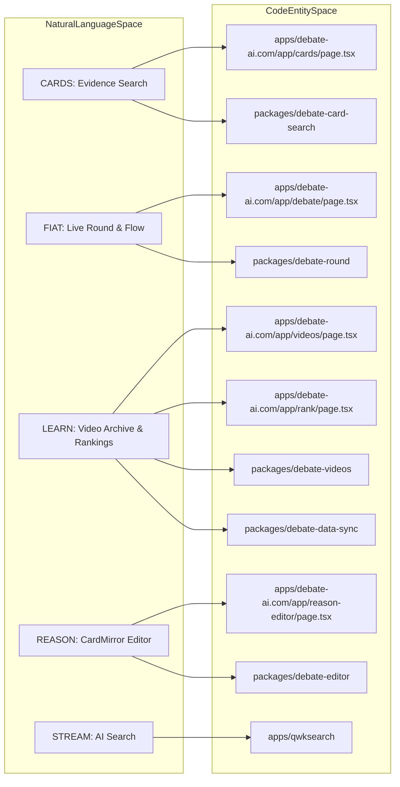
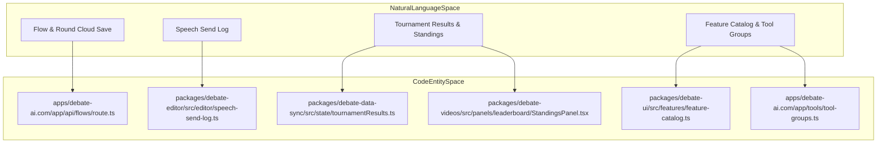

# Core Modules & Feature Map
Relevant source files
- [apps/debate-ai.com/app/debate/[tournament]/[teams]/page.tsx](apps/debate-ai.com/app/debate/%5Btournament%5D/%5Bteams%5D/page.tsx)
- [apps/debate-ai.com/app/debate/page.tsx](https://github.com/debate/debate-ai.com/blob/34937310/apps/debate-ai.com/app/debate/page.tsx)
- [apps/debate-ai.com/app/speech-documents/page.tsx](https://github.com/debate/debate-ai.com/blob/34937310/apps/debate-ai.com/app/speech-documents/page.tsx)
- [apps/debate-ai.com/app/tools/MySavedItems.tsx](https://github.com/debate/debate-ai.com/blob/34937310/apps/debate-ai.com/app/tools/MySavedItems.tsx)
- [apps/debate-ai.com/app/tools/mobile-setup/page.tsx](https://github.com/debate/debate-ai.com/blob/34937310/apps/debate-ai.com/app/tools/mobile-setup/page.tsx)
- [apps/debate-ai.com/app/tools/page.tsx](https://github.com/debate/debate-ai.com/blob/34937310/apps/debate-ai.com/app/tools/page.tsx)
- [apps/debate-ai.com/app/tools/tool-groups.ts](https://github.com/debate/debate-ai.com/blob/34937310/apps/debate-ai.com/app/tools/tool-groups.ts)
- [docs/features/features-page.md](https://github.com/debate/debate-ai.com/blob/34937310/docs/features/features-page.md?plain=1)
- [docs/features/legacy-verbatim-shortcuts.md](https://github.com/debate/debate-ai.com/blob/34937310/docs/features/legacy-verbatim-shortcuts.md?plain=1)
- [docs/features/speech-document-target.md](https://github.com/debate/debate-ai.com/blob/34937310/docs/features/speech-document-target.md?plain=1)
- [docs/features/team-rankings.md](https://github.com/debate/debate-ai.com/blob/34937310/docs/features/team-rankings.md?plain=1)
- [packages/debate-data-sync/src/rankings/tournament-results-csv-import.ts](https://github.com/debate/debate-ai.com/blob/34937310/packages/debate-data-sync/src/rankings/tournament-results-csv-import.ts)
- [packages/debate-data-sync/src/state/qualificationCutoff.ts](https://github.com/debate/debate-ai.com/blob/34937310/packages/debate-data-sync/src/state/qualificationCutoff.ts)
- [packages/debate-data-sync/src/state/tournamentResults.ts](https://github.com/debate/debate-ai.com/blob/34937310/packages/debate-data-sync/src/state/tournamentResults.ts)
- [packages/debate-data-sync/test/qualificationCutoff.test.ts](https://github.com/debate/debate-ai.com/blob/34937310/packages/debate-data-sync/test/qualificationCutoff.test.ts)
- [packages/debate-data-sync/test/tournament-results-csv-import.test.ts](https://github.com/debate/debate-ai.com/blob/34937310/packages/debate-data-sync/test/tournament-results-csv-import.test.ts)
- [packages/debate-data-sync/test/tournamentResults.test.ts](https://github.com/debate/debate-ai.com/blob/34937310/packages/debate-data-sync/test/tournamentResults.test.ts)
- [packages/debate-editor/src/react/MenuBar.tsx](https://github.com/debate/debate-ai.com/blob/34937310/packages/debate-editor/src/react/MenuBar.tsx)
- [packages/debate-editor/src/react/menu-bar-categories.ts](https://github.com/debate/debate-ai.com/blob/34937310/packages/debate-editor/src/react/menu-bar-categories.ts)
- [packages/debate-ui/src/features/feature-catalog.ts](https://github.com/debate/debate-ai.com/blob/34937310/packages/debate-ui/src/features/feature-catalog.ts)
- [packages/debate-videos/src/panels/leaderboard/RankingsLeaderboardPanel.tsx](https://github.com/debate/debate-ai.com/blob/34937310/packages/debate-videos/src/panels/leaderboard/RankingsLeaderboardPanel.tsx)
- [packages/debate-videos/src/panels/leaderboard/StandingsPanel.tsx](https://github.com/debate/debate-ai.com/blob/34937310/packages/debate-videos/src/panels/leaderboard/StandingsPanel.tsx)

## Purpose and Scope

This page provides a comprehensive technical breakdown of the five core modules that comprise the Debate AI platform—collectively known by the acronym **TRUTH** (**CARDS**, **FIAT**, **LEARN**, **STREAM**, and **REASON**). It maps these conceptual spaces to physical Next.js routes, workspace packages, internal components, the app-wide feature catalog (`packages/debate-ui/src/features/feature-catalog.ts`), the tool groups registry (`apps/debate-ai.com/app/tools/tool-groups.ts`), and markdown specifications under `docs/features/`.

Sources: [packages/debate-ui/src/features/feature-catalog.ts35-166](https://github.com/debate/debate-ai.com/blob/34937310/packages/debate-ui/src/features/feature-catalog.ts#L35-L166)[apps/debate-ai.com/app/tools/tool-groups.ts11-120](https://github.com/debate/debate-ai.com/blob/34937310/apps/debate-ai.com/app/tools/tool-groups.ts#L11-L120)

---

## TRUTH Architecture & Module Mapping

The platform organizes user workflows around the competitive debate lifecycle, exposing functionality through global navigation, the `/tools` directory [apps/debate-ai.com/app/tools/page.tsx8-51](https://github.com/debate/debate-ai.com/blob/34937310/apps/debate-ai.com/app/tools/page.tsx#L8-L51) and the application feature catalog (`packages/debate-ui/src/features/feature-catalog.ts`) [packages/debate-ui/src/features/feature-catalog.ts35-166](https://github.com/debate/debate-ai.com/blob/34937310/packages/debate-ui/src/features/feature-catalog.ts#L35-L166)

| Module | Full Name | Route | Primary Purpose & Associated Packages |
| --- | --- | --- | --- |
| **CARDS** | Crowdsourced Annotated Research for Debating Solutions | `/cards`, `/research`, `/community-hub` | Evidence search, card parsing, annotation agents, task routing, and crowdsourced repositories [packages/debate-ui/src/features/feature-catalog.ts109-166](https://github.com/debate/debate-ai.com/blob/34937310/packages/debate-ui/src/features/feature-catalog.ts#L109-L166)`packages/debate-card-search` |
| **FIAT** | Forum for Issue Analysis on Topics | `/debate`, `/coach` | Live round management, multi-column flow spreadsheets, timers, scouting, and AI coaching [packages/debate-ui/src/features/feature-catalog.ts119-161](https://github.com/debate/debate-ai.com/blob/34937310/packages/debate-ui/src/features/feature-catalog.ts#L119-L161)`packages/debate-round`, `packages/debate-speech-writer` |
| **LEARN** | Lectures from Educators, Archive of Rounds & Notes | `/videos`, `/rank`, `/dictionary` | Historical NDT/PF/LD round archives, instructional lecture series, NDCA standings, and team rankings [docs/features/team-rankings.md1-10](https://github.com/debate/debate-ai.com/blob/34937310/docs/features/team-rankings.md?plain=1#L1-L10)`packages/debate-videos`, `packages/debate-data-sync` |
| **STREAM** | Search with Top Result Extraction & Answer Model | `/qwksearch` | Web search, multi-site extraction, and AI research agents [apps/debate-ai.com/app/tools/tool-groups.ts1-120](https://github.com/debate/debate-ai.com/blob/34937310/apps/debate-ai.com/app/tools/tool-groups.ts#L1-L120)`apps/qwksearch` |
| **REASON** | Research Editor for Annotated Summaries in Outline Notation | `/doc`, `/reason-editor`, `/speech-documents` | Rich-text CardMirror ProseMirror engine, document trees, Verbatim shortcuts, and speech document targets [docs/features/legacy-verbatim-shortcuts.md1-37](https://github.com/debate/debate-ai.com/blob/34937310/docs/features/legacy-verbatim-shortcuts.md?plain=1#L1-L37)[docs/features/speech-document-target.md1-25](https://github.com/debate/debate-ai.com/blob/34937310/docs/features/speech-document-target.md?plain=1#L1-L25)`packages/debate-editor` |

Sources: [apps/debate-ai.com/app/tools/page.tsx8-51](https://github.com/debate/debate-ai.com/blob/34937310/apps/debate-ai.com/app/tools/page.tsx#L8-L51)[apps/debate-ai.com/app/tools/tool-groups.ts1-120](https://github.com/debate/debate-ai.com/blob/34937310/apps/debate-ai.com/app/tools/tool-groups.ts#L1-L120)[docs/features/legacy-verbatim-shortcuts.md1-37](https://github.com/debate/debate-ai.com/blob/34937310/docs/features/legacy-verbatim-shortcuts.md?plain=1#L1-L37)[docs/features/speech-document-target.md1-25](https://github.com/debate/debate-ai.com/blob/34937310/docs/features/speech-document-target.md?plain=1#L1-L25)[docs/features/team-rankings.md1-10](https://github.com/debate/debate-ai.com/blob/34937310/docs/features/team-rankings.md?plain=1#L1-L10)[packages/debate-ui/src/features/feature-catalog.ts35-166](https://github.com/debate/debate-ai.com/blob/34937310/packages/debate-ui/src/features/feature-catalog.ts#L35-L166)

---

## 📚 CARDS: Evidence & Research

The **CARDS** module manages the collection, parsing, search, and peer review of debate evidence across the platform.

- **UI & Routes:** Centered around `/cards` for full-text card search, `/research` for squad research management, and `/community-hub` for cross-squad directory navigation [packages/debate-ui/src/features/feature-catalog.ts109-166](https://github.com/debate/debate-ai.com/blob/34937310/packages/debate-ui/src/features/feature-catalog.ts#L109-L166)
- **ETL & Parsing:** Relies on parsers for converting DOCX and HTML documents into structured card models with citations, tag metadata, and verbatim shortcut helpers [docs/features/legacy-verbatim-shortcuts.md40-87](https://github.com/debate/debate-ai.com/blob/34937310/docs/features/legacy-verbatim-shortcuts.md?plain=1#L40-L87)
- **Key Components:** Features AI auto-highlight agents, view modes (read, highlight, underline), the **Daily Best Card Challenge** (`/cards/best-card`), contributor leaderboards (`/cards/leaderboard`), and task routing inbox panels (`/cards/inbox`) [apps/debate-ai.com/app/tools/tool-groups.ts78-120](https://github.com/debate/debate-ai.com/blob/34937310/apps/debate-ai.com/app/tools/tool-groups.ts#L78-L120)

Sources: [apps/debate-ai.com/app/tools/tool-groups.ts78-120](https://github.com/debate/debate-ai.com/blob/34937310/apps/debate-ai.com/app/tools/tool-groups.ts#L78-L120)[docs/features/legacy-verbatim-shortcuts.md40-87](https://github.com/debate/debate-ai.com/blob/34937310/docs/features/legacy-verbatim-shortcuts.md?plain=1#L40-L87)[packages/debate-ui/src/features/feature-catalog.ts109-166](https://github.com/debate/debate-ai.com/blob/34937310/packages/debate-ui/src/features/feature-catalog.ts#L109-L166)

---

## ⚖️ FIAT: Round Management & Flowing

**FIAT** operates as the live competition workspace for note-taking (flowing), timing, scouting, and round analysis.

- **UI & Routes:** Hosted at `/debate` (Flow spreadsheet and timers), `/coach` (Argument trees, flow summaries, and coaching prompts), and saved round libraries [packages/debate-ui/src/features/feature-catalog.ts119-161](https://github.com/debate/debate-ai.com/blob/34937310/packages/debate-ui/src/features/feature-catalog.ts#L119-L161)
- **Core Capabilities:** Multi-column speech spreadsheets via ag-Grid, shareable round URLs, speech/prep timers (`debate-timer`), and AI decision support prompts (`debate-speech-writer`) [docs/features/speech-document-target.md69-95](https://github.com/debate/debate-ai.com/blob/34937310/docs/features/speech-document-target.md?plain=1#L69-L95)
- **Collaborative Sync:** Supports cloud save endpoints (`/api/flows`, `/api/rounds`), cross-tab storage synchronization, and presence heartbeats (`/api/flow-sync`, `/api/flow-presence`) [apps/debate-ai.com/app/tools/MySavedItems.tsx1-78](https://github.com/debate/debate-ai.com/blob/34937310/apps/debate-ai.com/app/tools/MySavedItems.tsx#L1-L78)

Sources: [apps/debate-ai.com/app/tools/MySavedItems.tsx1-78](https://github.com/debate/debate-ai.com/blob/34937310/apps/debate-ai.com/app/tools/MySavedItems.tsx#L1-L78)[docs/features/speech-document-target.md69-95](https://github.com/debate/debate-ai.com/blob/34937310/docs/features/speech-document-target.md?plain=1#L69-L95)[packages/debate-ui/src/features/feature-catalog.ts119-161](https://github.com/debate/debate-ai.com/blob/34937310/packages/debate-ui/src/features/feature-catalog.ts#L119-L161)

---

## 🎥 LEARN: Video Library, Standings & Rankings

The **LEARN** module acts as the community's historical archive, educational hub, and season standings tracker.

- **UI & Routes:** Accessible via `/videos` for the video archive and `/rank` for the NDCA standings and Elo team rankings [docs/features/team-rankings.md1-10](https://github.com/debate/debate-ai.com/blob/34937310/docs/features/team-rankings.md?plain=1#L1-L10)[packages/debate-ui/src/features/feature-catalog.ts100-107](https://github.com/debate/debate-ai.com/blob/34937310/packages/debate-ui/src/features/feature-catalog.ts#L100-L107)
- **Dataset & Standings:** Indexes thousands of college NDT, Public Forum, Lincoln-Douglas, and Policy rounds, alongside CSV bulk-imported tournament results (`debate-data-sync/src/state/tournamentResults.ts`) and qualification cutoff points tables (`debate-data-sync/src/state/qualificationPointsTable.ts`) [packages/debate-data-sync/src/state/tournamentResults.ts1-130](https://github.com/debate/debate-ai.com/blob/34937310/packages/debate-data-sync/src/state/tournamentResults.ts#L1-L130)[packages/debate-videos/src/panels/leaderboard/StandingsPanel.tsx1-31](https://github.com/debate/debate-ai.com/blob/34937310/packages/debate-videos/src/panels/leaderboard/StandingsPanel.tsx#L1-L31)
- **Reference Data:** Bundles reference dictionaries, national champion records, and TOC bid list metadata [docs/features/team-rankings.md1-25](https://github.com/debate/debate-ai.com/blob/34937310/docs/features/team-rankings.md?plain=1#L1-L25)

Sources: [docs/features/team-rankings.md1-25](https://github.com/debate/debate-ai.com/blob/34937310/docs/features/team-rankings.md?plain=1#L1-L25)[packages/debate-data-sync/src/state/tournamentResults.ts1-130](https://github.com/debate/debate-ai.com/blob/34937310/packages/debate-data-sync/src/state/tournamentResults.ts#L1-L130)[packages/debate-videos/src/panels/leaderboard/StandingsPanel.tsx1-31](https://github.com/debate/debate-ai.com/blob/34937310/packages/debate-videos/src/panels/leaderboard/StandingsPanel.tsx#L1-L31)[packages/debate-ui/src/features/feature-catalog.ts100-107](https://github.com/debate/debate-ai.com/blob/34937310/packages/debate-ui/src/features/feature-catalog.ts#L100-L107)

---

## 🔎 STREAM: Search & Extraction

**STREAM** delivers external intelligence and document extraction capabilities across external research sources.

- **Capabilities:** Executes broad web searches across academic and news sites, parsing results into structured answers and citation formats.
- **Integration:** Powered via `apps/qwksearch` and integrated into the overarching search index and tool groups directory [apps/debate-ai.com/app/tools/tool-groups.ts1-120](https://github.com/debate/debate-ai.com/blob/34937310/apps/debate-ai.com/app/tools/tool-groups.ts#L1-L120)

Sources: [apps/debate-ai.com/app/tools/tool-groups.ts1-120](https://github.com/debate/debate-ai.com/blob/34937310/apps/debate-ai.com/app/tools/tool-groups.ts#L1-L120)

---

## 📝 REASON: Research Editor & Speech Targets

**REASON** provides advanced brief writing and document organization via the CardMirror editor engine and research document trees.

- **UI & Routes:** Located at `/doc` (nested topic tree), `/reason-editor` (CardMirror rich-text editor with `MenuBar.tsx` and command palettes), and `/speech-documents` (speech send history log) [docs/features/legacy-verbatim-shortcuts.md24-37](https://github.com/debate/debate-ai.com/blob/34937310/docs/features/legacy-verbatim-shortcuts.md?plain=1#L24-L37)[docs/features/speech-document-target.md1-25](https://github.com/debate/debate-ai.com/blob/34937310/docs/features/speech-document-target.md?plain=1#L1-L25)[packages/debate-editor/src/react/menu-bar-categories.ts1-30](https://github.com/debate/debate-ai.com/blob/34937310/packages/debate-editor/src/react/menu-bar-categories.ts#L1-L30)
- **Engine & Shortcuts:** Implements Verbatim-compatible keyboard shortcuts (`F8` cite, `F9` underline, `F10` emphasis, `F3` condense family, `Mod-Shift-k` short cite insertion) backed by `debate-editor` (`src/editor/ribbon-commands.ts`) [docs/features/legacy-verbatim-shortcuts.md38-61](https://github.com/debate/debate-ai.com/blob/34937310/docs/features/legacy-verbatim-shortcuts.md?plain=1#L38-L61)
- **Speech Document Target:** Manages active speech pane designations via `speech-doc-registry.ts` and logs dispatches through `speechSendLogStore` backed by IndexedDB and `speech-doc-send.ts`[docs/features/speech-document-target.md26-95](https://github.com/debate/debate-ai.com/blob/34937310/docs/features/speech-document-target.md?plain=1#L26-L95)

Sources: [docs/features/legacy-verbatim-shortcuts.md24-61](https://github.com/debate/debate-ai.com/blob/34937310/docs/features/legacy-verbatim-shortcuts.md?plain=1#L24-L61)[docs/features/speech-document-target.md1-95](https://github.com/debate/debate-ai.com/blob/34937310/docs/features/speech-document-target.md?plain=1#L1-L95)[packages/debate-editor/src/react/menu-bar-categories.ts1-30](https://github.com/debate/debate-ai.com/blob/34937310/packages/debate-editor/src/react/menu-bar-categories.ts#L1-L30)

---

## Feature Catalog & Specification Registry

The application feature catalog (`packages/debate-ui/src/features/feature-catalog.ts`) classifies every user-facing surface into distinct categories (`workspaces`, `evidence`, `collaboration`, `round`, `intelligence`, `practice`, `recognition`, and `standings`) [packages/debate-ui/src/features/feature-catalog.ts35-55](https://github.com/debate/debate-ai.com/blob/34937310/packages/debate-ui/src/features/feature-catalog.ts#L35-L55) Detailed specifications for individual features are maintained as Markdown files under `docs/features/` (such as `speech-document-target.md`, `legacy-verbatim-shortcuts.md`, and `team-rankings.md`) [docs/features/legacy-verbatim-shortcuts.md1-37](https://github.com/debate/debate-ai.com/blob/34937310/docs/features/legacy-verbatim-shortcuts.md?plain=1#L1-L37)[docs/features/speech-document-target.md1-25](https://github.com/debate/debate-ai.com/blob/34937310/docs/features/speech-document-target.md?plain=1#L1-L25)[docs/features/team-rankings.md1-10](https://github.com/debate/debate-ai.com/blob/34937310/docs/features/team-rankings.md?plain=1#L1-L10) The tool catalog (`apps/debate-ai.com/app/tools/tool-groups.ts`) aggregates all primary workspaces and progress tools into structured groups [apps/debate-ai.com/app/tools/tool-groups.ts11-120](https://github.com/debate/debate-ai.com/blob/34937310/apps/debate-ai.com/app/tools/tool-groups.ts#L11-L120)

Sources: [apps/debate-ai.com/app/tools/tool-groups.ts11-120](https://github.com/debate/debate-ai.com/blob/34937310/apps/debate-ai.com/app/tools/tool-groups.ts#L11-L120)[docs/features/legacy-verbatim-shortcuts.md1-37](https://github.com/debate/debate-ai.com/blob/34937310/docs/features/legacy-verbatim-shortcuts.md?plain=1#L1-L37)[docs/features/speech-document-target.md1-25](https://github.com/debate/debate-ai.com/blob/34937310/docs/features/speech-document-target.md?plain=1#L1-L25)[docs/features/team-rankings.md1-10](https://github.com/debate/debate-ai.com/blob/34937310/docs/features/team-rankings.md?plain=1#L1-L10)[packages/debate-ui/src/features/feature-catalog.ts35-55](https://github.com/debate/debate-ai.com/blob/34937310/packages/debate-ui/src/features/feature-catalog.ts#L35-L55)

---

## Module-to-Code Architecture Diagrams

### Diagram 1: Natural Language Space to Code Entity Mapping (Workspaces & Core Packages)

Sources: [docs/features/team-rankings.md1-10](https://github.com/debate/debate-ai.com/blob/34937310/docs/features/team-rankings.md?plain=1#L1-L10)[packages/debate-ui/src/features/feature-catalog.ts97-143](https://github.com/debate/debate-ai.com/blob/34937310/packages/debate-ui/src/features/feature-catalog.ts#L97-L143)

### Diagram 2: Data Persistence and State Subsystems

Sources: [apps/debate-ai.com/app/tools/tool-groups.ts11-120](https://github.com/debate/debate-ai.com/blob/34937310/apps/debate-ai.com/app/tools/tool-groups.ts#L11-L120)[docs/features/speech-document-target.md69-95](https://github.com/debate/debate-ai.com/blob/34937310/docs/features/speech-document-target.md?plain=1#L69-L95)[packages/debate-data-sync/src/state/tournamentResults.ts1-130](https://github.com/debate/debate-ai.com/blob/34937310/packages/debate-data-sync/src/state/tournamentResults.ts#L1-L130)[packages/debate-videos/src/panels/leaderboard/StandingsPanel.tsx1-31](https://github.com/debate/debate-ai.com/blob/34937310/packages/debate-videos/src/panels/leaderboard/StandingsPanel.tsx#L1-L31)[packages/debate-ui/src/features/feature-catalog.ts35-88](https://github.com/debate/debate-ai.com/blob/34937310/packages/debate-ui/src/features/feature-catalog.ts#L35-L88)