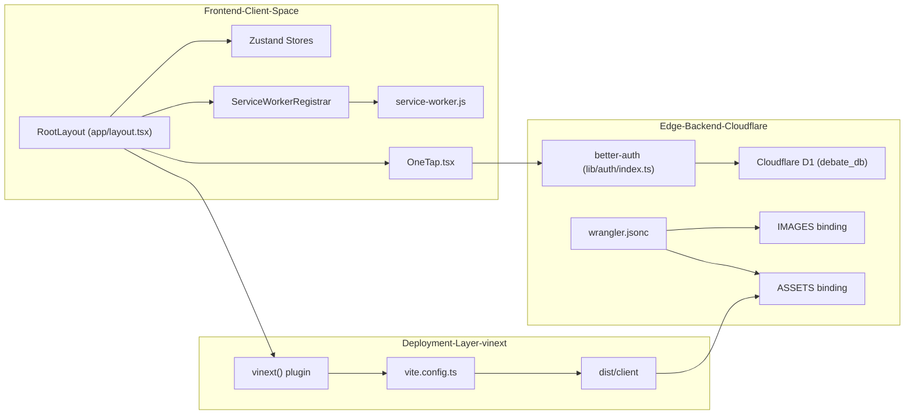
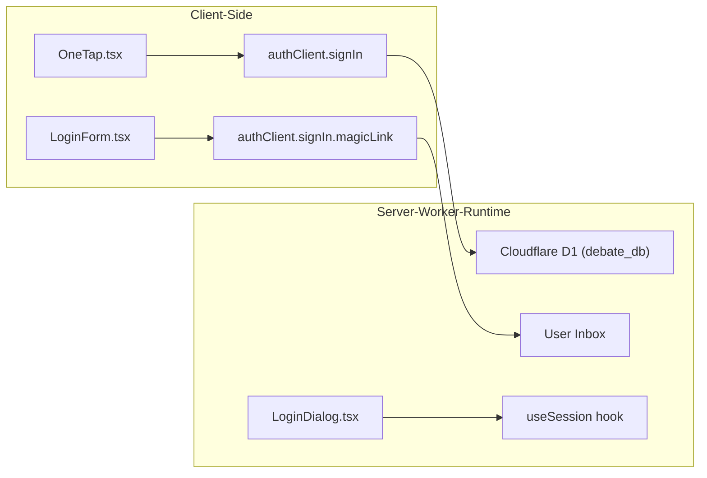

# Application Architecture
Relevant source files
- [.gitignore](https://github.com/debate/debate-ai.com/blob/34937310/.gitignore)
- [CHANGELOG.md](https://github.com/debate/debate-ai.com/blob/34937310/CHANGELOG.md?plain=1)
- [README.md](https://github.com/debate/debate-ai.com/blob/34937310/README.md?plain=1)
- [apps/debate-ai.com/lib/database/__tests__/d1-session.test.ts](https://github.com/debate/debate-ai.com/blob/34937310/apps/debate-ai.com/lib/database/__tests__/d1-session.test.ts)
- [apps/debate-ai.com/lib/database/d1-session.ts](https://github.com/debate/debate-ai.com/blob/34937310/apps/debate-ai.com/lib/database/d1-session.ts)
- [apps/debate-ai.com/lib/database/index.ts](https://github.com/debate/debate-ai.com/blob/34937310/apps/debate-ai.com/lib/database/index.ts)
- [apps/debate-ai.com/lib/stubs/canvas.ts](https://github.com/debate/debate-ai.com/blob/34937310/apps/debate-ai.com/lib/stubs/canvas.ts)
- [apps/debate-ai.com/package.json](https://github.com/debate/debate-ai.com/blob/34937310/apps/debate-ai.com/package.json)
- [apps/debate-ai.com/scripts/d1-read-replication.sh](https://github.com/debate/debate-ai.com/blob/34937310/apps/debate-ai.com/scripts/d1-read-replication.sh)
- [apps/debate-ai.com/vite.config.ts](https://github.com/debate/debate-ai.com/blob/34937310/apps/debate-ai.com/vite.config.ts)
- [apps/debate-ai.com/vitest.config.ts](https://github.com/debate/debate-ai.com/blob/34937310/apps/debate-ai.com/vitest.config.ts)
- [apps/debate-ai.com/worker/index.ts](https://github.com/debate/debate-ai.com/blob/34937310/apps/debate-ai.com/worker/index.ts)
- [bun.lock](https://github.com/debate/debate-ai.com/blob/34937310/bun.lock)
- [docs/d1-read-replication.md](https://github.com/debate/debate-ai.com/blob/34937310/docs/d1-read-replication.md?plain=1)
- [package.json](https://github.com/debate/debate-ai.com/blob/34937310/package.json)

This page serves as a high-level overview of the Next.js/vinext application architecture for the Debate AI platform, detailing its deployment on Cloudflare Workers, the server-side rendering (SSR) pipeline, and how frontend and backend layers interact.

As a parent page, it introduces the core architectural pillars and links to detailed child pages for deeper technical specifications.

---

### System Overview & Architecture Bridge

The application utilizes a decoupled architecture where client-side state supports local-first capabilities, while the edge backend runs on Cloudflare Workers via `vinext`[apps/debate-ai.com/vite.config.ts1-28](https://github.com/debate/debate-ai.com/blob/34937310/apps/debate-ai.com/vite.config.ts#L1-L28) The following diagram maps high-level system concepts to their specific implementation entities in the codebase.

**System to Code Mapping**

Sources: [apps/debate-ai.com/wrangler.jsonc17-23](https://github.com/debate/debate-ai.com/blob/34937310/apps/debate-ai.com/wrangler.jsonc#L17-L23)[apps/debate-ai.com/vite.config.ts1-28](https://github.com/debate/debate-ai.com/blob/34937310/apps/debate-ai.com/vite.config.ts#L1-L28)

---

### Build System & Deployment

The application is bundled using `vinext`, a build wrapper that adapts Next.js for the Cloudflare Workers edge environment [apps/debate-ai.com/vite.config.ts1-28](https://github.com/debate/debate-ai.com/blob/34937310/apps/debate-ai.com/vite.config.ts#L1-L28) The `vite.config.ts` file configures `vinext` and the `@cloudflare/vite-plugin`[apps/debate-ai.com/vite.config.ts24-27](https://github.com/debate/debate-ai.com/blob/34937310/apps/debate-ai.com/vite.config.ts#L24-L27) defining workspace source integration via `ssr.noExternal`[apps/debate-ai.com/vite.config.ts73-89](https://github.com/debate/debate-ai.com/blob/34937310/apps/debate-ai.com/vite.config.ts#L73-L89) and worker bindings in `wrangler.jsonc`[apps/debate-ai.com/wrangler.jsonc1-73](https://github.com/debate/debate-ai.com/blob/34937310/apps/debate-ai.com/wrangler.jsonc#L1-L73) The `apps/debate-ai.com/worker/index.ts` file serves as the Cloudflare Worker entry point, handling requests and scheduled tasks [apps/debate-ai.com/worker/index.ts1-108](https://github.com/debate/debate-ai.com/blob/34937310/apps/debate-ai.com/worker/index.ts#L1-L108)

For details, see [Build System & Deployment (vinext + Cloudflare)](/debate/debate-ai.com/2.1-build-system-and-deployment-(vinext-+-cloudflare)).

Sources: [apps/debate-ai.com/vite.config.ts1-28](https://github.com/debate/debate-ai.com/blob/34937310/apps/debate-ai.com/vite.config.ts#L1-L28)[apps/debate-ai.com/vite.config.ts73-89](https://github.com/debate/debate-ai.com/blob/34937310/apps/debate-ai.com/vite.config.ts#L73-L89)[apps/debate-ai.com/wrangler.jsonc1-73](https://github.com/debate/debate-ai.com/blob/34937310/apps/debate-ai.com/wrangler.jsonc#L1-L73)[apps/debate-ai.com/worker/index.ts1-108](https://github.com/debate/debate-ai.com/blob/34937310/apps/debate-ai.com/worker/index.ts#L1-L108)

---

### Database & Persistence Layer

Relational data and user state are managed via **Drizzle ORM** targeting **Cloudflare D1** (`debate_db`) [apps/debate-ai.com/wrangler.jsonc42-48](https://github.com/debate/debate-ai.com/blob/34937310/apps/debate-ai.com/wrangler.jsonc#L42-L48) The database schema (`lib/database/schema.ts`) houses tables for authentication, documents, topic starters, flow sync, and cloud-saved entities. The `d1-session.ts` module implements D1 read replication for sequential consistency across requests [apps/debate-ai.com/lib/database/d1-session.ts1-30](https://github.com/debate/debate-ai.com/blob/34937310/apps/debate-ai.com/lib/database/d1-session.ts#L1-L30)

For details, see [Database & Persistence Layer](/debate/debate-ai.com/2.2-database-and-persistence-layer).

Sources: [apps/debate-ai.com/wrangler.jsonc42-48](https://github.com/debate/debate-ai.com/blob/34937310/apps/debate-ai.com/wrangler.jsonc#L42-L48)[apps/debate-ai.com/lib/database/d1-session.ts1-30](https://github.com/debate/debate-ai.com/blob/34937310/apps/debate-ai.com/lib/database/d1-session.ts#L1-L30)

---

### Authentication & Session Management

Authentication is driven by **better-auth** with support for social providers, magic links, and anonymous sessions, routing requests through `/api/auth` endpoints [apps/debate-ai.com/package.json63-64](https://github.com/debate/debate-ai.com/blob/34937310/apps/debate-ai.com/package.json#L63-L64) The `better-auth-cloudflare` package provides the necessary Cloudflare Workers integration [apps/debate-ai.com/package.json65](https://github.com/debate/debate-ai.com/blob/34937310/apps/debate-ai.com/package.json#L65-L65)

**Auth Flow Mapping**

Sources: [apps/debate-ai.com/wrangler.jsonc42-48](https://github.com/debate/debate-ai.com/blob/34937310/apps/debate-ai.com/wrangler.jsonc#L42-L48)[apps/debate-ai.com/package.json63-64](https://github.com/debate/debate-ai.com/blob/34937310/apps/debate-ai.com/package.json#L63-L64)[apps/debate-ai.com/package.json65](https://github.com/debate/debate-ai.com/blob/34937310/apps/debate-ai.com/package.json#L65-L65)

For details, see [Authentication & Session Management](/debate/debate-ai.com/2.3-authentication-and-session-management).

---

### Frontend Layout & Navigation

The user interface revolves around a high-density desktop and mobile layout powered by root layout definitions, the `CategoryDock` navigation component, and global design tokens (`globals.css`/`themes.css`) [apps/debate-ai.com/app/layout.tsx1-50](https://github.com/debate/debate-ai.com/blob/34937310/apps/debate-ai.com/app/layout.tsx#L1-L50) The `AppSidebarShell` and `VideoSidebarTree` components manage the application's primary navigation and tool sections.

For details, see [Frontend Layout & Navigation](/debate/debate-ai.com/2.4-frontend-layout-and-navigation).

Sources: [apps/debate-ai.com/app/layout.tsx1-50](https://github.com/debate/debate-ai.com/blob/34937310/apps/debate-ai.com/app/layout.tsx#L1-L50)

---

### State Management, User Settings & Offline Support

Client state utilizes localStorage-first store patterns across packages. User preferences are synchronized via `UserSettingsPanel` and `/api/settings` endpoints, while service worker registration enables offline PWA capabilities [apps/debate-ai.com/app/settings/page.tsx1-58](https://github.com/debate/debate-ai.com/blob/34937310/apps/debate-ai.com/app/settings/page.tsx#L1-L58) The `lib/offline-sw` directory contains the service worker logic and generation scripts [apps/debate-ai.com/package.json12](https://github.com/debate/debate-ai.com/blob/34937310/apps/debate-ai.com/package.json#L12-L12)

For details, see [State Management, User Settings & Offline Support](/debate/debate-ai.com/2.5-state-management-user-settings-and-offline-support).

Sources: [apps/debate-ai.com/app/settings/page.tsx1-58](https://github.com/debate/debate-ai.com/blob/34937310/apps/debate-ai.com/app/settings/page.tsx#L1-L58)[apps/debate-ai.com/package.json12](https://github.com/debate/debate-ai.com/blob/34937310/apps/debate-ai.com/package.json#L12-L12)

---

### Child Pages

- [Build System & Deployment (vinext + Cloudflare)](/debate/debate-ai.com/2.1-build-system-and-deployment-(vinext-+-cloudflare)) — vinext build wrapper, Vite config, wrangler bindings, and artifact layout.
- [Database & Persistence Layer](/debate/debate-ai.com/2.2-database-and-persistence-layer) — Drizzle ORM schema, migration journal, and D1/libSQL setup.
- [Authentication & Session Management](/debate/debate-ai.com/2.3-authentication-and-session-management) — better-auth configuration, providers, Google One Tap, and login flows.
- [Frontend Layout & Navigation](/debate/debate-ai.com/2.4-frontend-layout-and-navigation) — Root layout, CategoryDock navigation, design tokens, and theme handling.
- [State Management, User Settings & Offline Support](/debate/debate-ai.com/2.5-state-management-user-settings-and-offline-support) — localStorage store patterns, settings synchronization, and PWA service worker registration.