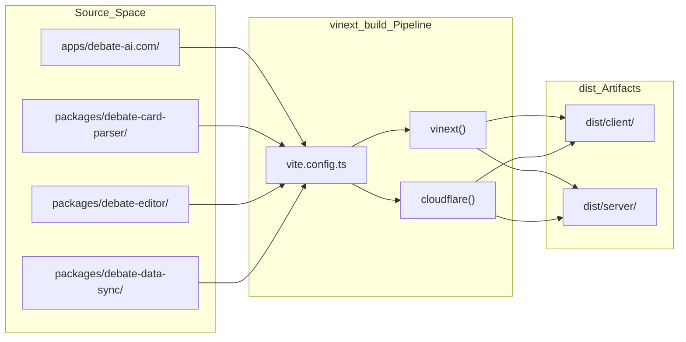
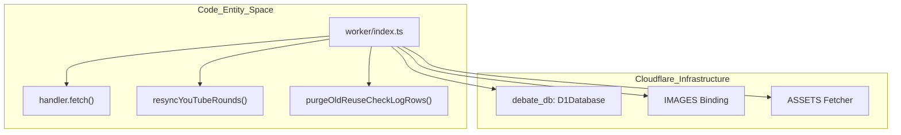

# Build System & Deployment (vinext + Cloudflare)
Relevant source files
- [.gitignore](https://github.com/debate/debate-ai.com/blob/34937310/.gitignore)
- [CHANGELOG.md](https://github.com/debate/debate-ai.com/blob/34937310/CHANGELOG.md?plain=1)
- [README.md](https://github.com/debate/debate-ai.com/blob/34937310/README.md?plain=1)
- [apps/debate-ai.com/app/settings/editor-panel/page.tsx](https://github.com/debate/debate-ai.com/blob/34937310/apps/debate-ai.com/app/settings/editor-panel/page.tsx)
- [apps/debate-ai.com/app/settings/page.tsx](https://github.com/debate/debate-ai.com/blob/34937310/apps/debate-ai.com/app/settings/page.tsx)
- [apps/debate-ai.com/lib/database/__tests__/d1-session.test.ts](https://github.com/debate/debate-ai.com/blob/34937310/apps/debate-ai.com/lib/database/__tests__/d1-session.test.ts)
- [apps/debate-ai.com/lib/database/d1-session.ts](https://github.com/debate/debate-ai.com/blob/34937310/apps/debate-ai.com/lib/database/d1-session.ts)
- [apps/debate-ai.com/lib/database/index.ts](https://github.com/debate/debate-ai.com/blob/34937310/apps/debate-ai.com/lib/database/index.ts)
- [apps/debate-ai.com/lib/stubs/canvas.ts](https://github.com/debate/debate-ai.com/blob/34937310/apps/debate-ai.com/lib/stubs/canvas.ts)
- [apps/debate-ai.com/next.config.mjs](https://github.com/debate/debate-ai.com/blob/34937310/apps/debate-ai.com/next.config.mjs)
- [apps/debate-ai.com/package.json](https://github.com/debate/debate-ai.com/blob/34937310/apps/debate-ai.com/package.json)
- [apps/debate-ai.com/scripts/d1-read-replication.sh](https://github.com/debate/debate-ai.com/blob/34937310/apps/debate-ai.com/scripts/d1-read-replication.sh)
- [apps/debate-ai.com/vite.config.ts](https://github.com/debate/debate-ai.com/blob/34937310/apps/debate-ai.com/vite.config.ts)
- [apps/debate-ai.com/vitest.config.ts](https://github.com/debate/debate-ai.com/blob/34937310/apps/debate-ai.com/vitest.config.ts)
- [apps/debate-ai.com/worker/index.ts](https://github.com/debate/debate-ai.com/blob/34937310/apps/debate-ai.com/worker/index.ts)
- [bun.lock](https://github.com/debate/debate-ai.com/blob/34937310/bun.lock)
- [docs/d1-read-replication.md](https://github.com/debate/debate-ai.com/blob/34937310/docs/d1-read-replication.md?plain=1)
- [package.json](https://github.com/debate/debate-ai.com/blob/34937310/package.json)

This section details the specialized build pipeline and deployment architecture of the Debate AI platform. The system leverages `vinext`, a high-performance build wrapper, to bridge Next.js-style development patterns with the Cloudflare Workers runtime, utilizing Vite and Rolldown for optimized bundling [apps/debate-ai.com/vite.config.ts1](https://github.com/debate/debate-ai.com/blob/34937310/apps/debate-ai.com/vite.config.ts#L1-L1)

## vinext Build Wrapper & Vite Pipeline

The application uses `vinext` as its primary build and development orchestrator [apps/debate-ai.com/vite.config.ts1](https://github.com/debate/debate-ai.com/blob/34937310/apps/debate-ai.com/vite.config.ts#L1-L1) It abstracts the complexities of compiling React Server Components (RSC) and Server-Side Rendering (SSR) logic into a format compatible with Cloudflare's V8 isolate environment.

### Bundling Pipeline

The pipeline uses `vite` as the underlying engine, configured via `defineConfig`[apps/debate-ai.com/vite.config.ts10](https://github.com/debate/debate-ai.com/blob/34937310/apps/debate-ai.com/vite.config.ts#L10-L10) Key aspects of the pipeline include:

- **RSC & SSR Separation**: Utilizing `@cloudflare/vite-plugin` to manage separate environments for Server Components (`rsc`) and traditional Server-Side Rendering (`ssr`) [apps/debate-ai.com/vite.config.ts25-27](https://github.com/debate/debate-ai.com/blob/34937310/apps/debate-ai.com/vite.config.ts#L25-L27)
- **Module Resolution & Aliasing**: Extensive use of path aliases to link monorepo packages directly into the build, specifically mapping `@/` to the application directory [apps/debate-ai.com/vite.config.ts31](https://github.com/debate/debate-ai.com/blob/34937310/apps/debate-ai.com/vite.config.ts#L31-L31) providing a stubbed `kysely-adapter` for `better-auth`[apps/debate-ai.com/vite.config.ts33](https://github.com/debate/debate-ai.com/blob/34937310/apps/debate-ai.com/vite.config.ts#L33-L33) resolving `canvas` to an in-repo no-op shim [apps/debate-ai.com/vite.config.ts39](https://github.com/debate/debate-ai.com/blob/34937310/apps/debate-ai.com/vite.config.ts#L39-L39) and mapping `@cardcutter/browser` to the local stub [apps/debate-ai.com/vite.config.ts48-51](https://github.com/debate/debate-ai.com/blob/34937310/apps/debate-ai.com/vite.config.ts#L48-L51)
- **Asset Handling**: `assetsInlineLimit` is set to `0` to prevent Vite from inlining small assets or SVGs as `data:` URIs [apps/debate-ai.com/vite.config.ts14-21](https://github.com/debate/debate-ai.com/blob/34937310/apps/debate-ai.com/vite.config.ts#L14-L21) This ensures the `vinext` image optimizer correctly identifies file extensions for routing through `/_vinext/image`[apps/debate-ai.com/vite.config.ts15-20](https://github.com/debate/debate-ai.com/blob/34937310/apps/debate-ai.com/vite.config.ts#L15-L20)
- **Dependency Deduplication**: Critical for maintaining a single instance of `react`, `react-dom`, and `prosemirror-*` modules across the editor shell and its dependencies [apps/debate-ai.com/vite.config.ts53-67](https://github.com/debate/debate-ai.com/blob/34937310/apps/debate-ai.com/vite.config.ts#L53-L67)
- **Workspace Package Bundling**: Because workspace packages like `reason-editor`, `debate-card-parser`, `debate-editor`, `debate-flow-ebb`, and `debate-round` ship as TypeScript source code, they are explicitly marked as `noExternal` in the SSR configuration to ensure they are bundled into the Worker rather than treated as external modules [apps/debate-ai.com/vite.config.ts72-90](https://github.com/debate/debate-ai.com/blob/34937310/apps/debate-ai.com/vite.config.ts#L72-L90)

### Build Artifact Flow

The following diagram illustrates the transformation from source code to the final `dist/` layout, bridging natural language concepts to concrete code entities.

**Source to Artifact Transformation**

**Sources:**[apps/debate-ai.com/vite.config.ts1-90](https://github.com/debate/debate-ai.com/blob/34937310/apps/debate-ai.com/vite.config.ts#L1-L90)

---

## Cloudflare Infrastructure Configuration & Worker Entrypoint

Deployment is coordinated through the custom worker entrypoint at `apps/debate-ai.com/worker/index.ts`, managing HTTP routing, image transformations, and scheduled background tasks [apps/debate-ai.com/worker/index.ts1-108](https://github.com/debate/debate-ai.com/blob/34937310/apps/debate-ai.com/worker/index.ts#L1-L108)

### Request Handling & Session Context

The `fetch` handler wraps requests in `runWithD1Session` and `runWithContext` to bind Cloudflare environment resources and pin D1 database read-replication sessions [apps/debate-ai.com/worker/index.ts60-86](https://github.com/debate/debate-ai.com/blob/34937310/apps/debate-ai.com/worker/index.ts#L60-L86) Image optimization requests directed to `/_vinext/image` are intercepted and handled via the Cloudflare `IMAGES` binding and static assets fetcher [apps/debate-ai.com/worker/index.ts70-80](https://github.com/debate/debate-ai.com/blob/34937310/apps/debate-ai.com/worker/index.ts#L70-L80) All other requests delegate to `handler.fetch(request, env, ctx)`[apps/debate-ai.com/worker/index.ts82](https://github.com/debate/debate-ai.com/blob/34937310/apps/debate-ai.com/worker/index.ts#L82-L82)

### Scheduled Triggers & Background Cron Jobs

The worker implements a `scheduled` event listener for cron triggers (such as weekly YouTube round updates) [apps/debate-ai.com/worker/index.ts88-107](https://github.com/debate/debate-ai.com/blob/34937310/apps/debate-ai.com/worker/index.ts#L88-L107) It invokes:

- `resyncYouTubeRounds(null)`: Keeps the video database and classification rules synchronized [apps/debate-ai.com/worker/index.ts98](https://github.com/debate/debate-ai.com/blob/34937310/apps/debate-ai.com/worker/index.ts#L98-L98)
- `purgeOldReuseCheckLogRows()`: Executes database maintenance to clear expired evidence reuse check logs [apps/debate-ai.com/worker/index.ts103](https://github.com/debate/debate-ai.com/blob/34937310/apps/debate-ai.com/worker/index.ts#L103-L103)

**Cloudflare Entity Mapping**

**Sources:**[apps/debate-ai.com/worker/index.ts1-108](https://github.com/debate/debate-ai.com/blob/34937310/apps/debate-ai.com/worker/index.ts#L1-L108)

---

## Artifact Layout & Offline Service Worker

The build script executes `vinext build` followed by service worker generation scripts to compile the application packages [apps/debate-ai.com/package.json9-12](https://github.com/debate/debate-ai.com/blob/34937310/apps/debate-ai.com/package.json#L9-L12)

### Client and Server Output Layout

- **`dist/client/`**: Houses browser-side assets, chunks, and static files served directly by the Cloudflare edge runtime via the `ASSETS` binding [apps/debate-ai.com/worker/index.ts17-74](https://github.com/debate/debate-ai.com/blob/34937310/apps/debate-ai.com/worker/index.ts#L17-L74)
- **`dist/server/`**: Contains the compiled Cloudflare Worker script and bundled workspace SSR artifacts [apps/debate-ai.com/vite.config.ts72-90](https://github.com/debate/debate-ai.com/blob/34937310/apps/debate-ai.com/vite.config.ts#L72-L90)

### Service Worker & PWA Build Steps

The build process invokes `node lib/offline-sw/generate.cjs` and Webpack to generate `public/service-worker.js`, which is subsequently copied to `dist/client/service-worker.js`[apps/debate-ai.com/package.json11-12](https://github.com/debate/debate-ai.com/blob/34937310/apps/debate-ai.com/package.json#L11-L12) This service worker provisions offline caching strategies (network-first for documents/APIs and cache-first for immutable assets).

| Artifact Path | Purpose | Configuration Reference |
| --- | --- | --- |
| `dist/client/` | Browser assets & hydration bundles | `apps/debate-ai.com/package.json` [line 12] |
| `dist/server/` | Worker runtime & bundled SSR modules | `apps/debate-ai.com/vite.config.ts` [line 72-90] |
| `worker/index.ts` | Main Worker Entrypoint & Cron Handler | `apps/debate-ai.com/worker/index.ts` [line 59-107] |

**Sources:**[apps/debate-ai.com/package.json9-16](https://github.com/debate/debate-ai.com/blob/34937310/apps/debate-ai.com/package.json#L9-L16)[apps/debate-ai.com/vite.config.ts72-90](https://github.com/debate/debate-ai.com/blob/34937310/apps/debate-ai.com/vite.config.ts#L72-L90)[apps/debate-ai.com/worker/index.ts59-107](https://github.com/debate/debate-ai.com/blob/34937310/apps/debate-ai.com/worker/index.ts#L59-L107)