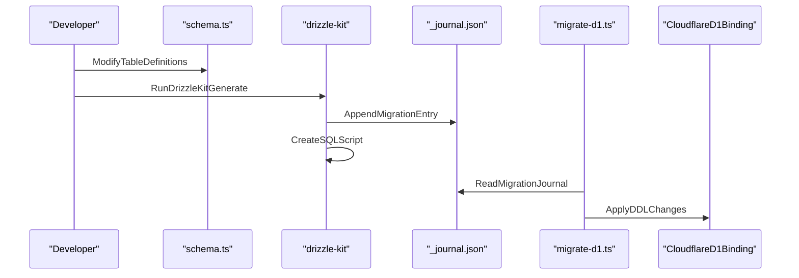

# Database & Persistence Layer
Relevant source files
- [apps/debate-ai.com/app/api/settings/route.ts](https://github.com/debate/debate-ai.com/blob/34937310/apps/debate-ai.com/app/api/settings/route.ts)
- [apps/debate-ai.com/components/settings/FavoriteToolsSettings.tsx](https://github.com/debate/debate-ai.com/blob/34937310/apps/debate-ai.com/components/settings/FavoriteToolsSettings.tsx)
- [apps/debate-ai.com/drizzle/meta/_journal.json](https://github.com/debate/debate-ai.com/blob/34937310/apps/debate-ai.com/drizzle/meta/_journal.json)
- [apps/debate-ai.com/lib/database/__tests__/d1-session.test.ts](https://github.com/debate/debate-ai.com/blob/34937310/apps/debate-ai.com/lib/database/__tests__/d1-session.test.ts)
- [apps/debate-ai.com/lib/database/__tests__/migration-sql.test.ts](https://github.com/debate/debate-ai.com/blob/34937310/apps/debate-ai.com/lib/database/__tests__/migration-sql.test.ts)
- [apps/debate-ai.com/lib/database/d1-session.ts](https://github.com/debate/debate-ai.com/blob/34937310/apps/debate-ai.com/lib/database/d1-session.ts)
- [apps/debate-ai.com/lib/database/index.ts](https://github.com/debate/debate-ai.com/blob/34937310/apps/debate-ai.com/lib/database/index.ts)
- [apps/debate-ai.com/lib/database/migration-sql.ts](https://github.com/debate/debate-ai.com/blob/34937310/apps/debate-ai.com/lib/database/migration-sql.ts)
- [apps/debate-ai.com/lib/database/schema.ts](https://github.com/debate/debate-ai.com/blob/34937310/apps/debate-ai.com/lib/database/schema.ts)
- [apps/debate-ai.com/lib/hooks/useFavoriteTools.ts](https://github.com/debate/debate-ai.com/blob/34937310/apps/debate-ai.com/lib/hooks/useFavoriteTools.ts)
- [apps/debate-ai.com/scripts/d1-read-replication.sh](https://github.com/debate/debate-ai.com/blob/34937310/apps/debate-ai.com/scripts/d1-read-replication.sh)
- [apps/debate-ai.com/scripts/migrate-d1.ts](https://github.com/debate/debate-ai.com/blob/34937310/apps/debate-ai.com/scripts/migrate-d1.ts)
- [apps/debate-ai.com/vitest.config.ts](https://github.com/debate/debate-ai.com/blob/34937310/apps/debate-ai.com/vitest.config.ts)
- [apps/debate-ai.com/worker/index.ts](https://github.com/debate/debate-ai.com/blob/34937310/apps/debate-ai.com/worker/index.ts)
- [docs/d1-read-replication.md](https://github.com/debate/debate-ai.com/blob/34937310/docs/d1-read-replication.md?plain=1)
- [docs/features/user-settings.md](https://github.com/debate/debate-ai.com/blob/34937310/docs/features/user-settings.md?plain=1)
- [packages/debate-round/src/panels/UserSettingsPanel.tsx](https://github.com/debate/debate-ai.com/blob/34937310/packages/debate-round/src/panels/UserSettingsPanel.tsx)
- [packages/debate-round/src/round/user-settings-client.ts](https://github.com/debate/debate-ai.com/blob/34937310/packages/debate-round/src/round/user-settings-client.ts)
- [packages/debate-round/src/state/favoriteTools.ts](https://github.com/debate/debate-ai.com/blob/34937310/packages/debate-round/src/state/favoriteTools.ts)
- [packages/debate-round/test/favoriteTools.test.ts](https://github.com/debate/debate-ai.com/blob/34937310/packages/debate-round/test/favoriteTools.test.ts)

The persistence layer of the Debate AI platform is built on **Drizzle ORM**, targeting **Cloudflare D1** (SQLite) for production and a local **libSQL** SQLite file for development (`apps/debate-ai.com/data/db.sqlite`). This architecture ensures low-latency data access at the edge while maintaining a strictly typed schema for authentication (`better-auth`), user session data, application documents, debate rounds, topic starters, user settings, cloud-saved entities, video metadata, and evidence reuse indexes.

## 1. Schema Definition & Entities

The database schema, defined in `apps/debate-ai.com/lib/database/schema.ts`, supports core authentication, editorial workflows, real-time round collaboration, and research crowdsourcing [apps/debate-ai.com/lib/database/schema.ts1-151](https://github.com/debate/debate-ai.com/blob/34937310/apps/debate-ai.com/lib/database/schema.ts#L1-L151)

### Core Tables Summary

| Table | Purpose | Key Columns |
| --- | --- | --- |
| `user` | Primary user identity record, including anonymous session tracking and better-auth plugin state. | `id`, `email`, `name`, `is_anonymous`[apps/debate-ai.com/lib/database/schema.ts4-20](https://github.com/debate/debate-ai.com/blob/34937310/apps/debate-ai.com/lib/database/schema.ts#L4-L20) |
| `session` | Active user sessions for authentication. | `id`, `user_id`, `token`, `expires_at`[apps/debate-ai.com/lib/database/schema.ts22-33](https://github.com/debate/debate-ai.com/blob/34937310/apps/debate-ai.com/lib/database/schema.ts#L22-L33) |
| `account` | OAuth and social provider links. | `id`, `user_id`, `account_id`, `provider_id`[apps/debate-ai.com/lib/database/schema.ts35-51](https://github.com/debate/debate-ai.com/blob/34937310/apps/debate-ai.com/lib/database/schema.ts#L35-L51) |
| `verification` | Tokens for magic-link email verification. | `id`, `identifier`, `value`, `expires_at`[apps/debate-ai.com/lib/database/schema.ts53-60](https://github.com/debate/debate-ai.com/blob/34937310/apps/debate-ai.com/lib/database/schema.ts#L53-L60) |
| `documents` | REASON editor document storage and folder structure. | `id`, `title`, `content`, `user_id`, `parent_id`, `is_folder`[apps/debate-ai.com/lib/database/schema.ts67-88](https://github.com/debate/debate-ai.com/blob/34937310/apps/debate-ai.com/lib/database/schema.ts#L67-L88) |
| `topic_starter_items` | Public admin-curated evidence packs and files. | `id`, `title`, `content`, `parent_id`, `is_folder`, `published`[apps/debate-ai.com/lib/database/schema.ts97-114](https://github.com/debate/debate-ai.com/blob/34937310/apps/debate-ai.com/lib/database/schema.ts#L97-L114) |
| `flow_sync_edits` | Live sync transport logs for debate round edits. | `id`, `flow_id`, `box_path`, `author_id`, `content`[apps/debate-ai.com/lib/database/schema.ts124-140](https://github.com/debate/debate-ai.com/blob/34937310/apps/debate-ai.com/lib/database/schema.ts#L124-L140) |
| `flow_presence_heartbeats` | Active collaborator presence tracking for rounds. | `flow_id`, `author_id`, `updated_at`[apps/debate-ai.com/lib/database/schema.ts144-151](https://github.com/debate/debate-ai.com/blob/34937310/apps/debate-ai.com/lib/database/schema.ts#L144-L151) |
| `user_settings` | Account-linked preferences (theme, fonts, presets, favorite tools). | `user_id`, `debate_style`, `font_size`, `color_theme`, `theme_mode`, `favorite_tools`[apps/debate-ai.com/app/api/settings/route.ts103-117](https://github.com/debate/debate-ai.com/blob/34937310/apps/debate-ai.com/app/api/settings/route.ts#L103-L117) |
| `saved_rounds` / `saved_flows` | Cloud persistence for exported rounds and flows. | `user_id`, `client_id`, `label`, `data`, `updated_at`[apps/debate-ai.com/app/api/rounds/[clientId]/route.ts:37-91]() |
| `evidence_reuse_index` | Tracking source URLs and citations for reuse checks. | `id`, `source_url`, `normalized_url`, `cite`, `arg_block`[apps/debate-ai.com/drizzle/meta/_journal.json1-250](https://github.com/debate/debate-ai.com/blob/34937310/apps/debate-ai.com/drizzle/meta/_journal.json#L1-L250) |

Sources: [apps/debate-ai.com/lib/database/schema.ts1-151](https://github.com/debate/debate-ai.com/blob/34937310/apps/debate-ai.com/lib/database/schema.ts#L1-L151)[apps/debate-ai.com/app/api/settings/route.ts103-117](https://github.com/debate/debate-ai.com/blob/34937310/apps/debate-ai.com/app/api/settings/route.ts#L103-L117)

### Code Entity Mapping

The following diagram bridges natural language feature spaces to specific Drizzle table and entity definitions in `schema.ts`.

**Diagram: Schema to Code Entity Mapping**

```

```

Sources: [apps/debate-ai.com/lib/database/schema.ts1-151](https://github.com/debate/debate-ai.com/blob/34937310/apps/debate-ai.com/lib/database/schema.ts#L1-L151)

---

## 2. Database Infrastructure, Context & D1 Read Replication

The application implements a dual-environment database initialization strategy via `lib/database/index.ts` alongside query session management and read replication support in `lib/database/d1-session.ts`.

### Context-Aware Initialization

The `getDB` function handles runtime environment detection:

1. **D1 Explicit Binding**: If a `D1Database` binding is passed directly, it initializes Drizzle with `drizzle-orm/d1`[apps/debate-ai.com/lib/database/index.ts11-16](https://github.com/debate/debate-ai.com/blob/34937310/apps/debate-ai.com/lib/database/index.ts#L11-L16)
2. **Cloudflare Worker Context**: It checks `getCloudflareContext()` for the `debate_db` environment binding [apps/debate-ai.com/lib/database/index.ts18-23](https://github.com/debate/debate-ai.com/blob/34937310/apps/debate-ai.com/lib/database/index.ts#L18-L23)
3. **Local libSQL Fallback**: If neither D1 target is present and local fallback is permitted, it loads `getLibSQLDB()` from `lib/database/libsql.ts`[apps/debate-ai.com/lib/database/index.ts25-33](https://github.com/debate/debate-ai.com/blob/34937310/apps/debate-ai.com/lib/database/index.ts#L25-L33)

### D1 Read Replication & Session Pining

In production Cloudflare Workers deployments, queries can leverage Cloudflare D1's read replication capabilities. The module `apps/debate-ai.com/lib/database/d1-session.ts` implements session pining (`runWithD1Session`) to ensure transactional consistency and causal ordering (session bookmarks) across requests, preventing read-your-writes anomalies when routing reads to replicas.

Sources: [apps/debate-ai.com/lib/database/index.ts1-34](https://github.com/debate/debate-ai.com/blob/34937310/apps/debate-ai.com/lib/database/index.ts#L1-L34)[apps/debate-ai.com/lib/database/d1-session.ts1-100](https://github.com/debate/debate-ai.com/blob/34937310/apps/debate-ai.com/lib/database/d1-session.ts#L1-L100)

---

## 3. Migration Workflow & Journal

Schema migrations are governed by `drizzle-kit`, tracking incremental DDL changes through a migration journal (`apps/debate-ai.com/drizzle/meta/_journal.json`) and automated migration runners (`apps/debate-ai.com/scripts/migrate-d1.ts` and `apps/debate-ai.com/lib/database/migration-sql.ts`).

### Migration Pipeline

Developers generate migrations locally using `drizzle-kit generate`, which outputs SQL migration scripts and snapshot metadata into the `drizzle/` directory.

**Diagram: Migration Data Flow**



Sources: [apps/debate-ai.com/drizzle/meta/_journal.json1-250](https://github.com/debate/debate-ai.com/blob/34937310/apps/debate-ai.com/drizzle/meta/_journal.json#L1-L250)[apps/debate-ai.com/lib/database/schema.ts1-151](https://github.com/debate/debate-ai.com/blob/34937310/apps/debate-ai.com/lib/database/schema.ts#L1-L151)[apps/debate-ai.com/scripts/migrate-d1.ts1-50](https://github.com/debate/debate-ai.com/blob/34937310/apps/debate-ai.com/scripts/migrate-d1.ts#L1-L50)

---

## 4. Schema Implementation Details & Cloud Persistence

### Account-Linked User Settings

User preferences such as theme mode, font size, debate style, and favorite tools are stored in the `user_settings` table [apps/debate-ai.com/app/api/settings/route.ts103-117](https://github.com/debate/debate-ai.com/blob/34937310/apps/debate-ai.com/app/api/settings/route.ts#L103-L117) The `/api/settings` route exposes `GET` and `PUT` handlers that normalize payloads using validation functions from `debate-round` and `debate-community` packages [apps/debate-ai.com/app/api/settings/route.ts62-101](https://github.com/debate/debate-ai.com/blob/34937310/apps/debate-ai.com/app/api/settings/route.ts#L62-L101) Clients such as `UserSettingsPanel` interact with this route while maintaining fallback state in local storage [packages/debate-round/src/panels/UserSettingsPanel.tsx106-160](https://github.com/debate/debate-ai.com/blob/34937310/packages/debate-round/src/panels/UserSettingsPanel.tsx#L106-L160)

### Saved Cloud Entities (Rounds & Flows)

Users can persist complex debate rounds and flows to the cloud via API routes such as `/api/rounds` and `/api/rounds/[clientId]`[apps/debate-ai.com/app/api/rounds/route.ts1-33](https://github.com/debate/debate-ai.com/blob/34937310/apps/debate-ai.com/app/api/rounds/route.ts#L1-L33)

- **GET**: Lists summaries or retrieves complete JSON payloads keyed by `clientId`.
- **PUT**: Validates incoming rounds, verifies byte limits, and upserts records using `onConflictDoUpdate`.
- **DELETE**: Removes saved round instances.

Sources: [apps/debate-ai.com/app/api/settings/route.ts1-170](https://github.com/debate/debate-ai.com/blob/34937310/apps/debate-ai.com/app/api/settings/route.ts#L1-L170)[apps/debate-ai.com/app/api/rounds/route.ts1-33](https://github.com/debate/debate-ai.com/blob/34937310/apps/debate-ai.com/app/api/rounds/route.ts#L1-L33)[packages/debate-round/src/panels/UserSettingsPanel.tsx1-160](https://github.com/debate/debate-ai.com/blob/34937310/packages/debate-round/src/panels/UserSettingsPanel.tsx#L1-L160)