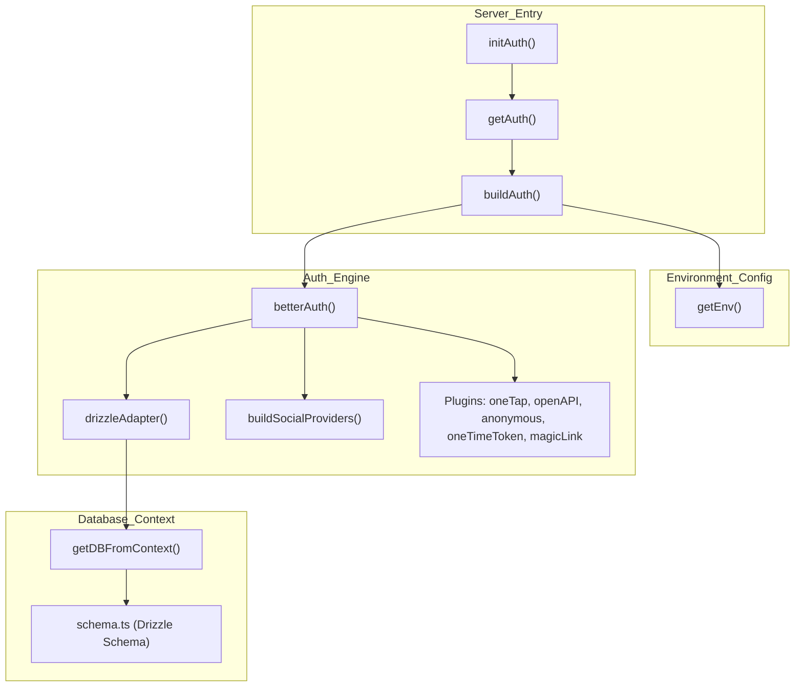
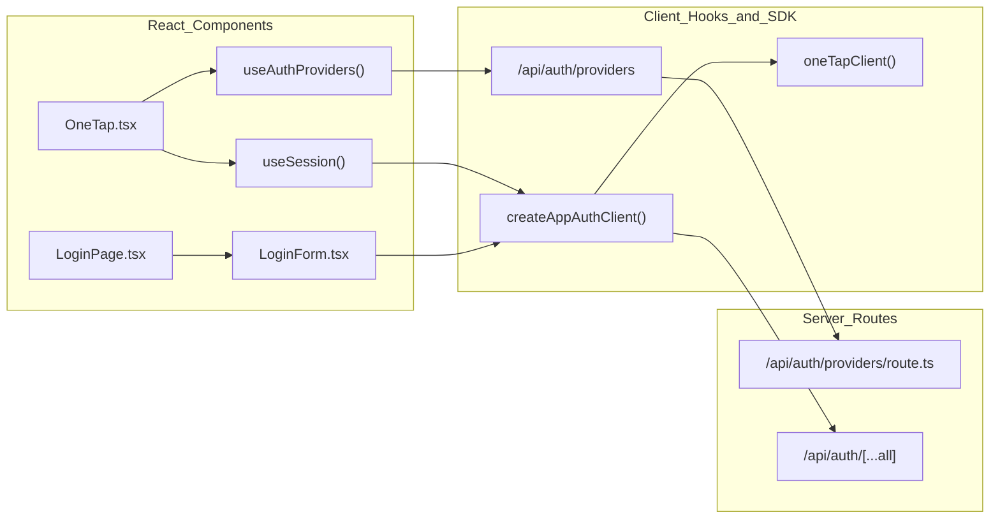

# Authentication & Session Management
Relevant source files
- [apps/debate-ai.com/app/api/auth/providers/route.ts](https://github.com/debate/debate-ai.com/blob/34937310/apps/debate-ai.com/app/api/auth/providers/route.ts)
- [apps/debate-ai.com/app/legal/privacy/page.tsx](https://github.com/debate/debate-ai.com/blob/34937310/apps/debate-ai.com/app/legal/privacy/page.tsx)
- [apps/debate-ai.com/app/legal/privacy/privacy.css](https://github.com/debate/debate-ai.com/blob/34937310/apps/debate-ai.com/app/legal/privacy/privacy.css)
- [apps/debate-ai.com/components/layout/LoginPage.tsx](https://github.com/debate/debate-ai.com/blob/34937310/apps/debate-ai.com/components/layout/LoginPage.tsx)
- [apps/debate-ai.com/components/layout/OneTap.tsx](https://github.com/debate/debate-ai.com/blob/34937310/apps/debate-ai.com/components/layout/OneTap.tsx)
- [apps/debate-ai.com/lib/auth/client.ts](https://github.com/debate/debate-ai.com/blob/34937310/apps/debate-ai.com/lib/auth/client.ts)
- [apps/debate-ai.com/lib/auth/index.ts](https://github.com/debate/debate-ai.com/blob/34937310/apps/debate-ai.com/lib/auth/index.ts)
- [apps/debate-ai.com/lib/config/site.ts](https://github.com/debate/debate-ai.com/blob/34937310/apps/debate-ai.com/lib/config/site.ts)
- [apps/debate-ai.com/lib/hooks/useAuthProviders.ts](https://github.com/debate/debate-ai.com/blob/34937310/apps/debate-ai.com/lib/hooks/useAuthProviders.ts)
- [packages/debate-videos/src/components/category-gallery/QuickLinksGrid.tsx](https://github.com/debate/debate-ai.com/blob/34937310/packages/debate-videos/src/components/category-gallery/QuickLinksGrid.tsx)

The Debate AI platform utilizes **better-auth** to manage user identities, session persistence, and multi-provider authentication. The system is designed to support seamless onboarding through social providers, passwordless "magic links" via Resend, and Google One Tap, while maintaining support for anonymous sessions, native app token handoffs, and dynamic runtime provider discovery via `/api/auth/providers`.

Sources: [apps/debate-ai.com/lib/auth/index.ts1-139](https://github.com/debate/debate-ai.com/blob/34937310/apps/debate-ai.com/lib/auth/index.ts#L1-L139)[apps/debate-ai.com/lib/auth/client.ts1-55](https://github.com/debate/debate-ai.com/blob/34937310/apps/debate-ai.com/lib/auth/client.ts#L1-L55)[apps/debate-ai.com/app/api/auth/providers/route.ts1-45](https://github.com/debate/debate-ai.com/blob/34937310/apps/debate-ai.com/app/api/auth/providers/route.ts#L1-L45)

## 1. Core Authentication Architecture & Server Setup

The authentication backend is configured via `getAuth` and `buildAuth`[apps/debate-ai.com/lib/auth/index.ts38-149](https://github.com/debate/debate-ai.com/blob/34937310/apps/debate-ai.com/lib/auth/index.ts#L38-L149) It sets up a `betterAuth` instance using a Drizzle ORM SQLite adapter targeting Cloudflare D1 or local SQLite [apps/debate-ai.com/lib/auth/index.ts76-79](https://github.com/debate/debate-ai.com/blob/34937310/apps/debate-ai.com/lib/auth/index.ts#L76-L79)

### Configuration Parameters

- **Base URL**: Derived from `BETTER_AUTH_URL`, `NEXT_PUBLIC_APP_URL`, or `NEXT_PUBLIC_BASE_URL`[apps/debate-ai.com/lib/auth/index.ts45-50](https://github.com/debate/debate-ai.com/blob/34937310/apps/debate-ai.com/lib/auth/index.ts#L45-L50) If unset, `better-auth` dynamically resolves the origin from the incoming request.
- **Trusted Origins**: Aggregates production origins, wildcards (`https://*.debate-ai.com`, `https://*.workers.dev`, `https://*.vercel.app`), local development hosts (`http://localhost:3000`), and any extra origins defined in `BETTER_AUTH_TRUSTED_ORIGINS`[apps/debate-ai.com/lib/auth/index.ts56-70](https://github.com/debate/debate-ai.com/blob/34937310/apps/debate-ai.com/lib/auth/index.ts#L56-L70)
- **Account Linking**: Enabled with `requireLocalEmailVerified: false` and `trustedProviders: ["google", "discord", "linkedin"]`[apps/debate-ai.com/lib/auth/index.ts93-98](https://github.com/debate/debate-ai.com/blob/34937310/apps/debate-ai.com/lib/auth/index.ts#L93-L98) This ensures users signing in across multiple methods sharing an email address are correctly merged into a single user account even if an OAuth provider (such as Discord) does not guarantee an out-of-band verified email flag.

Title: Server-Side Authentication Architecture

Sources: [apps/debate-ai.com/lib/auth/index.ts38-149](https://github.com/debate/debate-ai.com/blob/34937310/apps/debate-ai.com/lib/auth/index.ts#L38-L149)[apps/debate-ai.com/lib/database/schema.ts1-60](https://github.com/debate/debate-ai.com/blob/34937310/apps/debate-ai.com/lib/database/schema.ts#L1-L60)

---

## 2. Authentication Providers, Social Logins & /api/auth/providers

The platform supports social authentication, passwordless email links, and anonymous sessions. Providers are dynamically registered via `buildSocialProviders()` only when both client ID and client secret environment variables are present [apps/debate-ai.com/lib/auth/index.ts18-36](https://github.com/debate/debate-ai.com/blob/34937310/apps/debate-ai.com/lib/auth/index.ts#L18-L36)

### Social Providers & Endpoints

- **Google**: Configured via `GOOGLE_CLIENT_ID` and `GOOGLE_CLIENT_SECRET`[apps/debate-ai.com/lib/auth/index.ts22](https://github.com/debate/debate-ai.com/blob/34937310/apps/debate-ai.com/lib/auth/index.ts#L22-L22)
- **Discord**: Configured via `AUTH_DISCORD_ID` and `AUTH_DISCORD_SECRET`[apps/debate-ai.com/lib/auth/index.ts23](https://github.com/debate/debate-ai.com/blob/34937310/apps/debate-ai.com/lib/auth/index.ts#L23-L23)
- **LinkedIn**: Configured via `AUTH_LINKEDIN_ID` and `AUTH_LINKEDIN_SECRET`[apps/debate-ai.com/lib/auth/index.ts24](https://github.com/debate/debate-ai.com/blob/34937310/apps/debate-ai.com/lib/auth/index.ts#L24-L24)
- **Providers Route (`/api/auth/providers`)**: Inspects Worker environment variables to verify usable credentials (filtering out setup placeholders), returning an array of available provider identifiers and the public Google client ID needed by One Tap without exposing private secrets [apps/debate-ai.com/app/api/auth/providers/route.ts13-45](https://github.com/debate/debate-ai.com/blob/34937310/apps/debate-ai.com/app/api/auth/providers/route.ts#L13-L45)

### Magic Link, Anonymous Sessions & One-Time Tokens

- **Magic Link Plugin**: Configured with a 5-minute expiration (`expiresIn: 300`) and `disableSignUp: false`[apps/debate-ai.com/lib/auth/index.ts119-136](https://github.com/debate/debate-ai.com/blob/34937310/apps/debate-ai.com/lib/auth/index.ts#L119-L136) Outbound emails are sent via `Resend` (`RESEND_API_KEY` or `AUTH_RESEND_KEY`), falling back to a console log in development environments [apps/debate-ai.com/lib/auth/index.ts121-125](https://github.com/debate/debate-ai.com/blob/34937310/apps/debate-ai.com/lib/auth/index.ts#L121-L125)
- **Anonymous Sessions Plugin**: Enabled via `anonymous()` to allow guest users to interact with features before formally linking an account [apps/debate-ai.com/lib/auth/index.ts107](https://github.com/debate/debate-ai.com/blob/34937310/apps/debate-ai.com/lib/auth/index.ts#L107-L107)
- **One-Time Token Plugin**: Used by the Tauri native wrapper (`packages/native-wrapper`) to securely pass sessions established in the system browser into the desktop/mobile webview via hashed tokens with a 5-second expiration (`expiresIn: 5`) [apps/debate-ai.com/lib/auth/index.ts108-118](https://github.com/debate/debate-ai.com/blob/34937310/apps/debate-ai.com/lib/auth/index.ts#L108-L118)

Sources: [apps/debate-ai.com/lib/auth/index.ts17-36](https://github.com/debate/debate-ai.com/blob/34937310/apps/debate-ai.com/lib/auth/index.ts#L17-L36)[apps/debate-ai.com/lib/auth/index.ts107-136](https://github.com/debate/debate-ai.com/blob/34937310/apps/debate-ai.com/lib/auth/index.ts#L107-L136)[apps/debate-ai.com/app/api/auth/providers/route.ts1-45](https://github.com/debate/debate-ai.com/blob/34937310/apps/debate-ai.com/app/api/auth/providers/route.ts#L1-L45)

---

## 3. Client Authentication SDK, Providers Hook & Google One Tap

Client-side interaction relies on `createAppAuthClient` and specialized React hooks to manage network transport and UI prompts.

### Client Configuration & Providers Hook

- **Base URL Resolution**: `createAppAuthClient` targets `window.location.origin` when running in the browser, falling back to `NEXT_PUBLIC_BASE_URL` or `APP_ORIGIN` during SSR [apps/debate-ai.com/lib/auth/client.ts22-26](https://github.com/debate/debate-ai.com/blob/34937310/apps/debate-ai.com/lib/auth/client.ts#L22-L26)
- **`useAuthProviders`**: Fetches runtime provider configuration from `/api/auth/providers`, sharing a single deduplicated `pending` promise across all mounting UI components (such as the login page, dialogs, and One Tap) [apps/debate-ai.com/lib/hooks/useAuthProviders.ts33-56](https://github.com/debate/debate-ai.com/blob/34937310/apps/debate-ai.com/lib/hooks/useAuthProviders.ts#L33-L56)

### Google One Tap Component

The `OneTap` component mounts in the root layout to prompt unauthenticated users across page navigations [apps/debate-ai.com/components/layout/OneTap.tsx48-58](https://github.com/debate/debate-ai.com/blob/34937310/apps/debate-ai.com/components/layout/OneTap.tsx#L48-L58)

- **Client-side Initialization**: Because the Google Client ID is a Worker secret, `useAuthProviders()` fetches it asynchronously [apps/debate-ai.com/lib/hooks/useAuthProviders.ts17-21](https://github.com/debate/debate-ai.com/blob/34937310/apps/debate-ai.com/lib/hooks/useAuthProviders.ts#L17-L21) Once resolved, `createAppAuthClient(googleClientId)` initializes the One Tap client [apps/debate-ai.com/components/layout/OneTap.tsx77-80](https://github.com/debate/debate-ai.com/blob/34937310/apps/debate-ai.com/components/layout/OneTap.tsx#L77-L80)
- **Retryable Skip Reasons**: To prevent spamming users after a permanent dismissal, prompts are throttled per page load using `RETRYABLE_SKIP_REASONS` (`auto_cancel`, `tap_outside`, `issuing_failed`) [apps/debate-ai.com/components/layout/OneTap.tsx18-22](https://github.com/debate/debate-ai.com/blob/34937310/apps/debate-ai.com/components/layout/OneTap.tsx#L18-L22) Non-retryable dismissals settle the prompt for the remainder of the session [apps/debate-ai.com/components/layout/OneTap.tsx131-140](https://github.com/debate/debate-ai.com/blob/34937310/apps/debate-ai.com/components/layout/OneTap.tsx#L131-L140)

Title: Client-Side Authentication & One Tap Data Flow

Sources: [apps/debate-ai.com/components/layout/OneTap.tsx48-157](https://github.com/debate/debate-ai.com/blob/34937310/apps/debate-ai.com/components/layout/OneTap.tsx#L48-L157)[apps/debate-ai.com/lib/hooks/useAuthProviders.ts33-81](https://github.com/debate/debate-ai.com/blob/34937310/apps/debate-ai.com/lib/hooks/useAuthProviders.ts#L33-L81)[apps/debate-ai.com/lib/auth/client.ts39-55](https://github.com/debate/debate-ai.com/blob/34937310/apps/debate-ai.com/lib/auth/client.ts#L39-L55)[apps/debate-ai.com/app/api/auth/providers/route.ts1-45](https://github.com/debate/debate-ai.com/blob/34937310/apps/debate-ai.com/app/api/auth/providers/route.ts#L1-L45)

---

## 4. LoginPage & Site Configuration

### Full-Screen Login Page (`/login`)

The `LoginPage` component provides a dedicated authentication route centered around a card layout [apps/debate-ai.com/components/layout/LoginPage.tsx18-56](https://github.com/debate/debate-ai.com/blob/34937310/apps/debate-ai.com/components/layout/LoginPage.tsx#L18-L56) It reads the `callbackURL` search parameter (defaulting to `"/"`) to determine where visitors should land upon successful authentication [apps/debate-ai.com/components/layout/LoginPage.tsx23](https://github.com/debate/debate-ai.com/blob/34937310/apps/debate-ai.com/components/layout/LoginPage.tsx#L23-L23)

### Site Configuration & Debug Constants

Key environment and site constants are centralized in `lib/config/site.ts` and `lib/debug-log.ts`:

- `APP_ORIGIN`: Canonical production origin (`https://debate-ai.com`) [apps/debate-ai.com/lib/config/site.ts8](https://github.com/debate/debate-ai.com/blob/34937310/apps/debate-ai.com/lib/config/site.ts#L8-L8)
- `NEXT_PUBLIC_BASE_URL`: Build-time or runtime base URL fallback [apps/debate-ai.com/lib/config/site.ts14-15](https://github.com/debate/debate-ai.com/blob/34937310/apps/debate-ai.com/lib/config/site.ts#L14-L15)
- `NEXT_PUBLIC_GOOGLE_CLIENT_ID`: Public Google client ID exposed to the browser bundle [apps/debate-ai.com/lib/config/site.ts22-23](https://github.com/debate/debate-ai.com/blob/34937310/apps/debate-ai.com/lib/config/site.ts#L22-L23)
- `NATIVE_DEEP_LINK_SCHEME`: Custom URL scheme (`debateai`) registered with the OS for native desktop/mobile wrapper deep linking [apps/debate-ai.com/lib/config/site.ts25-29](https://github.com/debate/debate-ai.com/blob/34937310/apps/debate-ai.com/lib/config/site.ts#L25-L29)
- `isDebugLoggingEnabled()`: Opt-in client-side debug logging enabled via `localStorage.setItem("debate-ai:debug", "1")` or Vite development mode [apps/debate-ai.com/lib/debug-log.ts40-48](https://github.com/debate/debate-ai.com/blob/34937310/apps/debate-ai.com/lib/debug-log.ts#L40-L48)

Sources: [apps/debate-ai.com/components/layout/LoginPage.tsx18-56](https://github.com/debate/debate-ai.com/blob/34937310/apps/debate-ai.com/components/layout/LoginPage.tsx#L18-L56)[apps/debate-ai.com/lib/config/site.ts1-29](https://github.com/debate/debate-ai.com/blob/34937310/apps/debate-ai.com/lib/config/site.ts#L1-L29)