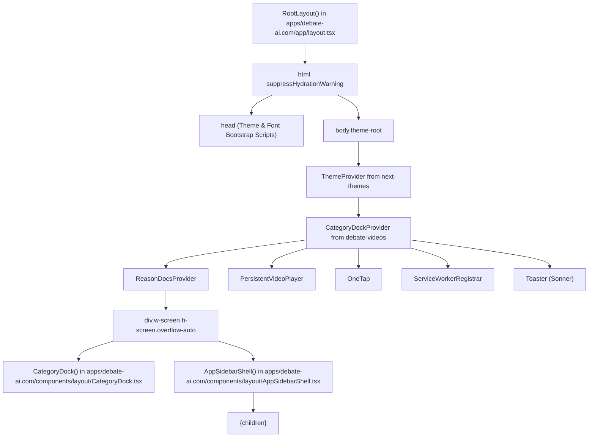
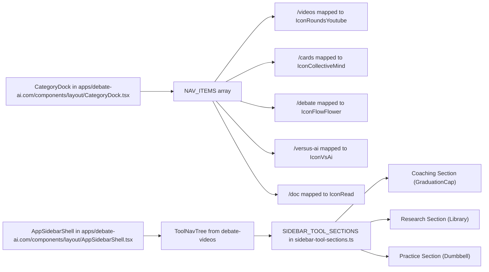
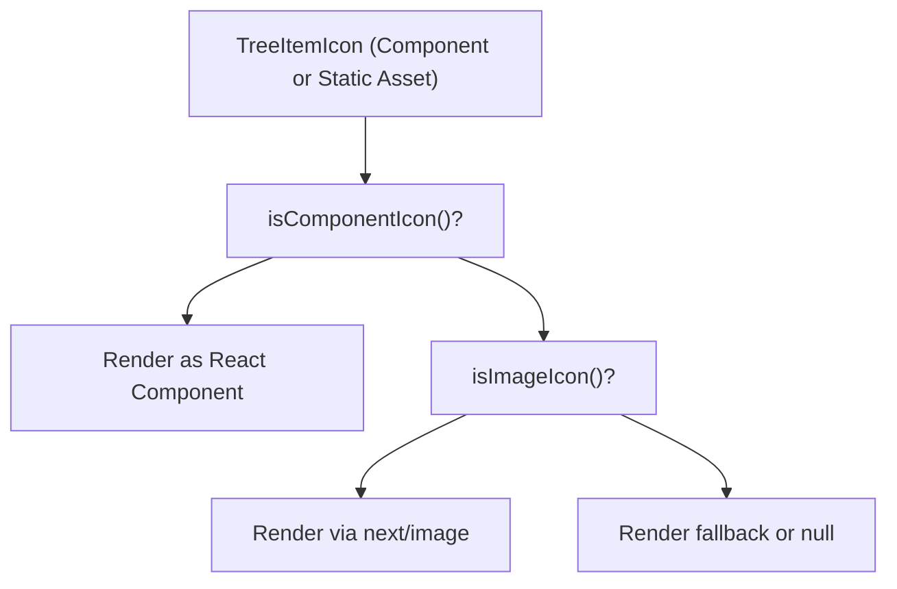

# Frontend Layout & Navigation
Relevant source files
- [TODO.md](https://github.com/debate/debate-ai.com/blob/34937310/TODO.md?plain=1)
- [apps/debate-ai.com/app/cards/layout.tsx](https://github.com/debate/debate-ai.com/blob/34937310/apps/debate-ai.com/app/cards/layout.tsx)
- [apps/debate-ai.com/app/doc/ResearchAgentEmbed.tsx](https://github.com/debate/debate-ai.com/blob/34937310/apps/debate-ai.com/app/doc/ResearchAgentEmbed.tsx)
- [apps/debate-ai.com/app/doc/page.tsx](https://github.com/debate/debate-ai.com/blob/34937310/apps/debate-ai.com/app/doc/page.tsx)
- [apps/debate-ai.com/app/globals.css](https://github.com/debate/debate-ai.com/blob/34937310/apps/debate-ai.com/app/globals.css)
- [apps/debate-ai.com/app/layout.tsx](https://github.com/debate/debate-ai.com/blob/34937310/apps/debate-ai.com/app/layout.tsx)
- [apps/debate-ai.com/components/layout/AppSidebarShell.tsx](https://github.com/debate/debate-ai.com/blob/34937310/apps/debate-ai.com/components/layout/AppSidebarShell.tsx)
- [apps/debate-ai.com/components/layout/CategoryDock.tsx](https://github.com/debate/debate-ai.com/blob/34937310/apps/debate-ai.com/components/layout/CategoryDock.tsx)
- [apps/debate-ai.com/components/theme-dropdown.tsx](https://github.com/debate/debate-ai.com/blob/34937310/apps/debate-ai.com/components/theme-dropdown.tsx)
- [apps/debate-ai.com/drizzle/0009_add_theme_settings.sql](https://github.com/debate/debate-ai.com/blob/34937310/apps/debate-ai.com/drizzle/0009_add_theme_settings.sql)
- [apps/debate-ai.com/drizzle/meta/0009_snapshot.json](https://github.com/debate/debate-ai.com/blob/34937310/apps/debate-ai.com/drizzle/meta/0009_snapshot.json)
- [apps/debate-ai.com/lib/offline-sw/app-file-list.ts](https://github.com/debate/debate-ai.com/blob/34937310/apps/debate-ai.com/lib/offline-sw/app-file-list.ts)
- [apps/debate-ai.com/lib/offline-sw/version.ts](https://github.com/debate/debate-ai.com/blob/34937310/apps/debate-ai.com/lib/offline-sw/version.ts)
- [apps/debate-ai.com/lib/sidebar-routes.ts](https://github.com/debate/debate-ai.com/blob/34937310/apps/debate-ai.com/lib/sidebar-routes.ts)
- [apps/debate-ai.com/lib/ui/layout/dock.tsx](https://github.com/debate/debate-ai.com/blob/34937310/apps/debate-ai.com/lib/ui/layout/dock.tsx)
- [apps/debate-ai.com/public/service-worker.js](https://github.com/debate/debate-ai.com/blob/34937310/apps/debate-ai.com/public/service-worker.js)
- [docs/features/app-nav-dock.md](https://github.com/debate/debate-ai.com/blob/34937310/docs/features/app-nav-dock.md?plain=1)
- [packages/debate-round/README.md](https://github.com/debate/debate-ai.com/blob/34937310/packages/debate-round/README.md?plain=1)
- [packages/debate-round/src/index.ts](https://github.com/debate/debate-ai.com/blob/34937310/packages/debate-round/src/index.ts)
- [packages/debate-round/src/state/themeSettings.ts](https://github.com/debate/debate-ai.com/blob/34937310/packages/debate-round/src/state/themeSettings.ts)
- [packages/debate-ui/src/layout/dock.tsx](https://github.com/debate/debate-ai.com/blob/34937310/packages/debate-ui/src/layout/dock.tsx)
- [packages/debate-ui/test/dock.test.tsx](https://github.com/debate/debate-ai.com/blob/34937310/packages/debate-ui/test/dock.test.tsx)
- [packages/debate-videos/src/components/category-gallery/ToolNavTree.tsx](https://github.com/debate/debate-ai.com/blob/34937310/packages/debate-videos/src/components/category-gallery/ToolNavTree.tsx)
- [packages/debate-videos/src/components/category-gallery/VideoSidebarTree.tsx](https://github.com/debate/debate-ai.com/blob/34937310/packages/debate-videos/src/components/category-gallery/VideoSidebarTree.tsx)
- [packages/debate-videos/src/components/category-gallery/icon-kind.ts](https://github.com/debate/debate-ai.com/blob/34937310/packages/debate-videos/src/components/category-gallery/icon-kind.ts)
- [packages/debate-videos/src/components/category-gallery/sidebar-routes.ts](https://github.com/debate/debate-ai.com/blob/34937310/packages/debate-videos/src/components/category-gallery/sidebar-routes.ts)
- [packages/debate-videos/src/components/category-gallery/sidebar-tool-sections.ts](https://github.com/debate/debate-ai.com/blob/34937310/packages/debate-videos/src/components/category-gallery/sidebar-tool-sections.ts)
- [packages/debate-videos/src/index.ts](https://github.com/debate/debate-ai.com/blob/34937310/packages/debate-videos/src/index.ts)
- [packages/debate-videos/test/icon-kind.test.ts](https://github.com/debate/debate-ai.com/blob/34937310/packages/debate-videos/test/icon-kind.test.ts)

This page covers the core frontend layout, navigation structures, sidebar shells, icon resolution, design tokens, and theme management of the Debate AI platform. It details how `RootLayout` initializes global providers and font bootstrapping [apps/debate-ai.com/app/layout.tsx33-92](https://github.com/debate/debate-ai.com/blob/34937310/apps/debate-ai.com/app/layout.tsx#L33-L92) how `CategoryDock` handles desktop navigation and settings menus [apps/debate-ai.com/components/layout/CategoryDock.tsx1-174](https://github.com/debate/debate-ai.com/blob/34937310/apps/debate-ai.com/components/layout/CategoryDock.tsx#L1-L174) how `AppSidebarShell` and `VideoSidebarTree` maintain persistent navigation across generic tool routes [apps/debate-ai.com/components/layout/AppSidebarShell.tsx29-54](https://github.com/debate/debate-ai.com/blob/34937310/apps/debate-ai.com/components/layout/AppSidebarShell.tsx#L29-L54) and how design tokens and themes are styled via `globals.css` and `themes.css`.

---

## Root Layout & Global Providers

The root layout (`RootLayout` in `apps/debate-ai.com/app/layout.tsx`) acts as the entry point for the application's React tree. It injects global stylesheets, configures font bootstrapping scripts in the `<head>`, and wraps children in client providers [apps/debate-ai.com/app/layout.tsx33-92](https://github.com/debate/debate-ai.com/blob/34937310/apps/debate-ai.com/app/layout.tsx#L33-L92)

Title: Root Layout & App Shell Entity Map



Sources: [apps/debate-ai.com/app/layout.tsx33-92](https://github.com/debate/debate-ai.com/blob/34937310/apps/debate-ai.com/app/layout.tsx#L33-L92)

### Component Hierarchy & Responsibilities

| Component / Provider | Role | Source |
| --- | --- | --- |
| `ThemeProvider` | Manages class-based theme injection (`light`/`dark` mode) via `next-themes`. | [apps/debate-ai.com/app/layout.tsx70](https://github.com/debate/debate-ai.com/blob/34937310/apps/debate-ai.com/app/layout.tsx#L70-L70) |
| `CategoryDockProvider` | React context managing dock state, expanded views, and category filtering. | [apps/debate-ai.com/app/layout.tsx71](https://github.com/debate/debate-ai.com/blob/34937310/apps/debate-ai.com/app/layout.tsx#L71-L71) |
| `ReasonDocsProvider` | Manages REASON docs tree and open tabs shared between sidebar and editor pages. | [apps/debate-ai.com/app/layout.tsx75](https://github.com/debate/debate-ai.com/blob/34937310/apps/debate-ai.com/app/layout.tsx#L75-L75) |
| `CategoryDock` | Floating dock navigation for primary routes and settings dropdown. | [apps/debate-ai.com/app/layout.tsx77](https://github.com/debate/debate-ai.com/blob/34937310/apps/debate-ai.com/app/layout.tsx#L77-L77) |
| `AppSidebarShell` | Persistent sidebar wrapper for tool routes containing tree nav and embedded dock. | [apps/debate-ai.com/app/layout.tsx78](https://github.com/debate/debate-ai.com/blob/34937310/apps/debate-ai.com/app/layout.tsx#L78-L78) |
| `PersistentVideoPlayer` | Global YouTube/video playback container persisting across route changes. | [apps/debate-ai.com/app/layout.tsx81](https://github.com/debate/debate-ai.com/blob/34937310/apps/debate-ai.com/app/layout.tsx#L81-L81) |
| `OneTap` | Google One Tap authentication helper component. | [apps/debate-ai.com/app/layout.tsx82](https://github.com/debate/debate-ai.com/blob/34937310/apps/debate-ai.com/app/layout.tsx#L82-L82) |
| `ServiceWorkerRegistrar` | Registers the PWA service worker for offline asset caching. | [apps/debate-ai.com/app/layout.tsx83](https://github.com/debate/debate-ai.com/blob/34937310/apps/debate-ai.com/app/layout.tsx#L83-L83) |
| `Toaster` | Global notification system (Sonner) for auth and system toasts. | [apps/debate-ai.com/app/layout.tsx86](https://github.com/debate/debate-ai.com/blob/34937310/apps/debate-ai.com/app/layout.tsx#L86-L86) |

Sources: [apps/debate-ai.com/app/layout.tsx33-92](https://github.com/debate/debate-ai.com/blob/34937310/apps/debate-ai.com/app/layout.tsx#L33-L92)

---

## CategoryDock Navigation

The `CategoryDock` component (`apps/debate-ai.com/components/layout/CategoryDock.tsx`) acts as the primary navigation bar and command center, supporting floating desktop behavior, embedded sidebar modes, and mobile bottom-bar adaptation [apps/debate-ai.com/components/layout/CategoryDock.tsx1-46](https://github.com/debate/debate-ai.com/blob/34937310/apps/debate-ai.com/components/layout/CategoryDock.tsx#L1-L46)

### Navigation Routes (`NAV_ITEMS`)

The dock surfaces core modules through distinct navigation items defined in `NAV_ITEMS`:

- **Videos** (`/videos`): LEARN module, video grids, and lectures (`IconRoundsYoutube`) [apps/debate-ai.com/components/layout/CategoryDock.tsx66](https://github.com/debate/debate-ai.com/blob/34937310/apps/debate-ai.com/components/layout/CategoryDock.tsx#L66-L66)
- **Shared** (`/cards`): CARDS module, crowd-sourced evidence search (`IconCollectiveMind`) [apps/debate-ai.com/components/layout/CategoryDock.tsx67](https://github.com/debate/debate-ai.com/blob/34937310/apps/debate-ai.com/components/layout/CategoryDock.tsx#L67-L67)
- **Debate** (`/debate`): FIAT module, live round management and flow spreadsheet (`IconFlowFlower`) [apps/debate-ai.com/components/layout/CategoryDock.tsx68](https://github.com/debate/debate-ai.com/blob/34937310/apps/debate-ai.com/components/layout/CategoryDock.tsx#L68-L68)
- **Practice vs AI** (`/versus-ai`): Timed rounds against AI opponent personas (`IconVsAi`) [apps/debate-ai.com/components/layout/CategoryDock.tsx71](https://github.com/debate/debate-ai.com/blob/34937310/apps/debate-ai.com/components/layout/CategoryDock.tsx#L71-L71)
- **Docs** (`/doc`): REASON module, CardMirror research editor and documentation (`IconRead`) [apps/debate-ai.com/components/layout/CategoryDock.tsx72](https://github.com/debate/debate-ai.com/blob/34937310/apps/debate-ai.com/components/layout/CategoryDock.tsx#L72-L72)

### Embedded & Mobile Adaptation

- **Embedded Mode:** When rendered inside `AppSidebarShell` with `embedded`, the dock adapts its container constraints to fit neatly within the sidebar column [apps/debate-ai.com/components/layout/AppSidebarShell.tsx35-50](https://github.com/debate/debate-ai.com/blob/34937310/apps/debate-ai.com/components/layout/AppSidebarShell.tsx#L35-L50)
- **Mobile Mode:** The container enforces bottom padding (`pb-[70px] md:pb-0`) in `RootLayout` to prevent the fixed dock from obscuring content on mobile viewports [apps/debate-ai.com/app/layout.tsx76](https://github.com/debate/debate-ai.com/blob/34937310/apps/debate-ai.com/app/layout.tsx#L76-L76)
- **Settings & Auth Integration:** The settings menu dropdown hosts site links (`SITE_LINKS`), debate resource shortcuts (`DEBATE_LINKS`), theme selections via `useThemeState()`, and an `AccountSection` managing user session state (`useSession()` and `authClient.signOut()`) [apps/debate-ai.com/components/layout/CategoryDock.tsx48-154](https://github.com/debate/debate-ai.com/blob/34937310/apps/debate-ai.com/components/layout/CategoryDock.tsx#L48-L154)

Sources: [apps/debate-ai.com/components/layout/CategoryDock.tsx1-174](https://github.com/debate/debate-ai.com/blob/34937310/apps/debate-ai.com/components/layout/CategoryDock.tsx#L1-L174)[apps/debate-ai.com/app/layout.tsx76](https://github.com/debate/debate-ai.com/blob/34937310/apps/debate-ai.com/app/layout.tsx#L76-L76)[apps/debate-ai.com/components/layout/AppSidebarShell.tsx35-50](https://github.com/debate/debate-ai.com/blob/34937310/apps/debate-ai.com/components/layout/AppSidebarShell.tsx#L35-L50)

---

## AppSidebarShell & VideoSidebarTree

To prevent navigation from disappearing when navigating away from `/videos` into sub-tools, `AppSidebarShell` wraps generic tool sidebar routes [apps/debate-ai.com/components/layout/AppSidebarShell.tsx29-54](https://github.com/debate/debate-ai.com/blob/34937310/apps/debate-ai.com/components/layout/AppSidebarShell.tsx#L29-L54) It checks `isGenericToolSidebarRoute(pathname)`, and if matched, renders a fixed left sidebar containing an embedded `CategoryDock`, `ReasonDocsSidebarPanels`, `ToolNavTree`, and `ToolSidebarFooter`[apps/debate-ai.com/components/layout/AppSidebarShell.tsx35-50](https://github.com/debate/debate-ai.com/blob/34937310/apps/debate-ai.com/components/layout/AppSidebarShell.tsx#L35-L50)

Title: Navigation & Sidebar Component Mapping



Sources: [apps/debate-ai.com/components/layout/AppSidebarShell.tsx29-54](https://github.com/debate/debate-ai.com/blob/34937310/apps/debate-ai.com/components/layout/AppSidebarShell.tsx#L29-L54)[packages/debate-videos/src/components/category-gallery/sidebar-tool-sections.ts54-114](https://github.com/debate/debate-ai.com/blob/34937310/packages/debate-videos/src/components/category-gallery/sidebar-tool-sections.ts#L54-L114)

---

## Sidebar Tool Sections & App Links

The Coaching, Research, and Practice tool sections rendered in the video and app sidebars are defined in `sidebar-tool-sections.ts`[packages/debate-videos/src/components/category-gallery/sidebar-tool-sections.ts1-114](https://github.com/debate/debate-ai.com/blob/34937310/packages/debate-videos/src/components/category-gallery/sidebar-tool-sections.ts#L1-L114) They mirror the entries of the `/tools` catalog (`app/tools/tool-groups.ts`) and provide direct links to tools such as:

- **Coaching:** Coach Workspace, AI Coach Mode, Coaching Programs, Coach Materials, Response-Outcome Charts, Team Rankings [packages/debate-videos/src/components/category-gallery/sidebar-tool-sections.ts55-70](https://github.com/debate/debate-ai.com/blob/34937310/packages/debate-videos/src/components/category-gallery/sidebar-tool-sections.ts#L55-L70)
- **Research:** Research Workspace, Community Research Hub, Evidence Library, Argument Library, Topic Coverage, Collaboration Prep Room, Reason Editor [packages/debate-videos/src/components/category-gallery/sidebar-tool-sections.ts71-90](https://github.com/debate/debate-ai.com/blob/34937310/packages/debate-videos/src/components/category-gallery/sidebar-tool-sections.ts#L71-L90)
- **Practice:** Practice Round Simulator, Debate Versus AI, Practice Drills, Pre-Round Briefings, Scout-to-Strategy, Opponent Team Profiles, Judge Profiles [packages/debate-videos/src/components/category-gallery/sidebar-tool-sections.ts91-114](https://github.com/debate/debate-ai.com/blob/34937310/packages/debate-videos/src/components/category-gallery/sidebar-tool-sections.ts#L91-L114)

Sources: [packages/debate-videos/src/components/category-gallery/sidebar-tool-sections.ts1-114](https://github.com/debate/debate-ai.com/blob/34937310/packages/debate-videos/src/components/category-gallery/sidebar-tool-sections.ts#L1-L114)

---

## Icon Type Guards

To support heterogeneous icon definitions (Lucide React component references versus imported static SVG/PNG asset paths), `debate-videos` utilizes strict runtime type guards in `tree-item-icon.ts`[packages/debate-videos/src/components/category-gallery/tree-item-icon.ts1-30](https://github.com/debate/debate-ai.com/blob/34937310/packages/debate-videos/src/components/category-gallery/tree-item-icon.ts#L1-L30)

- `isComponentIcon(icon)`: Checks if the icon reference is a valid React component function or forwardRef object.
- `isImageIcon(icon)`: Checks if the icon reference is a static image import object (`{ src, height, width }`) or a string URL.

Title: Icon Resolution Flow



Sources: [packages/debate-videos/src/components/category-gallery/tree-item-icon.ts1-30](https://github.com/debate/debate-ai.com/blob/34937310/packages/debate-videos/src/components/category-gallery/tree-item-icon.ts#L1-L30)

---

## Design Tokens, Globals.css & Themes.css

Styling across `apps/debate-ai.com` and monorepo packages is coordinated through `apps/debate-ai.com/app/globals.css`, which imports Tailwind CSS, utility animations, `themes.css`, and scoped styles from `debate-flow`[apps/debate-ai.com/app/globals.css1-18](https://github.com/debate/debate-ai.com/blob/34937310/apps/debate-ai.com/app/globals.css#L1-L18)

### Package Source Registration

Because monorepo package components reside in symlinked `packages/*` directories outside the immediate Next.js app app-dir tree, Tailwind v4 `@source` directives explicitly register them so their class names are included in the generated stylesheet:

```
@source "../../../packages/debate-ui/src";
@source "../../../packages/debate-card-search/src";
@source "../../../packages/debate-timer/src";
@source "../../../packages/debate-videos/src";
@source "../../../packages/debate-round/src";
@source "../../../packages/debate-editor/src";
@source "../../../packages/debate-flow/src";
```

Sources: [apps/debate-ai.com/app/globals.css21-29](https://github.com/debate/debate-ai.com/blob/34937310/apps/debate-ai.com/app/globals.css#L21-L29)

### CSS Design Tokens (`:root` and `.dark`)

The token system defines layout measurements (`--column-width`, `--sidebar-width`, `--button-size`), semantic color layers (`--background`, `--foreground`, `--card`, `--primary`, `--muted`, `--border`), and custom accent hues (`--accent-hue`, `--accent-secondary-hue`) [apps/debate-ai.com/app/globals.css72-165](https://github.com/debate/debate-ai.com/blob/34937310/apps/debate-ai.com/app/globals.css#L72-L165)

Sources: [apps/debate-ai.com/app/globals.css1-165](https://github.com/debate/debate-ai.com/blob/34937310/apps/debate-ai.com/app/globals.css#L1-L165)

---

## Theme Dropdown & User Settings

The theme dropdown (`components/theme-dropdown.tsx`) allows users to select custom color schemes and preview themes in real time. It works in conjunction with `UserSettingsPanel` and backend sync routes (`/api/settings`) to persist user preferences across sessions and synchronize theme classes on the `<html>` root element.

Sources: [apps/debate-ai.com/components/theme-dropdown.tsx1-80](https://github.com/debate/debate-ai.com/blob/34937310/apps/debate-ai.com/components/theme-dropdown.tsx#L1-L80)[apps/debate-ai.com/components/layout/CategoryDock.tsx168](https://github.com/debate/debate-ai.com/blob/34937310/apps/debate-ai.com/components/layout/CategoryDock.tsx#L168-L168)