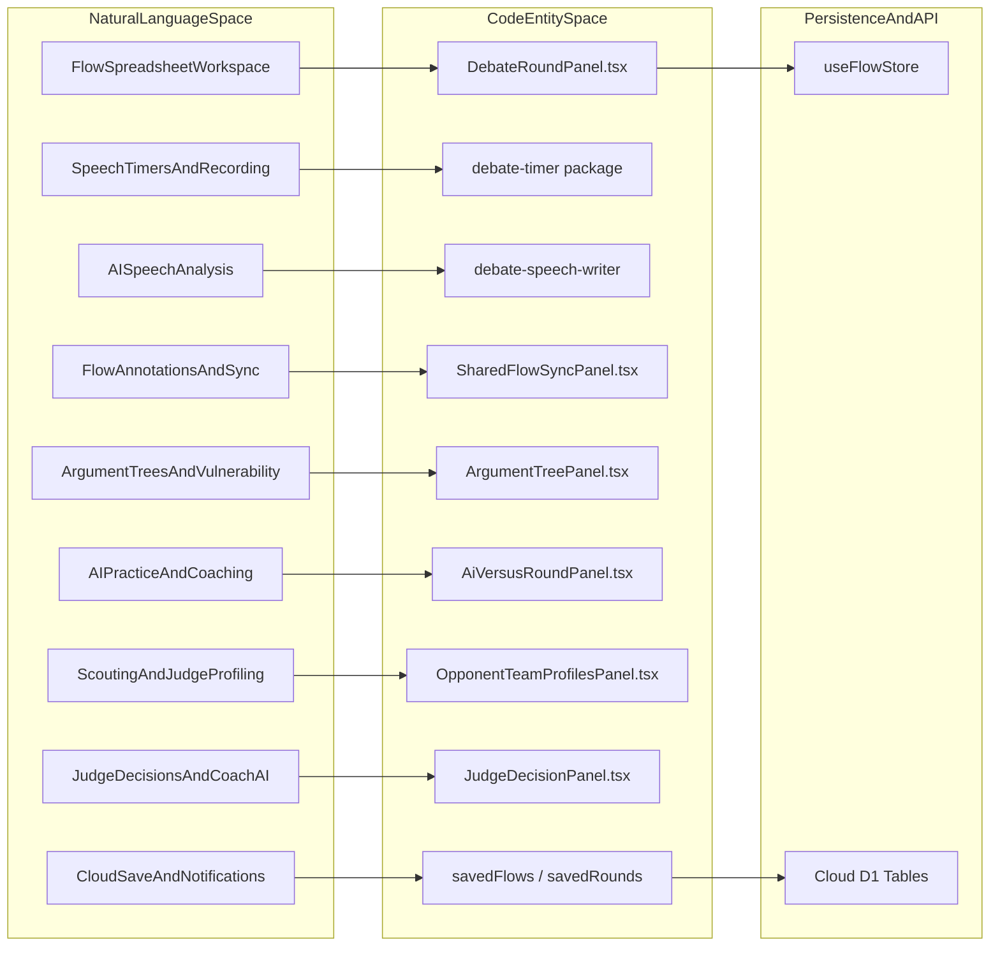
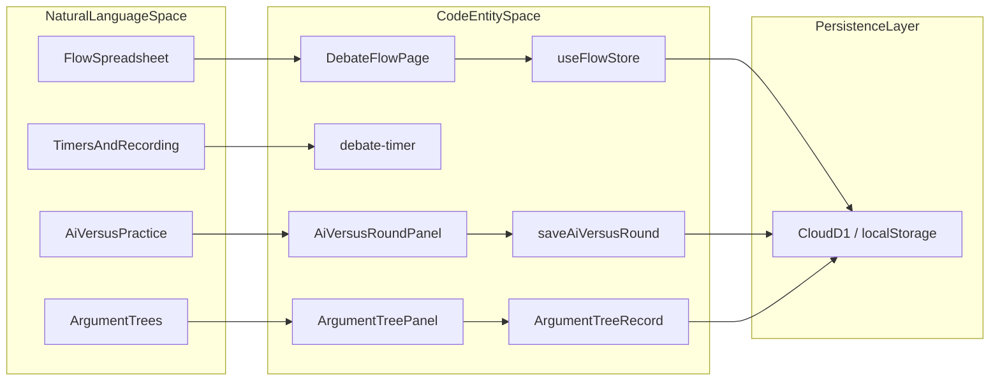
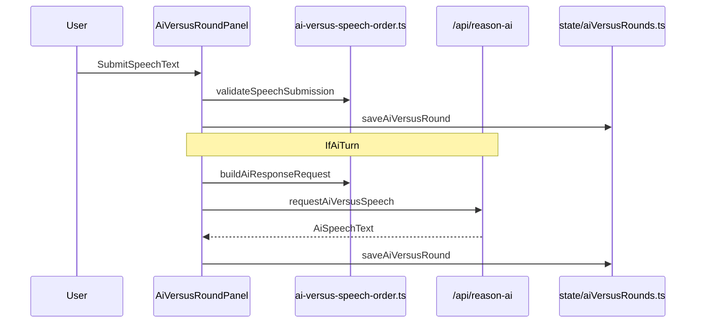

# FIAT Module — Debate Round Management
Relevant source files
- [TODO.md](https://github.com/debate/debate-ai.com/blob/34937310/TODO.md?plain=1)
- [apps/debate-ai.com/components/coach/CoachHub.tsx](https://github.com/debate/debate-ai.com/blob/34937310/apps/debate-ai.com/components/coach/CoachHub.tsx)
- [apps/debate-ai.com/components/layout/CategoryDock.tsx](https://github.com/debate/debate-ai.com/blob/34937310/apps/debate-ai.com/components/layout/CategoryDock.tsx)
- [apps/debate-ai.com/lib/offline-sw/app-file-list.ts](https://github.com/debate/debate-ai.com/blob/34937310/apps/debate-ai.com/lib/offline-sw/app-file-list.ts)
- [apps/debate-ai.com/lib/offline-sw/version.ts](https://github.com/debate/debate-ai.com/blob/34937310/apps/debate-ai.com/lib/offline-sw/version.ts)
- [apps/debate-ai.com/public/service-worker.js](https://github.com/debate/debate-ai.com/blob/34937310/apps/debate-ai.com/public/service-worker.js)
- [packages/debate-round/README.md](https://github.com/debate/debate-ai.com/blob/34937310/packages/debate-round/README.md?plain=1)
- [packages/debate-round/src/flow/shared-flow-sync.ts](https://github.com/debate/debate-ai.com/blob/34937310/packages/debate-round/src/flow/shared-flow-sync.ts)
- [packages/debate-round/src/index.ts](https://github.com/debate/debate-ai.com/blob/34937310/packages/debate-round/src/index.ts)
- [packages/debate-round/src/panels/SharedFlowSyncPanel.tsx](https://github.com/debate/debate-ai.com/blob/34937310/packages/debate-round/src/panels/SharedFlowSyncPanel.tsx)
- [packages/debate-round/src/panels/index.ts](https://github.com/debate/debate-ai.com/blob/34937310/packages/debate-round/src/panels/index.ts)
- [packages/debate-round/test/panels.test.tsx](https://github.com/debate/debate-ai.com/blob/34937310/packages/debate-round/test/panels.test.tsx)
- [packages/debate-round/test/shared-flow-sync.test.ts](https://github.com/debate/debate-ai.com/blob/34937310/packages/debate-round/test/shared-flow-sync.test.ts)

The **FIAT (Forum for Issue Analysis on Topics)** module is the central engine for live competitive debate management within the platform [packages/debate-round/README.md1-5](https://github.com/debate/debate-ai.com/blob/34937310/packages/debate-round/README.md?plain=1#L1-L5) It provides a comprehensive suite of tools designed to facilitate the execution of a debate round, from the initial pairing to the final judge decision [packages/debate-round/README.md1-5](https://github.com/debate/debate-ai.com/blob/34937310/packages/debate-round/README.md?plain=1#L1-L5) FIAT integrates real-time collaboration, specialized spreadsheet layouts for note-taking ("flowing"), and AI-driven analysis to assist debaters and coaches in tracking complex arguments [packages/debate-round/README.md1-5](https://github.com/debate/debate-ai.com/blob/34937310/packages/debate-round/README.md?plain=1#L1-L5)

For detailed information on each sub-system, refer to the respective child sections linked below.

## System Overview & Architecture

FIAT is accessible via the `/debate` route and is primarily implemented in the `packages/debate-round` workspace [packages/debate-round/README.md1-5](https://github.com/debate/debate-ai.com/blob/34937310/packages/debate-round/README.md?plain=1#L1-L5) The module bridges the gap between traditional pen-and-paper flowing and digital efficiency by offering format-specific tools for Policy, Lincoln-Douglas (LD), Public Forum (PF), and NDT debate styles [packages/debate-round/README.md1-5](https://github.com/debate/debate-ai.com/blob/34937310/packages/debate-round/README.md?plain=1#L1-L5)

Sources: [packages/debate-round/src/panels/DebateRoundPanel.tsx1-15](https://github.com/debate/debate-ai.com/blob/34937310/packages/debate-round/src/panels/DebateRoundPanel.tsx#L1-L15)[packages/debate-round/README.md1-82](https://github.com/debate/debate-ai.com/blob/34937310/packages/debate-round/README.md?plain=1#L1-L82)

---

## 3.1 Flow Spreadsheet & Round Workspace Layout

The Flow Spreadsheet serves as the primary interface for the FIAT live round workspace [packages/debate-round/README.md1-5](https://github.com/debate/debate-ai.com/blob/34937310/packages/debate-round/README.md?plain=1#L1-L5) Built around modular components like `DebateRoundPanel`[packages/debate-round/src/panels/index.ts8](https://github.com/debate/debate-ai.com/blob/34937310/packages/debate-round/src/panels/index.ts#L8-L8)`FlowPageSidebar`, `FlowMainContent`, and `SpeechHeaderBar`, it integrates `AgGridReact` for multi-column note-taking [packages/debate-round/README.md1-5](https://github.com/debate/debate-ai.com/blob/34937310/packages/debate-round/README.md?plain=1#L1-L5) State is managed via `useDebateFlowState` and Zustand stores to support split views, format columns, and rapid keyboard navigation.

For details, see [Flow Spreadsheet & Round Workspace Layout](/debate/debate-ai.com/3.1-flow-spreadsheet-and-round-workspace-layout).

Sources: [packages/debate-round/README.md1-6](https://github.com/debate/debate-ai.com/blob/34937310/packages/debate-round/README.md?plain=1#L1-L6)[packages/debate-round/src/panels/index.ts8](https://github.com/debate/debate-ai.com/blob/34937310/packages/debate-round/src/panels/index.ts#L8-L8)

## 3.2 Speech Timers, Word Counts & Recording

The timing and recording subsystem ensures strict adherence to competitive time limits using the standalone `debate-timer` package [packages/debate-round/README.md78-81](https://github.com/debate/debate-ai.com/blob/34937310/packages/debate-round/README.md?plain=1#L78-L81) It provides speech and prep timers, `TimerProgressRing`, per-format time allocations, `SpeechWordCounter`, and built-in microphone transcription hooks [packages/debate-round/README.md40-44](https://github.com/debate/debate-ai.com/blob/34937310/packages/debate-round/README.md?plain=1#L40-L44) Word-count-only rounds are supported via round state persistence through `/api/word-count-rounds`[packages/debate-round/README.md40-44](https://github.com/debate/debate-ai.com/blob/34937310/packages/debate-round/README.md?plain=1#L40-L44)

For details, see [Speech Timers, Word Counts & Recording](/debate/debate-ai.com/3.2-speech-timers-word-counts-and-recording).

Sources: [packages/debate-round/README.md40-44](https://github.com/debate/debate-ai.com/blob/34937310/packages/debate-round/README.md?plain=1#L40-L44)[packages/debate-round/README.md78-81](https://github.com/debate/debate-ai.com/blob/34937310/packages/debate-round/README.md?plain=1#L78-L81)

## 3.3 AI Speech Analysis Prompts (debate-speech-writer)

Leveraging the `debate-speech-writer` prompt library, this sub-system automates speech-to-flow translation, judge decision generation, flaw finding, research outline construction, and batch quote analysis [packages/debate-round/README.md1-82](https://github.com/debate/debate-ai.com/blob/34937310/packages/debate-round/README.md?plain=1#L1-L82) It interacts with backend proxies including `/api/reason-ai` and `/api/analyze` to generate strategic AI feedback [CoachHub.tsx40-56](https://github.com/debate/debate-ai.com/blob/34937310/CoachHub.tsx#L40-L56)

For details, see [AI Speech Analysis Prompts (debate-speech-writer)](/debate/debate-ai.com/3.3-ai-speech-analysis-prompts-(debate-speech-writer)).

Sources: [packages/debate-round/README.md1-82](https://github.com/debate/debate-ai.com/blob/34937310/packages/debate-round/README.md?plain=1#L1-L82)[CoachHub.tsx40-56](https://github.com/debate/debate-ai.com/blob/34937310/CoachHub.tsx#L40-L56)

## 3.4 Flow Annotations, Edit Log & Shared Sync

The collaboration suite handles video timestamp attachments on spreadsheet cells, change auditing via `FlowEditLogPanel`[CoachHub.tsx32-40](https://github.com/debate/debate-ai.com/blob/34937310/CoachHub.tsx#L32-L40) and concurrent merge conflict resolution through `SharedFlowSyncPanel`[packages/debate-round/src/panels/SharedFlowSyncPanel.tsx1-7](https://github.com/debate/debate-ai.com/blob/34937310/packages/debate-round/src/panels/SharedFlowSyncPanel.tsx#L1-L7) It tracks real-time collaborator presence via background heartbeats communicating with `/api/flow-sync` and `/api/flow-presence`[SharedFlowSyncPanel.tsx146-152](https://github.com/debate/debate-ai.com/blob/34937310/SharedFlowSyncPanel.tsx#L146-L152)

For details, see [Flow Annotations, Edit Log & Shared Sync](/debate/debate-ai.com/3.4-flow-annotations-edit-log-and-shared-sync).

Sources: [packages/debate-round/README.md71-77](https://github.com/debate/debate-ai.com/blob/34937310/packages/debate-round/README.md?plain=1#L71-L77)[packages/debate-round/src/panels/SharedFlowSyncPanel.tsx1-152](https://github.com/debate/debate-ai.com/blob/34937310/packages/debate-round/src/panels/SharedFlowSyncPanel.tsx#L1-L152)

## 3.5 Argument Tree, Summaries & Vulnerability Charts

To distill complex rounds into actionable intelligence, `ArgumentTreePanel` provides a filterable, heading-grouped outline with customizable presets [packages/debate-round/README.md45-50](https://github.com/debate/debate-ai.com/blob/34937310/packages/debate-round/README.md?plain=1#L45-L50) This is complemented by transcript summaries (`flow-transcript-summary`) and response-outcome vulnerability charts (`VulnerabilityChartsPanel`) that calculate argument exposure risks per side [packages/debate-round/README.md34-69](https://github.com/debate/debate-ai.com/blob/34937310/packages/debate-round/README.md?plain=1#L34-L69)

For details, see [Argument Tree, Summaries & Vulnerability Charts](/debate/debate-ai.com/3.5-argument-tree-summaries-and-vulnerability-charts).

Sources: [packages/debate-round/README.md34-70](https://github.com/debate/debate-ai.com/blob/34937310/packages/debate-round/README.md?plain=1#L34-L70)

## 3.6 AI Practice, Drills & Coaching Features

Debaters can train autonomously using the practice tool suite, which includes `AiVersusRoundPanel` for full rounds against AI opponents, practice round simulators with customizable opponent personas, automated drill generators, pre-round briefings, and squad coaching programs [packages/debate-round/README.md20-63](https://github.com/debate/debate-ai.com/blob/34937310/packages/debate-round/README.md?plain=1#L20-L63)

For details, see [AI Practice, Drills & Coaching Features](/debate/debate-ai.com/3.6-ai-practice-drills-and-coaching-features).

Sources: [packages/debate-round/README.md20-63](https://github.com/debate/debate-ai.com/blob/34937310/packages/debate-round/README.md?plain=1#L20-L63)

## 3.7 Scouting & Judge Profiling

The scouting infrastructure aggregates historical tournament data and records via `OpponentTeamProfilesPanel` and `JudgeProfilesPanel`[packages/debate-round/README.md15-18](https://github.com/debate/debate-ai.com/blob/34937310/packages/debate-round/README.md?plain=1#L15-L18) It supports CSV round record imports, paradigm comparison utilities, and team scouting rosters to inform pre-round strategy [packages/debate-round/README.md15-18](https://github.com/debate/debate-ai.com/blob/34937310/packages/debate-round/README.md?plain=1#L15-L18)

For details, see [Scouting & Judge Profiling](/debate/debate-ai.com/3.7-scouting-and-judge-profiling).

Sources: [packages/debate-round/README.md15-18](https://github.com/debate/debate-ai.com/blob/34937310/packages/debate-round/README.md?plain=1#L15-L18)

## 3.8 Judge Decisions & Team Coach AI

Judge decision simulations are provided by `JudgeDecisionPanel` for Affirmative/Negative decision outlines [CoachHub.tsx48](https://github.com/debate/debate-ai.com/blob/34937310/CoachHub.tsx#L48-L48) Additionally, the `CoachHub` interface [CoachHub.tsx171-172](https://github.com/debate/debate-ai.com/blob/34937310/CoachHub.tsx#L171-L172) integrates a RAG-grounded Team Coach AI that evaluates `CoachMaterials`[CoachHub.tsx56](https://github.com/debate/debate-ai.com/blob/34937310/CoachHub.tsx#L56-L56) utilizing versioning, review gating, and relevance scoring.

For details, see [Judge Decisions & Team Coach AI](/debate/debate-ai.com/3.8-judge-decisions-and-team-coach-ai).

Sources: [CoachHub.tsx48-56](https://github.com/debate/debate-ai.com/blob/34937310/CoachHub.tsx#L48-L56)[CoachHub.tsx171-172](https://github.com/debate/debate-ai.com/blob/34937310/CoachHub.tsx#L171-L172)

## 3.9 Round & Flow Cloud Save, Invites and Notifications

Round metadata, custom flows, and bulk saves are synchronized with cloud persistence layers (`savedFlows`, `savedRounds`, and cloud library stores) [packages/debate-round/src/index.ts14-23](https://github.com/debate/debate-ai.com/blob/34937310/packages/debate-round/src/index.ts#L14-L23) Navigation and restoration are handled via `FlowHistoryDialog` and API endpoints (`/api/flows`, `/api/rounds`), alongside user search invites and the platform notifications feed [packages/debate-round/src/index.ts25-26](https://github.com/debate/debate-ai.com/blob/34937310/packages/debate-round/src/index.ts#L25-L26)

For details, see [Round & Flow Cloud Save, Invites and Notifications](/debate/debate-ai.com/3.9-round-and-flow-cloud-save-invites-and-notifications).

Sources: [packages/debate-round/src/index.ts14-26](https://github.com/debate/debate-ai.com/blob/34937310/packages/debate-round/src/index.ts#L14-L26)

---

## Component Mapping & Data Flow Diagrams

### FIAT Component Entity Mapping

Sources: [packages/debate-round/src/panels/DebateRoundPanel.tsx1-15](https://github.com/debate/debate-ai.com/blob/34937310/packages/debate-round/src/panels/DebateRoundPanel.tsx#L1-L15)[packages/debate-round/README.md1-82](https://github.com/debate/debate-ai.com/blob/34937310/packages/debate-round/README.md?plain=1#L1-L82)

### AI Versus Submission Sequence

Sources: [packages/debate-round/src/panels/DebateRoundPanel.tsx31-45](https://github.com/debate/debate-ai.com/blob/34937310/packages/debate-round/src/panels/DebateRoundPanel.tsx#L31-L45)[packages/debate-round/README.md51-56](https://github.com/debate/debate-ai.com/blob/34937310/packages/debate-round/README.md?plain=1#L51-L56)