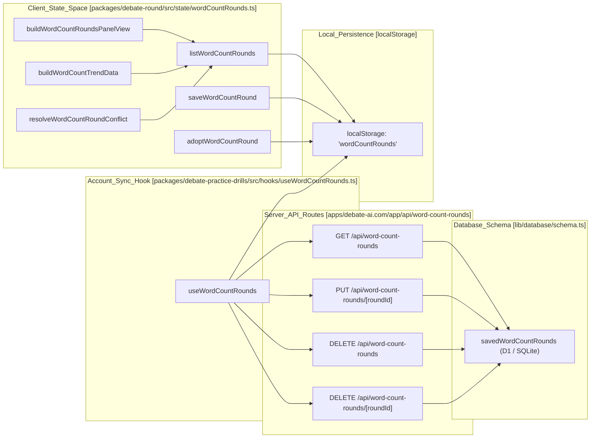
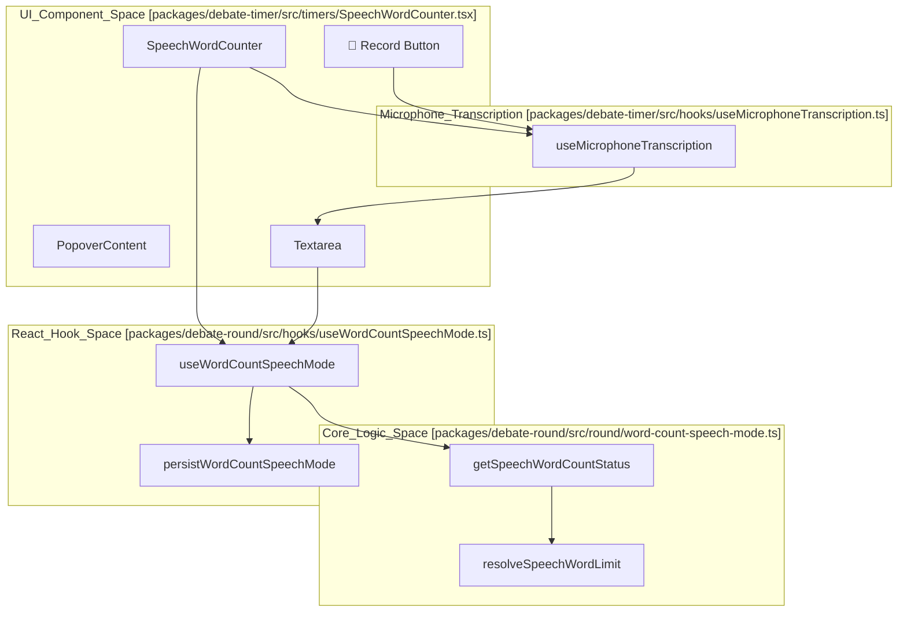

# Speech Timers, Word Counts & Recording
Relevant source files
- [apps/debate-ai.com/app/api/word-count-rounds/[roundId]/route.ts](apps/debate-ai.com/app/api/word-count-rounds/%5BroundId%5D/route.ts)
- [apps/debate-ai.com/app/api/word-count-rounds/route.ts](https://github.com/debate/debate-ai.com/blob/34937310/apps/debate-ai.com/app/api/word-count-rounds/route.ts)
- [apps/debate-ai.com/drizzle/0015_magenta_microbe.sql](https://github.com/debate/debate-ai.com/blob/34937310/apps/debate-ai.com/drizzle/0015_magenta_microbe.sql)
- [apps/debate-ai.com/drizzle/meta/0015_snapshot.json](https://github.com/debate/debate-ai.com/blob/34937310/apps/debate-ai.com/drizzle/meta/0015_snapshot.json)
- [docs/features/word-count-rounds.md](https://github.com/debate/debate-ai.com/blob/34937310/docs/features/word-count-rounds.md?plain=1)
- [packages/debate-practice-drills/src/hooks/useWordCountRounds.ts](https://github.com/debate/debate-ai.com/blob/34937310/packages/debate-practice-drills/src/hooks/useWordCountRounds.ts)
- [packages/debate-round/src/state/wordCountRounds.ts](https://github.com/debate/debate-ai.com/blob/34937310/packages/debate-round/src/state/wordCountRounds.ts)
- [packages/debate-round/test/wordCountRounds.test.ts](https://github.com/debate/debate-ai.com/blob/34937310/packages/debate-round/test/wordCountRounds.test.ts)
- [packages/debate-timer/src/hooks/useMicrophoneTranscription.ts](https://github.com/debate/debate-ai.com/blob/34937310/packages/debate-timer/src/hooks/useMicrophoneTranscription.ts)
- [packages/debate-timer/src/timers/SpeechWordCounter.tsx](https://github.com/debate/debate-ai.com/blob/34937310/packages/debate-timer/src/timers/SpeechWordCounter.tsx)
- [packages/debate-timer/src/timers/microphone-transcription.ts](https://github.com/debate/debate-ai.com/blob/34937310/packages/debate-timer/src/timers/microphone-transcription.ts)
- [packages/debate-timer/test/TimerProgressRing.test.tsx](https://github.com/debate/debate-ai.com/blob/34937310/packages/debate-timer/test/TimerProgressRing.test.tsx)
- [packages/debate-timer/test/microphone-transcription.test.ts](https://github.com/debate/debate-ai.com/blob/34937310/packages/debate-timer/test/microphone-transcription.test.ts)

The `debate-timer` package and `debate-round` integration provide a comprehensive timing, word-counting, and speech recording subsystem for live debate rounds and asynchronous practice. This page covers format-specific speech allocations, preparation timing, the `SpeechWordCounter` component, word-count round state management, cloud persistence via `/api/word-count-rounds`, and microphone-backed dictation via the Web Speech API.

## Debate Format Configurations & Time-Based Allocations

Competitive debate formats follow strict speech sequences, time allocations, and prep time rules. Time-based formats are mapped in `debate-timer/src/formats/debate-format-times.ts`, which indexes numerical style structures used by `SpeechHeaderBar`[packages/debate-round/src/layout/SpeechHeaderBar.tsx176-180](https://github.com/debate/debate-ai.com/blob/34937310/packages/debate-round/src/layout/SpeechHeaderBar.tsx#L176-L180)

| Format | Speech Type | Duration (Seconds) | Code / Source Reference |
| --- | --- | --- | --- |
| **PF** | Constructive / Rebuttal | 240 (4 min) | `debate-timer/src/formats/debate-format-times.ts` |
| **PF** | Summary | 180 (3 min) | `debate-timer/src/formats/debate-format-times.ts` |
| **PF** | Final Focus | 120 (2 min) | `debate-timer/src/formats/debate-format-times.ts` |
| **LD** | Affirmative Constructive (AC) | 360 (6 min) | `debate-timer/src/formats/debate-format-times.ts` |
| **LD** | 1NC | 420 (7 min) | `debate-timer/src/formats/debate-format-times.ts` |
| **LD** | 1AR | 240 (4 min) | `debate-timer/src/formats/debate-format-times.ts` |
| **Policy** | Constructive | 540 (9 min) | `debate-timer/src/formats/debate-format-times.ts` |
| **Policy** | Rebuttal | 300 (5 min) | `debate-timer/src/formats/debate-format-times.ts` |

Sources: [packages/debate-round/src/layout/SpeechHeaderBar.tsx176-180](https://github.com/debate/debate-ai.com/blob/34937310/packages/debate-round/src/layout/SpeechHeaderBar.tsx#L176-L180)[packages/debate-timer/src/formats/debate-format-times.ts1-50](https://github.com/debate/debate-ai.com/blob/34937310/packages/debate-timer/src/formats/debate-format-times.ts#L1-L50)

## Word-Count Rounds State & Persistence Architecture

For asynchronous or practice rounds, word-count limits replace timers. The core logic resides in `debate-timer/src/formats/word-count-format.ts` and `packages/debate-round/src/state/wordCountRounds.ts`.

### State Operations & Functions

- `listWordCountRounds()`: Reads and parses all saved round records from `localStorage` under the `wordCountRounds` key [packages/debate-round/src/state/wordCountRounds.ts58-80](https://github.com/debate/debate-ai.com/blob/34937310/packages/debate-round/src/state/wordCountRounds.ts#L58-L80)
- `getWordCountRound(roundId)`: Retrieves a specific `WordCountRoundRecord` by its identifier [packages/debate-round/src/state/wordCountRounds.ts82-85](https://github.com/debate/debate-ai.com/blob/34937310/packages/debate-round/src/state/wordCountRounds.ts#L82-L85)
- `saveWordCountRound(record)`: Upserts a round record, stamping `createdAt` on initial creation and refreshing `updatedAt` on every modification [packages/debate-round/src/state/wordCountRounds.ts87-109](https://github.com/debate/debate-ai.com/blob/34937310/packages/debate-round/src/state/wordCountRounds.ts#L87-L109)
- `adoptWordCountRound(record)`: Stores a record, preserving its `createdAt` and `updatedAt` timestamps, used for syncing from an external source [packages/debate-round/src/state/wordCountRounds.ts121-130](https://github.com/debate/debate-ai.com/blob/34937310/packages/debate-round/src/state/wordCountRounds.ts#L121-L130)
- `resolveWordCountRoundConflict(local, remote)`: Determines newer records during cross-device synchronization based on `updatedAt` timestamps [packages/debate-round/src/state/wordCountRounds.ts149-160](https://github.com/debate/debate-ai.com/blob/34937310/packages/debate-round/src/state/wordCountRounds.ts#L149-L160)
- `buildWordCountRoundsPanelView()`: Sorts the stored list of `WordCountRoundRecord` by `roundId` for stable display order [docs/features/word-count-rounds.md70-72](https://github.com/debate/debate-ai.com/blob/34937310/docs/features/word-count-rounds.md?plain=1#L70-L72)
- `buildWordCountTrendData(presets)`: Flattens all persisted rounds' submitted speeches into a single list, sorted by `createdAt`, recomputing word counts and limits [docs/features/word-count-rounds.md134-138](https://github.com/debate/debate-ai.com/blob/34937310/docs/features/word-count-rounds.md?plain=1#L134-L138)

### API Persistence Routes

Word-count round history syncs with the backend via Next.js API routes:

- `GET /api/word-count-rounds` and `DELETE /api/word-count-rounds`: Manages authenticated retrieval and bulk deletion of saved word-count rounds stored in D1 SQLite via the `savedWordCountRounds` Drizzle schema [apps/debate-ai.com/app/api/word-count-rounds/route.ts30-56](https://github.com/debate/debate-ai.com/blob/34937310/apps/debate-ai.com/app/api/word-count-rounds/route.ts#L30-L56)[apps/debate-ai.com/drizzle/0015_magenta_microbe.sql1-9](https://github.com/debate/debate-ai.com/blob/34937310/apps/debate-ai.com/drizzle/0015_magenta_microbe.sql#L1-L9)
- `PUT /api/word-count-rounds/[roundId]` and `DELETE /api/word-count-rounds/[roundId]`: Handles single-round upserts and deletion backed by `isValidWordCountRoundRecord` validation [apps/debate-ai.com/app/api/word-count-rounds/[roundId]/route.ts:24-80]().

#### Word Count Rounds Data Flow

Sources: [packages/debate-round/src/state/wordCountRounds.ts58-160](https://github.com/debate/debate-ai.com/blob/34937310/packages/debate-round/src/state/wordCountRounds.ts#L58-L160)[packages/debate-round/src/state/wordCountRounds.ts121-130](https://github.com/debate/debate-ai.com/blob/34937310/packages/debate-round/src/state/wordCountRounds.ts#L121-L130)[apps/debate-ai.com/app/api/word-count-rounds/route.ts30-56](https://github.com/debate/debate-ai.com/blob/34937310/apps/debate-ai.com/app/api/word-count-rounds/route.ts#L30-L56)[apps/debate-ai.com/app/api/word-count-rounds/[roundId]/route.ts:24-80](), [apps/debate-ai.com/drizzle/0015_magenta_microbe.sql1-9](https://github.com/debate/debate-ai.com/blob/34937310/apps/debate-ai.com/drizzle/0015_magenta_microbe.sql#L1-L9)[docs/features/word-count-rounds.md70-72](https://github.com/debate/debate-ai.com/blob/34937310/docs/features/word-count-rounds.md?plain=1#L70-L72)[docs/features/word-count-rounds.md134-138](https://github.com/debate/debate-ai.com/blob/34937310/docs/features/word-count-rounds.md?plain=1#L134-L138)

### Word Limit Presets

Users can define custom word limits for speeches via the **Word limit presets** section on `/settings` (`WordLimitPresetsPanel`). These presets are local-first (stored in `localStorage` under `word-limit-presets`) and best-effort synced to the account through the `/api/settings` route.

- `state/wordLimitPresets.ts`: Handles validation, serialization, and `findPresetWordLimit` logic [docs/features/word-count-rounds.md105-106](https://github.com/debate/debate-ai.com/blob/34937310/docs/features/word-count-rounds.md?plain=1#L105-L106)
- `hooks/useWordLimitPresets.ts`: Provides the `localStorage`-first state and account sync [docs/features/word-count-rounds.md106-107](https://github.com/debate/debate-ai.com/blob/34937310/docs/features/word-count-rounds.md?plain=1#L106-L107)
- `WordCountRoundsPanel`: Resolves a speech's limit by checking matching presets first, then falling back to the style's authored `wordLimit`[docs/features/word-count-rounds.md95-98](https://github.com/debate/debate-ai.com/blob/34937310/docs/features/word-count-rounds.md?plain=1#L95-L98)

Sources: [docs/features/word-count-rounds.md77-110](https://github.com/debate/debate-ai.com/blob/34937310/docs/features/word-count-rounds.md?plain=1#L77-L110)

## Timer & Word-Counter Components

The `debate-timer` package exports discrete components for round management [packages/debate-timer/src/index.ts1-8](https://github.com/debate/debate-ai.com/blob/34937310/packages/debate-timer/src/index.ts#L1-L8):

- `SpeechTimer`: Manages active speech countdowns, auto-advance rules, and visual warning thresholds.
- `PrepTimer`: Tracks shared preparation time pools for affirmative and negative teams.
- `SpeechWordCounter`: Renders a `words / limit` readout in the header bar [packages/debate-timer/src/timers/SpeechWordCounter.tsx61-103](https://github.com/debate/debate-ai.com/blob/34937310/packages/debate-timer/src/timers/SpeechWordCounter.tsx#L61-L103) It opens a popover containing the editable speech text, a warning fill bar (turning yellow at `WARNING_RATIO` 90% and red when `overLimit`), and a transcription dictation button [packages/debate-timer/src/timers/SpeechWordCounter.tsx70-147](https://github.com/debate/debate-ai.com/blob/34937310/packages/debate-timer/src/timers/SpeechWordCounter.tsx#L70-L147)
- `TimerProgressRing`: A visual component that renders a circular progress indicator based on a `progress` value between 0 and 1 [packages/debate-timer/src/timers/TimerProgressRing.tsx4-5](https://github.com/debate/debate-ai.com/blob/34937310/packages/debate-timer/src/timers/TimerProgressRing.tsx#L4-L5) It calculates `stroke-dashoffset` to represent the progress [packages/debate-timer/src/timers/TimerProgressRing.test.tsx17-24](https://github.com/debate/debate-ai.com/blob/34937310/packages/debate-timer/src/timers/TimerProgressRing.test.tsx#L17-L24)
- `useWordCountSpeechMode`: React hook binding live round speech names to draft state and persistence via `round/word-count-speech-mode.ts`[packages/debate-round/src/hooks/useWordCountSpeechMode.ts61-110](https://github.com/debate/debate-ai.com/blob/34937310/packages/debate-round/src/hooks/useWordCountSpeechMode.ts#L61-L110)[packages/debate-round/src/round/word-count-speech-mode.ts64-169](https://github.com/debate/debate-ai.com/blob/34937310/packages/debate-round/src/round/word-count-speech-mode.ts#L64-L169)

#### Speech Word Counter Component Flow

Sources: [packages/debate-timer/src/index.ts1-8](https://github.com/debate/debate-ai.com/blob/34937310/packages/debate-timer/src/index.ts#L1-L8)[packages/debate-timer/src/timers/SpeechWordCounter.tsx61-147](https://github.com/debate/debate-ai.com/blob/34937310/packages/debate-timer/src/timers/SpeechWordCounter.tsx#L61-L147)[packages/debate-round/src/hooks/useWordCountSpeechMode.ts61-110](https://github.com/debate/debate-ai.com/blob/34937310/packages/debate-round/src/hooks/useWordCountSpeechMode.ts#L61-L110)[packages/debate-round/src/round/word-count-speech-mode.ts64-169](https://github.com/debate/debate-ai.com/blob/34937310/packages/debate-round/src/round/word-count-speech-mode.ts#L64-L169)[packages/debate-timer/src/timers/TimerProgressRing.tsx4-5](https://github.com/debate/debate-ai.com/blob/34937310/packages/debate-timer/src/timers/TimerProgressRing.tsx#L4-L5)[packages/debate-timer/src/timers/TimerProgressRing.test.tsx17-24](https://github.com/debate/debate-ai.com/blob/34937310/packages/debate-timer/src/timers/TimerProgressRing.test.tsx#L17-L24)

## Microphone Transcription & Dictation

Speech text entry can be driven by browser speech recognition via the Web Speech API wrapper in `debate-timer`.

- `useMicrophoneTranscription`: React hook managing `SpeechRecognition` or `webkitSpeechRecognition` event listeners (`onresult`, `onerror`, `onend`) [packages/debate-timer/src/hooks/useMicrophoneTranscription.ts1-117](https://github.com/debate/debate-ai.com/blob/34937310/packages/debate-timer/src/hooks/useMicrophoneTranscription.ts#L1-L117) It provides `isSupported`, `isListening`, `start`, `stop`, and `error` states [packages/debate-timer/src/hooks/useMicrophoneTranscription.ts116-117](https://github.com/debate/debate-ai.com/blob/34937310/packages/debate-timer/src/hooks/useMicrophoneTranscription.ts#L116-L117)
- `getSpeechRecognitionConstructor`: Returns the browser's `SpeechRecognition` or `webkitSpeechRecognition` constructor, or `undefined` if not supported [packages/debate-timer/src/timers/microphone-transcription.ts48-54](https://github.com/debate/debate-ai.com/blob/34937310/packages/debate-timer/src/timers/microphone-transcription.ts#L48-L54)
- `isMicrophoneTranscriptionSupported`: Checks if microphone dictation is available in the current environment [packages/debate-timer/src/timers/microphone-transcription.ts57-61](https://github.com/debate/debate-ai.com/blob/34937310/packages/debate-timer/src/timers/microphone-transcription.ts#L57-L61)
- `appendDictatedSegment`: Utility function joining transcribed segments with existing text cleanly, avoiding double spaces [packages/debate-timer/src/timers/microphone-transcription.ts69-75](https://github.com/debate/debate-ai.com/blob/34937310/packages/debate-timer/src/timers/microphone-transcription.ts#L69-L75)
- `describeMicrophoneTranscriptionError`: Maps `SpeechRecognitionErrorEvent.error` codes to user-friendly messages [packages/debate-timer/src/timers/microphone-transcription.ts98-101](https://github.com/debate/debate-ai.com/blob/34937310/packages/debate-timer/src/timers/microphone-transcription.ts#L98-L101)
- `SpeechWordCounter` integration: Mounts a `"🎤 Record" / "Stop recording"` button that feeds directly into the active draft text and automatically stops if the popover is closed while active [packages/debate-timer/src/timers/SpeechWordCounter.tsx79-143](https://github.com/debate/debate-ai.com/blob/34937310/packages/debate-timer/src/timers/SpeechWordCounter.tsx#L79-L143)

Sources: [packages/debate-timer/src/timers/microphone-transcription.ts48-101](https://github.com/debate/debate-ai.com/blob/34937310/packages/debate-timer/src/timers/microphone-transcription.ts#L48-L101)[packages/debate-timer/src/hooks/useMicrophoneTranscription.ts1-117](https://github.com/debate/debate-ai.com/blob/34937310/packages/debate-timer/src/hooks/useMicrophoneTranscription.ts#L1-L117)[packages/debate-timer/src/timers/SpeechWordCounter.tsx79-143](https://github.com/debate/debate-ai.com/blob/34937310/packages/debate-timer/src/timers/SpeechWordCounter.tsx#L79-L143)