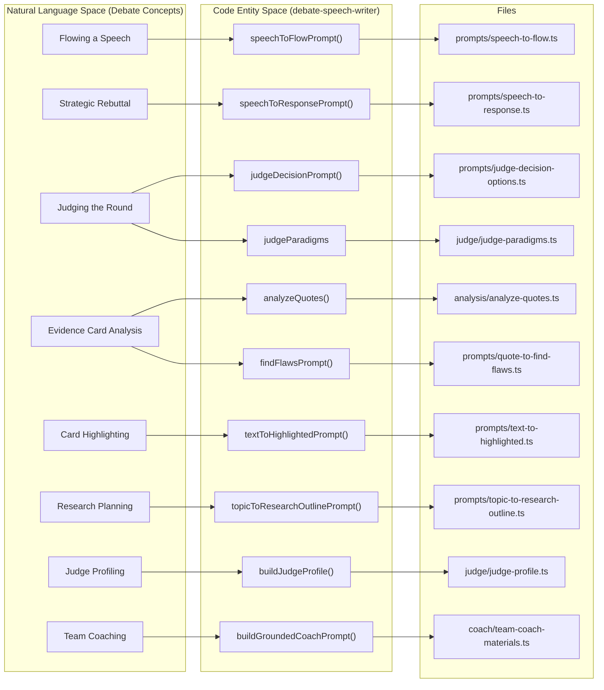
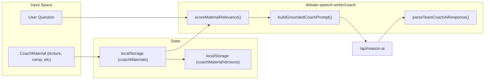
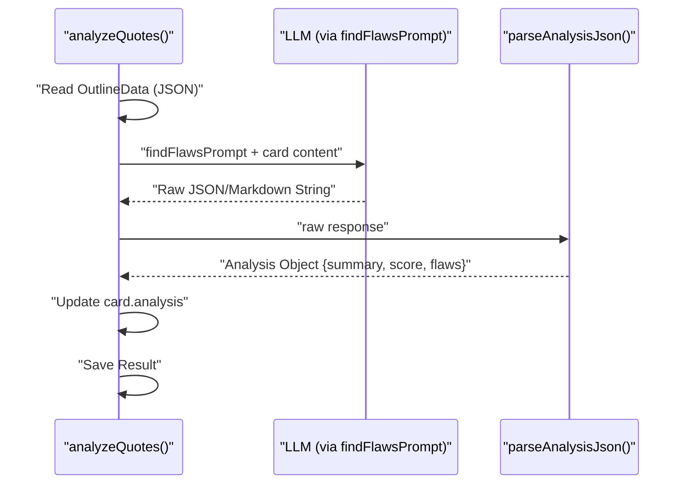

# AI Speech Analysis Prompts (debate-speech-writer)
Relevant source files
- [docs/features/coach-materials.md](https://github.com/debate/debate-ai.com/blob/34937310/docs/features/coach-materials.md?plain=1)
- [packages/debate-card-parser/README.md](https://github.com/debate/debate-ai.com/blob/34937310/packages/debate-card-parser/README.md?plain=1)
- [packages/debate-data-sync/README.md](https://github.com/debate/debate-ai.com/blob/34937310/packages/debate-data-sync/README.md?plain=1)
- [packages/debate-editor/README.md](https://github.com/debate/debate-ai.com/blob/34937310/packages/debate-editor/README.md?plain=1)
- [packages/debate-speech-writer/README.md](https://github.com/debate/debate-ai.com/blob/34937310/packages/debate-speech-writer/README.md?plain=1)
- [packages/debate-speech-writer/src/coach/team-coach-materials.ts](https://github.com/debate/debate-ai.com/blob/34937310/packages/debate-speech-writer/src/coach/team-coach-materials.ts)
- [packages/debate-speech-writer/src/index.ts](https://github.com/debate/debate-ai.com/blob/34937310/packages/debate-speech-writer/src/index.ts)
- [packages/debate-speech-writer/src/panels/CoachMaterialsPanel.tsx](https://github.com/debate/debate-ai.com/blob/34937310/packages/debate-speech-writer/src/panels/CoachMaterialsPanel.tsx)
- [packages/debate-speech-writer/src/state/coachMaterials.ts](https://github.com/debate/debate-ai.com/blob/34937310/packages/debate-speech-writer/src/state/coachMaterials.ts)
- [packages/debate-speech-writer/src/state/live-update.ts](https://github.com/debate/debate-ai.com/blob/34937310/packages/debate-speech-writer/src/state/live-update.ts)
- [packages/debate-speech-writer/test/coachMaterials.test.ts](https://github.com/debate/debate-ai.com/blob/34937310/packages/debate-speech-writer/test/coachMaterials.test.ts)
- [packages/debate-speech-writer/test/live-update.test.ts](https://github.com/debate/debate-ai.com/blob/34937310/packages/debate-speech-writer/test/live-update.test.ts)
- [packages/debate-speech-writer/test/team-coach-materials.test.ts](https://github.com/debate/debate-ai.com/blob/34937310/packages/debate-speech-writer/test/team-coach-materials.test.ts)
- [packages/debate-timer/README.md](https://github.com/debate/debate-ai.com/blob/34937310/packages/debate-timer/README.md?plain=1)
- [packages/debate-timer/src/index.ts](https://github.com/debate/debate-ai.com/blob/34937310/packages/debate-timer/src/index.ts)
- [packages/debate-timer/src/timers/TimerProgressRing.tsx](https://github.com/debate/debate-ai.com/blob/34937310/packages/debate-timer/src/timers/TimerProgressRing.tsx)
- [packages/debate-ui/README.md](https://github.com/debate/debate-ai.com/blob/34937310/packages/debate-ui/README.md?plain=1)
- [packages/debate-videos/README.md](https://github.com/debate/debate-ai.com/blob/34937310/packages/debate-videos/README.md?plain=1)

The `debate-speech-writer` package serves as the LLM orchestration layer for the FIAT module. It provides a suite of specialized prompts and utility functions designed to transform raw debate transcripts, speech documents, and research evidence into structured debate entities such as flow grids, response outlines, and judged ballots.

## Package Overview & Architecture

The package is structured as a collection of string-based prompts optimized for high-reasoning models (e.g., Llama 3, Claude 3.5 Sonnet) and a batch processing utility for evidence analysis. It also includes systems for modeling judge paradigms, historical performance, and grounded coaching.

| Prompt / Utility | File Path | Purpose |
| --- | --- | --- |
| `speechToFlowPrompt` | [packages/debate-speech-writer/src/prompts/speech-to-flow.ts1-82](https://github.com/debate/debate-ai.com/blob/34937310/packages/debate-speech-writer/src/prompts/speech-to-flow.ts#L1-L82) | Extracts author/tag citations from a speech to populate a specific column in the flow. |
| `speechToResponsePrompt` | [packages/debate-speech-writer/src/prompts/speech-to-response.ts1-138](https://github.com/debate/debate-ai.com/blob/34937310/packages/debate-speech-writer/src/prompts/speech-to-response.ts#L1-L138) | Generates a strategic rebuttal outline based on current flow state and opponent arguments. |
| `judgeDecisionPrompt` | [packages/debate-speech-writer/src/prompts/judge-decision-options.ts1-102](https://github.com/debate/debate-ai.com/blob/34937310/packages/debate-speech-writer/src/prompts/judge-decision-options.ts#L1-L102) | Produces dual-ballot (AFF and NEG) outcomes with strategic swing-factor analysis. |
| `findFlawsPrompt` | [packages/debate-speech-writer/src/prompts/quote-to-find-flaws.ts1-23](https://github.com/debate/debate-ai.com/blob/34937310/packages/debate-speech-writer/src/prompts/quote-to-find-flaws.ts#L1-L23) | Analyzes a specific card for warrants, support scores, and logical fallacies. |
| `textToHighlightedPrompt` | [packages/debate-speech-writer/src/prompts/text-to-highlighted.ts1-63](https://github.com/debate/debate-ai.com/blob/34937310/packages/debate-speech-writer/src/prompts/text-to-highlighted.ts#L1-L63) | Distills raw text into a single, tournament-ready "highlighted" card sentence. |
| `topicToResearchOutlinePrompt` | [packages/debate-speech-writer/src/prompts/topic-to-research-outline.ts1-51](https://github.com/debate/debate-ai.com/blob/34937310/packages/debate-speech-writer/src/prompts/topic-to-research-outline.ts#L1-L51) | Generates a comprehensive research strategy for a given debate resolution. |
| `analyzeQuotes` | [packages/debate-speech-writer/src/analysis/analyze-quotes.ts18](https://github.com/debate/debate-ai.com/blob/34937310/packages/debate-speech-writer/src/analysis/analyze-quotes.ts#L18-L18) | A batch helper function that iterates over research data to apply LLM analysis. |
| `judgeParadigms` | [packages/debate-speech-writer/src/index.ts21-28](https://github.com/debate/debate-ai.com/blob/34937310/packages/debate-speech-writer/src/index.ts#L21-L28) | A registry of pre-defined judge personas (Flow, Lay, Critic, etc.). |
| `TEAM_COACH_AI_SYSTEM_PROMPT` | [packages/debate-speech-writer/src/index.ts144](https://github.com/debate/debate-ai.com/blob/34937310/packages/debate-speech-writer/src/index.ts#L144-L144) | Frames the AI as a private team coach grounded in specific uploaded materials. |

Sources: [packages/debate-speech-writer/src/index.ts18-205](https://github.com/debate/debate-ai.com/blob/34937310/packages/debate-speech-writer/src/index.ts#L18-L205)

### Natural Language to Code Entity Mapping

The following diagram illustrates how natural language debate concepts are mapped to specific code constants and functions within the `debate-speech-writer` package.

**Figure 1: Domain Mapping (NL Space to Code Entity Space)**

Sources: [packages/debate-speech-writer/src/index.ts18-205](https://github.com/debate/debate-ai.com/blob/34937310/packages/debate-speech-writer/src/index.ts#L18-L205)

## Judge Paradigms and Profiling

The package provides a sophisticated system for modeling how different judges evaluate rounds.

### Judge Paradigms

The `judgeParadigms` registry contains definitions for common debate judging styles [packages/debate-speech-writer/src/index.ts21-28](https://github.com/debate/debate-ai.com/blob/34937310/packages/debate-speech-writer/src/index.ts#L21-L28) Each `JudgeParadigm` includes `votingPriorities`, `speedTolerance`, `jargonTolerance`, and specific `instructions` for the LLM.

- **Persistence**: Paradigms are stored in `localStorage` via the `judgeParadigmSelections` key [packages/debate-speech-writer/src/state/judgeParadigmSelections.ts2-10](https://github.com/debate/debate-ai.com/blob/34937310/packages/debate-speech-writer/src/state/judgeParadigmSelections.ts#L2-L10)
- **Custom Paradigms**: The `buildCustomJudgeParadigm` function allows creating a paradigm from a judge's specific notes, sanitizing the input and clamping length to 2000 characters [packages/debate-speech-writer/src/index.ts21-28](https://github.com/debate/debate-ai.com/blob/34937310/packages/debate-speech-writer/src/index.ts#L21-L28)
- **Picker UI**: `JudgeParadigmPickerPanel` provides a form to select built-in paradigms or enter custom judge notes, persisting them per `roundId`[packages/debate-speech-writer/src/panels/JudgeParadigmPickerPanel.tsx58-60](https://github.com/debate/debate-ai.com/blob/34937310/packages/debate-speech-writer/src/panels/JudgeParadigmPickerPanel.tsx#L58-L60)

### Judge Profiling

The `buildJudgeProfile` function aggregates a list of `JudgeRoundRecord` objects into a `JudgeProfile`[packages/debate-speech-writer/src/index.ts36-51](https://github.com/debate/debate-ai.com/blob/34937310/packages/debate-speech-writer/src/index.ts#L36-L51)

**Calculated Metrics:**

- **Side Bias**: Flags `hasNotableSideBias` if a judge has decided at least 5 rounds and the win rate deviates by more than 15% from even [packages/debate-speech-writer/src/index.ts36-51](https://github.com/debate/debate-ai.com/blob/34937310/packages/debate-speech-writer/src/index.ts#L36-L51)
- **Speed Tolerance**: Buckets average WPM into "low" (<=200), "medium" (<=300), or "high" [packages/debate-speech-writer/src/index.ts36-51](https://github.com/debate/debate-ai.com/blob/34937310/packages/debate-speech-writer/src/index.ts#L36-L51)
- **Theory Receptiveness**: Buckets win rates for theory arguments into "low" (<33%), "medium", or "high" (>66%) [packages/debate-speech-writer/src/index.ts36-51](https://github.com/debate/debate-ai.com/blob/34937310/packages/debate-speech-writer/src/index.ts#L36-L51)

Sources: [packages/debate-speech-writer/src/index.ts21-51](https://github.com/debate/debate-ai.com/blob/34937310/packages/debate-speech-writer/src/index.ts#L21-L51)[packages/debate-speech-writer/src/state/judgeParadigmSelections.ts1-94](https://github.com/debate/debate-ai.com/blob/34937310/packages/debate-speech-writer/src/state/judgeParadigmSelections.ts#L1-L94)

## Team Coach AI and Grounding Materials

The `CoachMaterialsPanel` allows for a RAG-based coaching experience where the AI answers questions based strictly on team-specific materials.

### Grounding Material Pipeline & Version History

1. **Storage**: Materials are persisted in `localStorage` under the `coachMaterials` key, with version snapshots stored under `coachMaterialVersions`[packages/debate-speech-writer/src/state/coachMaterials.ts35-52](https://github.com/debate/debate-ai.com/blob/34937310/packages/debate-speech-writer/src/state/coachMaterials.ts#L35-L52)[packages/debate-speech-writer/src/state/coachMaterialVersions.ts31-51](https://github.com/debate/debate-ai.com/blob/34937310/packages/debate-speech-writer/src/state/coachMaterialVersions.ts#L31-L51)
2. **Relevance Scoring**: `scoreMaterialRelevance` calculates the share of query tokens found in the material's title, tags, and body [packages/debate-speech-writer/src/coach/team-coach-materials.ts161-175](https://github.com/debate/debate-ai.com/blob/34937310/packages/debate-speech-writer/src/coach/team-coach-materials.ts#L161-L175)
3. **Prompt Construction**: `buildGroundedCoachPrompt` assembles a prompt that instructs the AI to answer "strictly using the grounding materials below" [packages/debate-speech-writer/src/index.ts114-142](https://github.com/debate/debate-ai.com/blob/34937310/packages/debate-speech-writer/src/index.ts#L114-L142) (specifically, [packages/debate-speech-writer/src/coach/team-coach-materials.ts178-220](https://github.com/debate/debate-ai.com/blob/34937310/packages/debate-speech-writer/src/coach/team-coach-materials.ts#L178-L220)).
4. **System Prompt**: `TEAM_COACH_AI_SYSTEM_PROMPT` instructs the model to act as a private coach and reply with answer text ONLY [packages/debate-speech-writer/src/index.ts144](https://github.com/debate/debate-ai.com/blob/34937310/packages/debate-speech-writer/src/index.ts#L144-L144)
5. **Execution**: `requestTeamCoachAnswer` calls the existing `/api/reason-ai` proxy [packages/debate-speech-writer/src/index.ts145-146](https://github.com/debate/debate-ai.com/blob/34937310/packages/debate-speech-writer/src/index.ts#L145-L146)

**Figure 2: Coach AI Data Flow**

Sources: [packages/debate-speech-writer/src/index.ts114-146](https://github.com/debate/debate-ai.com/blob/34937310/packages/debate-speech-writer/src/index.ts#L114-L146)[packages/debate-speech-writer/src/state/coachMaterials.ts35-92](https://github.com/debate/debate-ai.com/blob/34937310/packages/debate-speech-writer/src/state/coachMaterials.ts#L35-L92)[packages/debate-speech-writer/src/state/coachMaterialVersions.ts31-91](https://github.com/debate/debate-ai.com/blob/34937310/packages/debate-speech-writer/src/state/coachMaterialVersions.ts#L31-L91)

## Speech Processing Prompts

### Speech to Flow

The `speechToFlowPrompt` is designed to maintain the integrity of the `FlowSpreadsheet`. It instructs the LLM to match the exact row structure of an existing grid and extract `author + year + claim` for each quote found in a new speech document [packages/debate-speech-writer/src/index.ts202](https://github.com/debate/debate-ai.com/blob/34937310/packages/debate-speech-writer/src/index.ts#L202-L202) It enforces strict formatting rules, such as a maximum of 3 bullets per cell and mandatory file references.

### Speech to Response

The `speechToResponsePrompt` acts as a strategist. It requires two inputs: the `Existing Flow Grid` and the `New Opponent Speech`[packages/debate-speech-writer/src/index.ts203](https://github.com/debate/debate-ai.com/blob/34937310/packages/debate-speech-writer/src/index.ts#L203-L203) The output is a structured outline that includes "Killer Arguments" to extend and specific answers to new opponent offense.

Sources: [packages/debate-speech-writer/src/index.ts202-203](https://github.com/debate/debate-ai.com/blob/34937310/packages/debate-speech-writer/src/index.ts#L202-L203)

## Judging and Decision Logic

The `JudgeDecisionPanel` wires together flow summaries and judge paradigms to request an AI verdict.

**Key Analysis Steps:**

1. **Resolve Inputs**: `buildJudgeDecisionInputFromStores` resolves the round's saved flow summary and paradigm selection [packages/debate-round/src/panels/JudgeDecisionPanel.tsx1-50](https://github.com/debate/debate-ai.com/blob/34937310/packages/debate-round/src/panels/JudgeDecisionPanel.tsx#L1-L50)
2. **Request Decision**: `requestJudgeDecision` calls the backend via `judge-decision-client.ts`[packages/debate-round/src/panels/JudgeDecisionPanel.tsx80-120](https://github.com/debate/debate-ai.com/blob/34937310/packages/debate-round/src/panels/JudgeDecisionPanel.tsx#L80-L120)
3. **Deep Linking**: `buildJudgeDecisionDeepLink` creates a `/judge-decision?roundId=...` link that `JudgeDecisionPanel` consumes via `useSearchParams` to pre-fill the UI [packages/debate-speech-writer/src/state/judgeParadigmSelections.ts70-94](https://github.com/debate/debate-ai.com/blob/34937310/packages/debate-speech-writer/src/state/judgeParadigmSelections.ts#L70-L94)

Sources: [packages/debate-round/src/panels/JudgeDecisionPanel.tsx1-180](https://github.com/debate/debate-ai.com/blob/34937310/packages/debate-round/src/panels/JudgeDecisionPanel.tsx#L1-L180)[packages/debate-speech-writer/src/state/judgeParadigmSelections.ts70-94](https://github.com/debate/debate-ai.com/blob/34937310/packages/debate-speech-writer/src/state/judgeParadigmSelections.ts#L70-L94)

## Evidence Analysis Pipeline

The `analyzeQuotes` function and `findFlawsPrompt` provide a technical pipeline for scoring the quality of research cards.

**Figure 3: analyzeQuotes Sequence**

Sources: [packages/debate-speech-writer/src/index.ts18](https://github.com/debate/debate-ai.com/blob/34937310/packages/debate-speech-writer/src/index.ts#L18-L18)[packages/debate-speech-writer/src/index.ts200](https://github.com/debate/debate-ai.com/blob/34937310/packages/debate-speech-writer/src/index.ts#L200-L200)

### analyzeQuotes Function

This function performs batch processing of card entries. It takes either a file path to an `OutlineData` JSON or the object itself [packages/debate-speech-writer/src/index.ts18](https://github.com/debate/debate-ai.com/blob/34937310/packages/debate-speech-writer/src/index.ts#L18-L18) It iterates through the card list and attaches LLM-generated warrants, scores, and logical flaws to each entry.

Sources: [packages/debate-speech-writer/src/index.ts18](https://github.com/debate/debate-ai.com/blob/34937310/packages/debate-speech-writer/src/index.ts#L18-L18)

## Research and Extraction Prompts

### Text to Highlighted

The `textToHighlightedPrompt` is a specialized extraction tool. It transforms raw article text into a "perfect, standalone debate card sentence" of 8-25 words [packages/debate-speech-writer/src/index.ts204](https://github.com/debate/debate-ai.com/blob/34937310/packages/debate-speech-writer/src/index.ts#L204-L204) It prioritizes quantified, causal, and recent claims.

### Topic to Research Outline

The `topicToResearchOutlinePrompt` acts as a research assistant for college-level (NDT/CEDA) debate [packages/debate-speech-writer/src/index.ts205](https://github.com/debate/debate-ai.com/blob/34937310/packages/debate-speech-writer/src/index.ts#L205-L205) It generates:

- **8-12 Core Research Questions**
- **25-35 Search Queries** using advanced operators (`site:`, `filetype:pdf`)
- **Source Hierarchy** prioritizing think tanks and government reports

Sources: [packages/debate-speech-writer/src/index.ts204-205](https://github.com/debate/debate-ai.com/blob/34937310/packages/debate-speech-writer/src/index.ts#L204-L205)

## API Proxies (`/api/reason-ai` & `/api/analyze`)

The client components within `debate-speech-writer` (such as `requestTeamCoachAnswer`) and workflow panels communicate with the LLM backend through specialized Next.js API route proxies:

- `/api/reason-ai`: Handles raw conversation streaming and multi-turn message arrays destined for Anthropic or compatible LLM providers.
- `/api/analyze`: Coordinates bulk quote analysis and batch payload handling for evidence assessment workflows.

Sources: [packages/debate-speech-writer/src/index.ts145-146](https://github.com/debate/debate-ai.com/blob/34937310/packages/debate-speech-writer/src/index.ts#L145-L146)[packages/debate-speech-writer/src/index.ts18](https://github.com/debate/debate-ai.com/blob/34937310/packages/debate-speech-writer/src/index.ts#L18-L18)