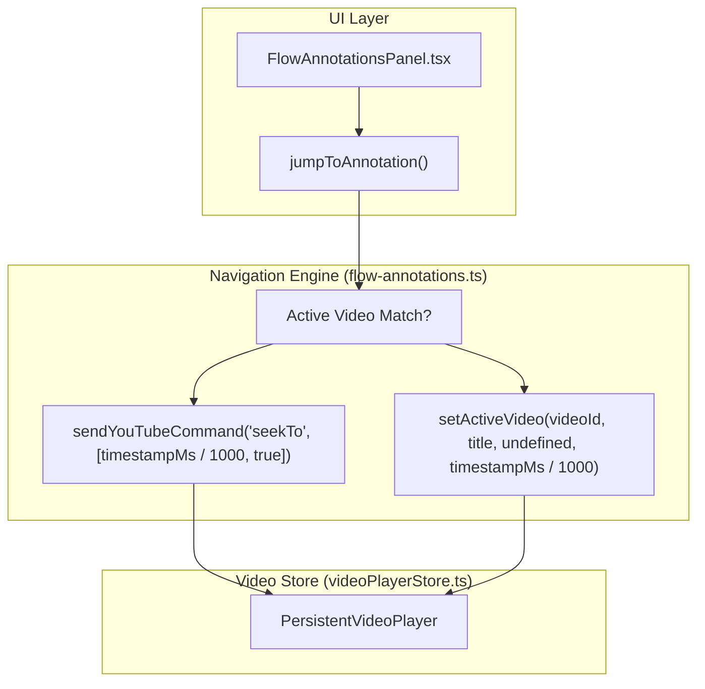
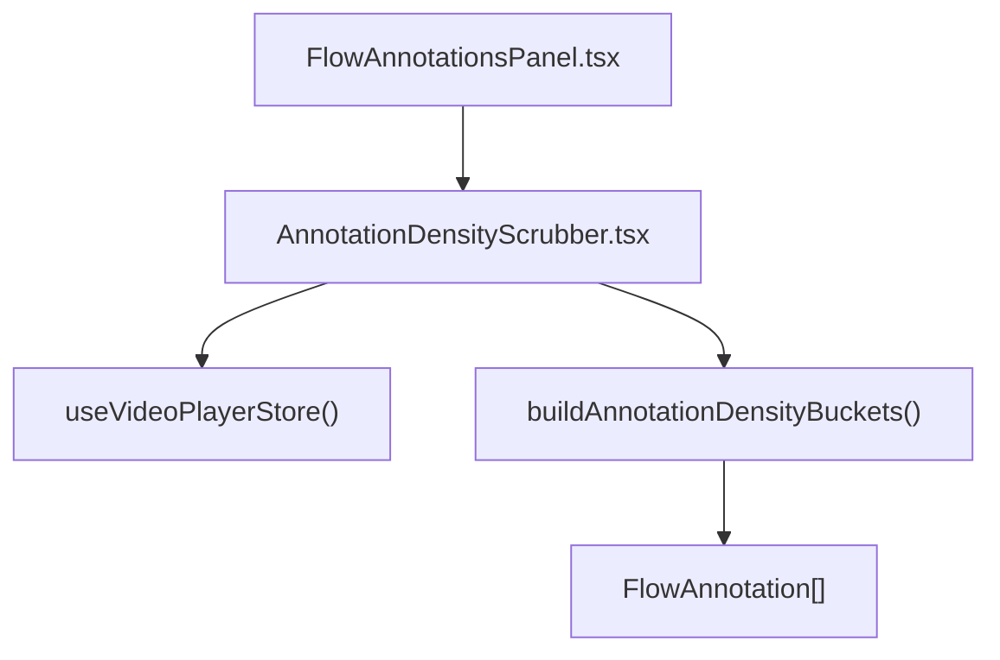
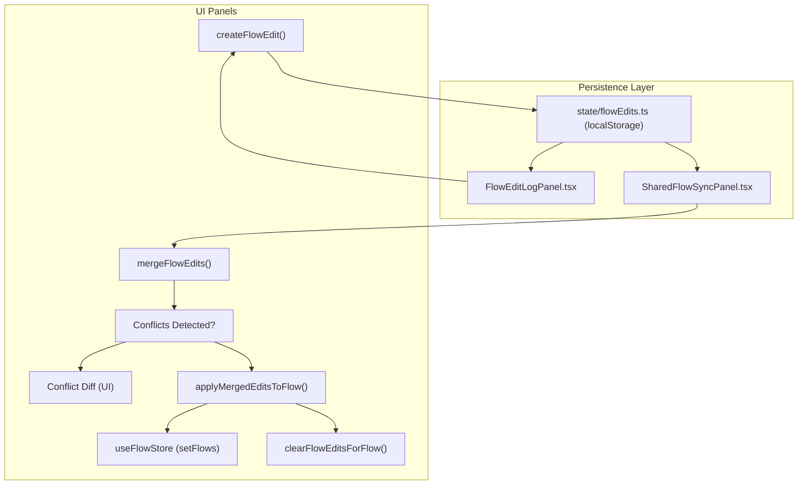
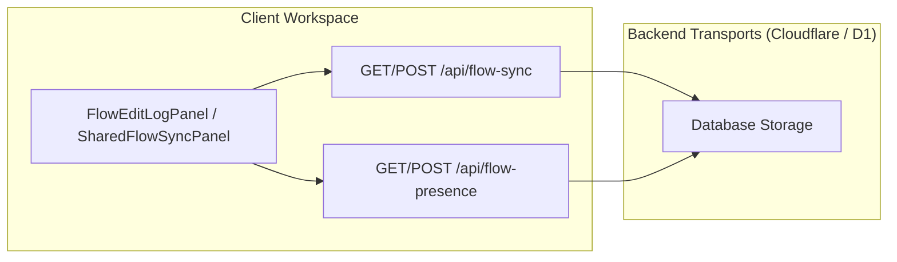
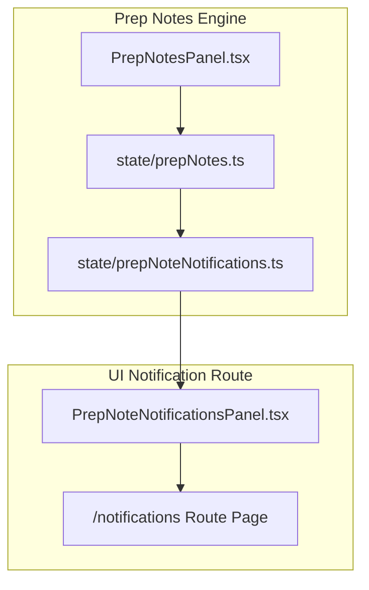

# Flow Annotations, Edit Log & Shared Sync
Relevant source files
- [apps/debate-ai.com/app/annotations/page.tsx](https://github.com/debate/debate-ai.com/blob/34937310/apps/debate-ai.com/app/annotations/page.tsx)
- [apps/debate-ai.com/app/api/flow-presence/route.ts](https://github.com/debate/debate-ai.com/blob/34937310/apps/debate-ai.com/app/api/flow-presence/route.ts)
- [apps/debate-ai.com/app/summaries/FlowSummariesPanelWithPrepNotes.tsx](https://github.com/debate/debate-ai.com/blob/34937310/apps/debate-ai.com/app/summaries/FlowSummariesPanelWithPrepNotes.tsx)
- [apps/debate-ai.com/app/summaries/page.tsx](https://github.com/debate/debate-ai.com/blob/34937310/apps/debate-ai.com/app/summaries/page.tsx)
- [apps/debate-ai.com/drizzle/0030_careful_doctor_strange.sql](https://github.com/debate/debate-ai.com/blob/34937310/apps/debate-ai.com/drizzle/0030_careful_doctor_strange.sql)
- [apps/debate-ai.com/drizzle/meta/0030_snapshot.json](https://github.com/debate/debate-ai.com/blob/34937310/apps/debate-ai.com/drizzle/meta/0030_snapshot.json)
- [docs/features/coaching-sessions.md](https://github.com/debate/debate-ai.com/blob/34937310/docs/features/coaching-sessions.md?plain=1)
- [docs/features/drill-sets.md](https://github.com/debate/debate-ai.com/blob/34937310/docs/features/drill-sets.md?plain=1)
- [docs/features/flow-annotations.md](https://github.com/debate/debate-ai.com/blob/34937310/docs/features/flow-annotations.md?plain=1)
- [docs/features/flow-summaries.md](https://github.com/debate/debate-ai.com/blob/34937310/docs/features/flow-summaries.md?plain=1)
- [docs/features/prep-notes.md](https://github.com/debate/debate-ai.com/blob/34937310/docs/features/prep-notes.md?plain=1)
- [docs/features/shared-flow-sync.md](https://github.com/debate/debate-ai.com/blob/34937310/docs/features/shared-flow-sync.md?plain=1)
- [packages/debate-practice-drills/src/flow/AnnotationDensityScrubber.tsx](https://github.com/debate/debate-ai.com/blob/34937310/packages/debate-practice-drills/src/flow/AnnotationDensityScrubber.tsx)
- [packages/debate-practice-drills/src/flow/annotation-density.ts](https://github.com/debate/debate-ai.com/blob/34937310/packages/debate-practice-drills/src/flow/annotation-density.ts)
- [packages/debate-practice-drills/src/hooks/useDrillSets.ts](https://github.com/debate/debate-ai.com/blob/34937310/packages/debate-practice-drills/src/hooks/useDrillSets.ts)
- [packages/debate-practice-drills/src/panels/CoachingSessionsPanel.tsx](https://github.com/debate/debate-ai.com/blob/34937310/packages/debate-practice-drills/src/panels/CoachingSessionsPanel.tsx)
- [packages/debate-practice-drills/src/panels/FlowAnnotationsPanel.tsx](https://github.com/debate/debate-ai.com/blob/34937310/packages/debate-practice-drills/src/panels/FlowAnnotationsPanel.tsx)
- [packages/debate-practice-drills/src/panels/FlowSummariesPanel.tsx](https://github.com/debate/debate-ai.com/blob/34937310/packages/debate-practice-drills/src/panels/FlowSummariesPanel.tsx)
- [packages/debate-practice-drills/src/state/live-update.ts](https://github.com/debate/debate-ai.com/blob/34937310/packages/debate-practice-drills/src/state/live-update.ts)
- [packages/debate-practice-drills/test/annotation-density.test.ts](https://github.com/debate/debate-ai.com/blob/34937310/packages/debate-practice-drills/test/annotation-density.test.ts)
- [packages/debate-practice-drills/test/live-update.test.ts](https://github.com/debate/debate-ai.com/blob/34937310/packages/debate-practice-drills/test/live-update.test.ts)
- [packages/debate-round/package.json](https://github.com/debate/debate-ai.com/blob/34937310/packages/debate-round/package.json)
- [packages/debate-round/src/flow/flow-annotations.ts](https://github.com/debate/debate-ai.com/blob/34937310/packages/debate-round/src/flow/flow-annotations.ts)
- [packages/debate-round/src/flow/flow-presence-client.ts](https://github.com/debate/debate-ai.com/blob/34937310/packages/debate-round/src/flow/flow-presence-client.ts)
- [packages/debate-round/src/flow/flow-presence.ts](https://github.com/debate/debate-ai.com/blob/34937310/packages/debate-round/src/flow/flow-presence.ts)
- [packages/debate-round/src/flow/strategy-sync-notes.ts](https://github.com/debate/debate-ai.com/blob/34937310/packages/debate-round/src/flow/strategy-sync-notes.ts)
- [packages/debate-round/src/hooks/useFlowPresencePolling.ts](https://github.com/debate/debate-ai.com/blob/34937310/packages/debate-round/src/hooks/useFlowPresencePolling.ts)
- [packages/debate-round/src/panels/FlowEditLogPanel.tsx](https://github.com/debate/debate-ai.com/blob/34937310/packages/debate-round/src/panels/FlowEditLogPanel.tsx)
- [packages/debate-round/test/flow-annotations.test.ts](https://github.com/debate/debate-ai.com/blob/34937310/packages/debate-round/test/flow-annotations.test.ts)
- [packages/debate-round/test/strategy-sync-notes.test.ts](https://github.com/debate/debate-ai.com/blob/34937310/packages/debate-round/test/strategy-sync-notes.test.ts)
- [packages/debate-team-collaboration/src/panels/PrepNotesPanel.tsx](https://github.com/debate/debate-ai.com/blob/34937310/packages/debate-team-collaboration/src/panels/PrepNotesPanel.tsx)
- [packages/debate-team-collaboration/src/state/prepNotes.ts](https://github.com/debate/debate-ai.com/blob/34937310/packages/debate-team-collaboration/src/state/prepNotes.ts)
- [packages/debate-team-collaboration/test/prep-note-notifications.test.ts](https://github.com/debate/debate-ai.com/blob/34937310/packages/debate-team-collaboration/test/prep-note-notifications.test.ts)
- [packages/debate-videos/src/state/videoPlayerStore.ts](https://github.com/debate/debate-ai.com/blob/34937310/packages/debate-videos/src/state/videoPlayerStore.ts)

This page covers the real-time collaboration, video-linked metadata, and synchronization infrastructure for the FIAT flow spreadsheet module (`debate-round`). It details how users record timestamped metadata against video playback, manage proposed argument edits through a merge and conflict engine, monitor live collaborator presence via `/api/flow-presence`, synchronize round edits through `/api/flow-sync`, and track strategy notes and notifications.

## 1. Flow Annotations & Video Integration

Flow Annotations allow viewers to attach timestamped notes to specific cells within a flow spreadsheet. These annotations persist locally and enable users to jump straight back to the exact moment in a debate recording.

### Data Model & Validation

Annotations are governed by the `FlowAnnotation` model, which uses a numeric `boxPath` array to address a specific node and a `videoId` to reference YouTube recordings from `debate-videos`.

| Field | Type | Description |
| --- | --- | --- |
| `id` | `string` | Unique identifier (e.g., `anno-171...`). |
| `flowId` | `number` | ID of the specific flow sheet. |
| `boxPath` | `number[]` | Numeric array path to the target `Box` (e.g., `[0, 1]`). |
| `speechId` | `string` | Speech identifier during which the note was dropped (e.g., `1AC`). |
| `timestampMs` | `number` | Playback position in milliseconds. |
| `videoId` | `string?` | YouTube ID for cross-video jumping. |
| `videoTitle` | `string?` | Title of the recording. |
| `speaker` | `string?` | Who made the annotation. |
| `tag` | `string?` | Short free-text label for grouping/filtering. |

Validation is handled by `createFlowAnnotation`, which ensures non-empty box paths, valid speech IDs, and non-negative timestamps. It also trims and clamps the `note`, `videoId`, `videoTitle`, `speaker`, and `tag` fields [packages/debate-round/src/flow/flow-annotations.ts58-88](https://github.com/debate/debate-ai.com/blob/34937310/packages/debate-round/src/flow/flow-annotations.ts#L58-L88)

### Video Integration (Jump-to-Annotation)

The `jumpToAnnotation` helper orchestrates navigation between the spreadsheet and the persistent video player. If the target video is already loaded, it invokes `sendYouTubeCommand("seekTo", ...)`[packages/debate-round/src/flow/flow-annotations.ts162-179](https://github.com/debate/debate-ai.com/blob/34937310/packages/debate-round/src/flow/flow-annotations.ts#L162-L179) If a different or uninitialized video is referenced, it calls `useVideoPlayerStore.setActiveVideo(...)` with an initial timestamp [packages/debate-videos/src/state/videoPlayerStore.ts70-93](https://github.com/debate/debate-ai.com/blob/34937310/packages/debate-videos/src/state/videoPlayerStore.ts#L70-L93)

Sources: [packages/debate-round/src/flow/flow-annotations.ts58-181](https://github.com/debate/debate-ai.com/blob/34937310/packages/debate-round/src/flow/flow-annotations.ts#L58-L181)[packages/debate-videos/src/state/videoPlayerStore.ts70-141](https://github.com/debate/debate-ai.com/blob/34937310/packages/debate-videos/src/state/videoPlayerStore.ts#L70-L141)[docs/features/flow-annotations.md42-69](https://github.com/debate/debate-ai.com/blob/34937310/docs/features/flow-annotations.md?plain=1#L42-L69)

### Annotation Density Scrubber

The `AnnotationDensityScrubber` component [packages/debate-practice-drills/src/flow/AnnotationDensityScrubber.tsx](https://github.com/debate/debate-ai.com/blob/34937310/packages/debate-practice-drills/src/flow/AnnotationDensityScrubber.tsx) provides a visual representation of annotation density across a video's timeline. It uses `buildAnnotationDensityBuckets`[packages/debate-practice-drills/src/flow/annotation-density.ts10-40](https://github.com/debate/debate-ai.com/blob/34937310/packages/debate-practice-drills/src/flow/annotation-density.ts#L10-L40) to aggregate annotations into time buckets, allowing users to quickly identify heavily annotated segments. This scrubber is integrated into the `FlowAnnotationsPanel`[packages/debate-practice-drills/src/panels/FlowAnnotationsPanel.tsx](https://github.com/debate/debate-ai.com/blob/34937310/packages/debate-practice-drills/src/panels/FlowAnnotationsPanel.tsx)

Sources: [packages/debate-practice-drills/src/flow/AnnotationDensityScrubber.tsx](https://github.com/debate/debate-ai.com/blob/34937310/packages/debate-practice-drills/src/flow/AnnotationDensityScrubber.tsx)[packages/debate-practice-drills/src/flow/annotation-density.ts10-40](https://github.com/debate/debate-ai.com/blob/34937310/packages/debate-practice-drills/src/flow/annotation-density.ts#L10-L40)[packages/debate-practice-drills/src/panels/FlowAnnotationsPanel.tsx](https://github.com/debate/debate-ai.com/blob/34937310/packages/debate-practice-drills/src/panels/FlowAnnotationsPanel.tsx)

## 2. Flow Edit Log & Shared Sync Engine

To support team collaboration without risking silent overwrites, proposed argument changes are logged as `FlowEdit` records and reconciled using a conflict-detection merge engine.

### The FlowEdit Model & Merge Engine

`FlowEdit` objects track proposed updates to specific box paths (`flowId`, `boxPath`, `authorId`, `content`). The `FlowEditLogPanel`[packages/debate-round/src/panels/FlowEditLogPanel.tsx](https://github.com/debate/debate-ai.com/blob/34937310/packages/debate-round/src/panels/FlowEditLogPanel.tsx) provides a form to log new edits and lists persisted edits. The `createFlowEdit` function validates input, ensuring a non-empty `boxPath`, non-blank `authorId`, and trimmed/clamped `content`[docs/features/shared-flow-sync.md33-62](https://github.com/debate/debate-ai.com/blob/34937310/docs/features/shared-flow-sync.md?plain=1#L33-L62)

The `SharedFlowSyncPanel`[packages/debate-round/src/panels/SharedFlowSyncPanel.tsx](https://github.com/debate/debate-ai.com/blob/34937310/packages/debate-round/src/panels/SharedFlowSyncPanel.tsx) displays a merge preview. It uses `mergeFlowEdits` to evaluate concurrent edits against a configurable window (5 seconds by default) to identify diverging edits. If conflicts are detected, they are flagged for human resolution [docs/features/shared-flow-sync.md43-47](https://github.com/debate/debate-ai.com/blob/34937310/docs/features/shared-flow-sync.md?plain=1#L43-L47) The "Apply" action in `SharedFlowSyncPanel` calls `applyMergedEditsToFlow` to update the flow and then clears the logged edits via `clearFlowEditsForFlow`[docs/features/shared-flow-sync.md73-78](https://github.com/debate/debate-ai.com/blob/34937310/docs/features/shared-flow-sync.md?plain=1#L73-L78)

Sources: [docs/features/shared-flow-sync.md33-79](https://github.com/debate/debate-ai.com/blob/34937310/docs/features/shared-flow-sync.md?plain=1#L33-L79)[packages/debate-round/src/panels/FlowEditLogPanel.tsx](https://github.com/debate/debate-ai.com/blob/34937310/packages/debate-round/src/panels/FlowEditLogPanel.tsx)[packages/debate-round/src/panels/SharedFlowSyncPanel.tsx](https://github.com/debate/debate-ai.com/blob/34937310/packages/debate-round/src/panels/SharedFlowSyncPanel.tsx)

## 3. Flow Presence & Sync Transports

Real-time synchronization and collaborator presence across browser sessions are driven by client-side polling hooks communicating with Next.js API endpoints.

### API Routes & Polling Architecture

- `/api/flow-sync`[apps/debate-ai.com/app/api/flow-sync/route.ts](https://github.com/debate/debate-ai.com/blob/34937310/apps/debate-ai.com/app/api/flow-sync/route.ts): Manages push/pull operations for `FlowEdit` records associated with a specific flow.
- `/api/flow-presence`[apps/debate-ai.com/app/api/flow-presence/route.ts](https://github.com/debate/debate-ai.com/blob/34937310/apps/debate-ai.com/app/api/flow-presence/route.ts): Handles heartbeats for active editors viewing a flow.
- `useFlowSyncPolling`[packages/debate-round/src/hooks/useFlowSyncPolling.ts](https://github.com/debate/debate-ai.com/blob/34937310/packages/debate-round/src/hooks/useFlowSyncPolling.ts): Periodically fetches remote edits and triggers sync callbacks.
- `useFlowPresencePolling`[packages/debate-round/src/hooks/useFlowPresencePolling.ts](https://github.com/debate/debate-ai.com/blob/34937310/packages/debate-round/src/hooks/useFlowPresencePolling.ts): Maintains active editor heartbeats and returns the list of active users via `flow-presence-client.ts`[packages/debate-round/src/flow/flow-presence-client.ts](https://github.com/debate/debate-ai.com/blob/34937310/packages/debate-round/src/flow/flow-presence-client.ts)

Sources: [apps/debate-ai.com/app/api/flow-sync/route.ts](https://github.com/debate/debate-ai.com/blob/34937310/apps/debate-ai.com/app/api/flow-sync/route.ts)[apps/debate-ai.com/app/api/flow-presence/route.ts](https://github.com/debate/debate-ai.com/blob/34937310/apps/debate-ai.com/app/api/flow-presence/route.ts)[packages/debate-round/src/hooks/useFlowSyncPolling.ts](https://github.com/debate/debate-ai.com/blob/34937310/packages/debate-round/src/hooks/useFlowSyncPolling.ts)[packages/debate-round/src/hooks/useFlowPresencePolling.ts](https://github.com/debate/debate-ai.com/blob/34937310/packages/debate-round/src/hooks/useFlowPresencePolling.ts)[packages/debate-round/src/flow/flow-presence-client.ts](https://github.com/debate/debate-ai.com/blob/34937310/packages/debate-round/src/flow/flow-presence-client.ts)

## 4. Prep Notes, Strategy Sync & Notifications

Strategy Sync Notes (`PrepNote`) and associated notifications provide a task-tracking layer across debate rounds.

### Prep Notes State & Priority Management

Notes are managed through `state/prepNotes.ts` and structured by `flow/strategy-sync-notes.ts`. They can be either `BoxAnchoredPrepNote` (attached to a specific flow argument) or `RoundAnchoredPrepNote` (attached to a round as a whole) [packages/debate-round/src/flow/strategy-sync-notes.ts38-55](https://github.com/debate/debate-ai.com/blob/34937310/packages/debate-round/src/flow/strategy-sync-notes.ts#L38-L55) The `createPrepNote` and `createRoundPrepNote` functions handle their creation and validation [packages/debate-round/src/flow/strategy-sync-notes.ts86-109](https://github.com/debate/debate-ai.com/blob/34937310/packages/debate-round/src/flow/strategy-sync-notes.ts#L86-L109)[packages/debate-round/src/flow/strategy-sync-notes.ts128-150](https://github.com/debate/debate-ai.com/blob/34937310/packages/debate-round/src/flow/strategy-sync-notes.ts#L128-L150)

Notes support status cycling (`open` → `covered` → `needs-follow-up`) via `updateNoteStatus`[packages/debate-round/src/flow/strategy-sync-notes.ts153-155](https://github.com/debate/debate-ai.com/blob/34937310/packages/debate-round/src/flow/strategy-sync-notes.ts#L153-L155) and priority flagging (`setNotePriority`, `sortNotesByPriorityThenCreatedAt`) [docs/features/prep-notes.md36-58](https://github.com/debate/debate-ai.com/blob/34937310/docs/features/prep-notes.md?plain=1#L36-L58)[packages/debate-round/src/flow/strategy-sync-notes.ts175-181](https://github.com/debate/debate-ai.com/blob/34937310/packages/debate-round/src/flow/strategy-sync-notes.ts#L175-L181) The `PrepNotesPanel`[packages/debate-team-collaboration/src/panels/PrepNotesPanel.tsx](https://github.com/debate/debate-ai.com/blob/34937310/packages/debate-team-collaboration/src/panels/PrepNotesPanel.tsx) renders these notes, grouped by status and sorted by priority [docs/features/prep-notes.md78-81](https://github.com/debate/debate-ai.com/blob/34937310/docs/features/prep-notes.md?plain=1#L78-L81)

### Notifications Subsystem

When a `PrepNote` is assigned to a teammate via `assignPersistedPrepNote`[packages/debate-team-collaboration/src/state/prepNotes.ts](https://github.com/debate/debate-ai.com/blob/34937310/packages/debate-team-collaboration/src/state/prepNotes.ts)`state/prepNoteNotifications.ts` records a `PrepNoteNotification` (`flow/prep-note-notifications.ts`) to alert the recipient [docs/features/prep-notes.md82-96](https://github.com/debate/debate-ai.com/blob/34937310/docs/features/prep-notes.md?plain=1#L82-L96) These notifications are rendered via `PrepNoteNotificationsPanel` at `/notifications`[docs/features/prep-notes.md125-141](https://github.com/debate/debate-ai.com/blob/34937310/docs/features/prep-notes.md?plain=1#L125-L141)

Sources: [docs/features/prep-notes.md1-141](https://github.com/debate/debate-ai.com/blob/34937310/docs/features/prep-notes.md?plain=1#L1-L141)[packages/debate-team-collaboration/src/state/prepNotes.ts](https://github.com/debate/debate-ai.com/blob/34937310/packages/debate-team-collaboration/src/state/prepNotes.ts)[packages/debate-team-collaboration/src/state/prepNoteNotifications.ts](https://github.com/debate/debate-ai.com/blob/34937310/packages/debate-team-collaboration/src/state/prepNoteNotifications.ts)[packages/debate-team-collaboration/src/panels/PrepNotesPanel.tsx](https://github.com/debate/debate-ai.com/blob/34937310/packages/debate-team-collaboration/src/panels/PrepNotesPanel.tsx)[packages/debate-team-collaboration/src/panels/PrepNoteNotificationsPanel.tsx](https://github.com/debate/debate-ai.com/blob/34937310/packages/debate-team-collaboration/src/panels/PrepNoteNotificationsPanel.tsx)[packages/debate-round/src/flow/strategy-sync-notes.ts1-192](https://github.com/debate/debate-ai.com/blob/34937310/packages/debate-round/src/flow/strategy-sync-notes.ts#L1-L192)

## 5. Cross-Tab Live Updates & UI Renderers

Because local storage changes do not fire `storage` events in the originating tab, `packages/debate-round/src/flow/live-update.ts` provides explicit event predicate helpers (`isFlowLiveUpdateStorageEvent`, `isPrepNotesPanelLiveUpdateStorageEvent`, `isFlowEditLogPanelLiveUpdateStorageEvent`) to synchronize multi-tab views [packages/debate-round/src/flow/live-update.ts1-144](https://github.com/debate/debate-ai.com/blob/34937310/packages/debate-round/src/flow/live-update.ts#L1-L144) Similar `live-update.ts` files exist in other packages to handle their specific `localStorage` keys, such as `packages/debate-practice-drills/src/state/live-update.ts` for `JudgeParadigmPickerPanel`, `VulnerabilityChartsPanel`, `ArgumentTreePanel`, `WordCountRoundsPanel`, `DrillSetsPanel`, `AiVersusRoundPanel`, `CoachingSessionsPanel`, and `PracticeRoundSimulatorPanel`[packages/debate-practice-drills/src/state/live-update.ts1-27](https://github.com/debate/debate-ai.com/blob/34937310/packages/debate-practice-drills/src/state/live-update.ts#L1-L27)

### Cell Renderers & Badges

- **Note on Regression:** The AG Grid-based `FlowSpreadsheet` view, along with `Flow/AnnotationBadge.tsx`, `Flow/EditBadge.tsx`, and `Flow/PrepNoteBadge.tsx`, was removed in PR #498. The new "ebb flow" editor (`debate-flow`'s `EbbFlowEmbed.tsx`/`HotGrid.tsx`) currently lacks equivalent in-grid affordances for annotations, edits, or prep notes [docs/features/shared-flow-sync.md13-27](https://github.com/debate/debate-ai.com/blob/34937310/docs/features/shared-flow-sync.md?plain=1#L13-L27)[docs/features/flow-annotations.md93-110](https://github.com/debate/debate-ai.com/blob/34937310/docs/features/flow-annotations.md?plain=1#L93-L110)[docs/features/prep-notes.md13-21](https://github.com/debate/debate-ai.com/blob/34937310/docs/features/prep-notes.md?plain=1#L13-L21) This represents a known capability gap.

Sources: [packages/debate-round/src/flow/live-update.ts1-144](https://github.com/debate/debate-ai.com/blob/34937310/packages/debate-round/src/flow/live-update.ts#L1-L144)[packages/debate-practice-drills/src/state/live-update.ts1-27](https://github.com/debate/debate-ai.com/blob/34937310/packages/debate-practice-drills/src/state/live-update.ts#L1-L27)[packages/debate-practice-drills/test/live-update.test.ts1-21](https://github.com/debate/debate-ai.com/blob/34937310/packages/debate-practice-drills/test/live-update.test.ts#L1-L21)[docs/features/flow-annotations.md93-110](https://github.com/debate/debate-ai.com/blob/34937310/docs/features/flow-annotations.md?plain=1#L93-L110)[docs/features/shared-flow-sync.md13-27](https://github.com/debate/debate-ai.com/blob/34937310/docs/features/shared-flow-sync.md?plain=1#L13-L27)[docs/features/prep-notes.md13-21](https://github.com/debate/debate-ai.com/blob/34937310/docs/features/prep-notes.md?plain=1#L13-L21)