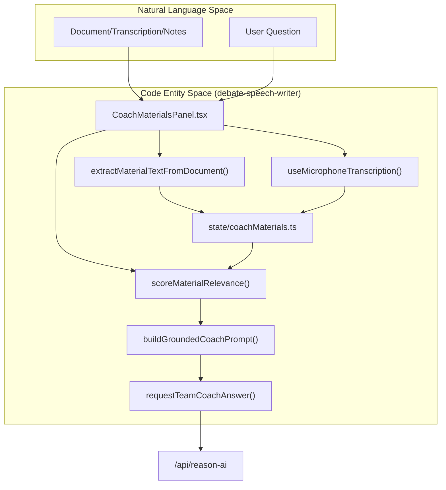
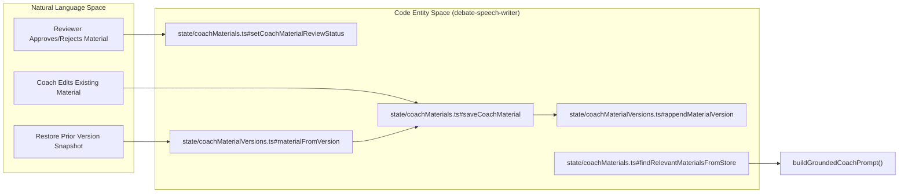

# Judge Decisions & Team Coach AI
Relevant source files
- [apps/debate-ai.com/app/judge-decision/page.tsx](https://github.com/debate/debate-ai.com/blob/34937310/apps/debate-ai.com/app/judge-decision/page.tsx)
- [docs/features/coach-materials.md](https://github.com/debate/debate-ai.com/blob/34937310/docs/features/coach-materials.md?plain=1)
- [packages/debate-practice-drills/src/panels/JudgeDecisionPanel.tsx](https://github.com/debate/debate-ai.com/blob/34937310/packages/debate-practice-drills/src/panels/JudgeDecisionPanel.tsx)
- [packages/debate-practice-drills/src/round/judge-decision-store-wiring.ts](https://github.com/debate/debate-ai.com/blob/34937310/packages/debate-practice-drills/src/round/judge-decision-store-wiring.ts)
- [packages/debate-practice-drills/src/state/judgeDecisions.ts](https://github.com/debate/debate-ai.com/blob/34937310/packages/debate-practice-drills/src/state/judgeDecisions.ts)
- [packages/debate-practice-drills/src/state/savedJudgeDecisions.ts](https://github.com/debate/debate-ai.com/blob/34937310/packages/debate-practice-drills/src/state/savedJudgeDecisions.ts)
- [packages/debate-round/src/round/judge-decision-ai.ts](https://github.com/debate/debate-ai.com/blob/34937310/packages/debate-round/src/round/judge-decision-ai.ts)
- [packages/debate-round/src/round/judge-decision-panel.ts](https://github.com/debate/debate-ai.com/blob/34937310/packages/debate-round/src/round/judge-decision-panel.ts)
- [packages/debate-round/test/judge-decision-ai.test.ts](https://github.com/debate/debate-ai.com/blob/34937310/packages/debate-round/test/judge-decision-ai.test.ts)
- [packages/debate-round/test/judge-decision-panel.test.ts](https://github.com/debate/debate-ai.com/blob/34937310/packages/debate-round/test/judge-decision-panel.test.ts)
- [packages/debate-speech-writer/src/coach/team-coach-client.ts](https://github.com/debate/debate-ai.com/blob/34937310/packages/debate-speech-writer/src/coach/team-coach-client.ts)
- [packages/debate-speech-writer/src/coach/team-coach-materials.ts](https://github.com/debate/debate-ai.com/blob/34937310/packages/debate-speech-writer/src/coach/team-coach-materials.ts)
- [packages/debate-speech-writer/src/hooks/useCoachMaterialsSync.ts](https://github.com/debate/debate-ai.com/blob/34937310/packages/debate-speech-writer/src/hooks/useCoachMaterialsSync.ts)
- [packages/debate-speech-writer/src/index.ts](https://github.com/debate/debate-ai.com/blob/34937310/packages/debate-speech-writer/src/index.ts)
- [packages/debate-speech-writer/src/panels/CoachMaterialsPanel.tsx](https://github.com/debate/debate-ai.com/blob/34937310/packages/debate-speech-writer/src/panels/CoachMaterialsPanel.tsx)
- [packages/debate-speech-writer/src/state/coachConversation.ts](https://github.com/debate/debate-ai.com/blob/34937310/packages/debate-speech-writer/src/state/coachConversation.ts)
- [packages/debate-speech-writer/src/state/coachMaterialVersions.ts](https://github.com/debate/debate-ai.com/blob/34937310/packages/debate-speech-writer/src/state/coachMaterialVersions.ts)
- [packages/debate-speech-writer/src/state/coachMaterials.ts](https://github.com/debate/debate-ai.com/blob/34937310/packages/debate-speech-writer/src/state/coachMaterials.ts)
- [packages/debate-speech-writer/src/state/live-update.ts](https://github.com/debate/debate-ai.com/blob/34937310/packages/debate-speech-writer/src/state/live-update.ts)
- [packages/debate-speech-writer/src/state/savedCoachMaterials.ts](https://github.com/debate/debate-ai.com/blob/34937310/packages/debate-speech-writer/src/state/savedCoachMaterials.ts)
- [packages/debate-speech-writer/test/coachConversation.test.ts](https://github.com/debate/debate-ai.com/blob/34937310/packages/debate-speech-writer/test/coachConversation.test.ts)
- [packages/debate-speech-writer/test/coachMaterialVersions.test.ts](https://github.com/debate/debate-ai.com/blob/34937310/packages/debate-speech-writer/test/coachMaterialVersions.test.ts)
- [packages/debate-speech-writer/test/coachMaterials.test.ts](https://github.com/debate/debate-ai.com/blob/34937310/packages/debate-speech-writer/test/coachMaterials.test.ts)
- [packages/debate-speech-writer/test/live-update.test.ts](https://github.com/debate/debate-ai.com/blob/34937310/packages/debate-speech-writer/test/live-update.test.ts)
- [packages/debate-speech-writer/test/savedCoachMaterials.test.ts](https://github.com/debate/debate-ai.com/blob/34937310/packages/debate-speech-writer/test/savedCoachMaterials.test.ts)
- [packages/debate-speech-writer/test/team-coach-client.test.ts](https://github.com/debate/debate-ai.com/blob/34937310/packages/debate-speech-writer/test/team-coach-client.test.ts)
- [packages/debate-speech-writer/test/team-coach-materials.test.ts](https://github.com/debate/debate-ai.com/blob/34937310/packages/debate-speech-writer/test/team-coach-materials.test.ts)

This page covers the AI-driven analytical features of the **FIAT** and team coaching systems, specifically focusing on generating judge ballots from flow data via `JudgeDecisionPanel`, the tabbed `CoachHub` orchestration component, and the Retrieval-Augmented Generation (RAG) Team Coach AI grounded over `CoachMaterials` (including version tracking, review gating, relevance scoring, and conversation state).

## Overview

The Judge Decision and Team Coach systems rely on the `debate-speech-writer` package to interface with LLMs via centralized API proxies.

- **Judge Decisions**: Analyzes round flows and judge paradigms to generate Aff/Neg decision outlines and simulate balloting. [packages/debate-speech-writer/src/index.ts201](https://github.com/debate/debate-ai.com/blob/34937310/packages/debate-speech-writer/src/index.ts#L201-L201)
- **Team Coach AI & Coach Materials**: A private RAG pipeline enabling teams to upload, tag, review, version, and query instructional content (transcripts, camp notes, recordings) to ground an AI coach in team-specific philosophy. [packages/debate-speech-writer/src/coach/team-coach-materials.ts1-76](https://github.com/debate/debate-ai.com/blob/34937310/packages/debate-speech-writer/src/coach/team-coach-materials.ts#L1-L76)
- **CoachHub**: A tabbed application surface integrating round flows, coaching, prep, scouting, and practice panels. [packages/debate-speech-writer/src/panels/CoachMaterialsPanel.tsx1-81](https://github.com/debate/debate-ai.com/blob/34937310/packages/debate-speech-writer/src/panels/CoachMaterialsPanel.tsx#L1-L81)

Sources: [packages/debate-speech-writer/src/index.ts1-205](https://github.com/debate/debate-ai.com/blob/34937310/packages/debate-speech-writer/src/index.ts#L1-L205)[packages/debate-speech-writer/src/panels/CoachMaterialsPanel.tsx1-81](https://github.com/debate/debate-ai.com/blob/34937310/packages/debate-speech-writer/src/panels/CoachMaterialsPanel.tsx#L1-L81)[packages/debate-speech-writer/src/coach/team-coach-materials.ts1-76](https://github.com/debate/debate-ai.com/blob/34937310/packages/debate-speech-writer/src/coach/team-coach-materials.ts#L1-L76)

---

## Judge Decision System

The Judge Decision system evaluates debate rounds by processing structured flow data against configured judge paradigms.

### Judge Paradigms & Selections

Users select from built-in paradigms or configure custom preferences reflecting real judges. [packages/debate-speech-writer/src/index.ts20-34](https://github.com/debate/debate-ai.com/blob/34937310/packages/debate-speech-writer/src/index.ts#L20-L34)

- **Execution**: `JudgeDecisionPanel` wires round states into decision requests. [packages/debate-practice-drills/src/panels/JudgeDecisionPanel.tsx1-10](https://github.com/debate/debate-ai.com/blob/34937310/packages/debate-practice-drills/src/panels/JudgeDecisionPanel.tsx#L1-L10)
- **Prompting**: Utilizes `judgeDecisionPrompt` for analytical grounding. [packages/debate-speech-writer/src/index.ts201](https://github.com/debate/debate-ai.com/blob/34937310/packages/debate-speech-writer/src/index.ts#L201-L201)

### Judge Decision AI Workflow

The AI judge decision process involves constructing a detailed prompt based on the selected judge paradigm and the round's flow summary, sending it to an LLM, and then parsing the structured response.

#### Judge Decision AI Data Flow

```

```

Sources: [packages/debate-round/src/round/judge-decision-ai.ts1-205](https://github.com/debate/debate-ai.com/blob/34937310/packages/debate-round/src/round/judge-decision-ai.ts#L1-L205)[packages/debate-speech-writer/src/judge/judge-paradigms.ts1-34](https://github.com/debate/debate-ai.com/blob/34937310/packages/debate-speech-writer/src/judge/judge-paradigms.ts#L1-L34)

#### Key Functions

- `buildJudgeDecisionAiUserPrompt(input: JudgeDecisionAiInput)`: Constructs the user-turn message for the AI, combining the judge paradigm's prompt, side labels, and the round's flow summary. [packages/debate-round/src/round/judge-decision-ai.ts89-102](https://github.com/debate/debate-ai.com/blob/34937310/packages/debate-round/src/round/judge-decision-ai.ts#L89-L102)
- `JUDGE_DECISION_AI_SYSTEM_PROMPT`: Defines the system prompt instructing the AI to act as a debate judge and respond in strict JSON. [packages/debate-round/src/round/judge-decision-ai.ts71-81](https://github.com/debate/debate-ai.com/blob/34937310/packages/debate-round/src/round/judge-decision-ai.ts#L71-L81)
- `parseJudgeDecisionAiResponse(raw: string)`: Tolerantly parses the AI's raw response, extracting JSON even if wrapped in prose or a markdown code fence, and validates its structure against `JudgeDecisionAiResult`. [packages/debate-round/src/round/judge-decision-ai.ts146-147](https://github.com/debate/debate-ai.com/blob/34937310/packages/debate-round/src/round/judge-decision-ai.ts#L146-L147)
- `buildJudgeDecisionRubric(paradigm: JudgeParadigm, decision: JudgeDecisionAiResult)`: Generates a scoring rubric based on the judge paradigm's `votingPriorities`, marking each criterion as addressed or unaddressed by the AI's decision. [packages/debate-round/src/round/judge-decision-ai.ts108](https://github.com/debate/debate-ai.com/blob/34937310/packages/debate-round/src/round/judge-decision-ai.ts#L108-L108)

### Judge Panel Decisions

When multiple judge paradigms are used, `combineJudgePanelDecisions` aggregates their individual results.

- It determines a majority winner or declares a split. [packages/debate-round/test/judge-decision-panel.test.ts18-28](https://github.com/debate/debate-ai.com/blob/34937310/packages/debate-round/test/judge-decision-panel.test.ts#L18-L28)
- It unions key voting issues, de-duplicated and in first-seen order. [packages/debate-round/test/judge-decision-panel.test.ts51-57](https://github.com/debate/debate-ai.com/blob/34937310/packages/debate-round/test/judge-decision-panel.test.ts#L51-L57)

Sources: [packages/debate-speech-writer/src/index.ts20-34](https://github.com/debate/debate-ai.com/blob/34937310/packages/debate-speech-writer/src/index.ts#L20-L34)[packages/debate-practice-drills/src/panels/JudgeDecisionPanel.tsx1-10](https://github.com/debate/debate-ai.com/blob/34937310/packages/debate-practice-drills/src/panels/JudgeDecisionPanel.tsx#L1-L10)[packages/debate-speech-writer/src/index.ts201](https://github.com/debate/debate-ai.com/blob/34937310/packages/debate-speech-writer/src/index.ts#L201-L201)[packages/debate-round/src/round/judge-decision-ai.ts1-205](https://github.com/debate/debate-ai.com/blob/34937310/packages/debate-round/src/round/judge-decision-ai.ts#L1-L205)[packages/debate-round/test/judge-decision-panel.test.ts11-57](https://github.com/debate/debate-ai.com/blob/34937310/packages/debate-round/test/judge-decision-panel.test.ts#L11-L57)

---

## Team Coach AI & RAG Architecture

The Team Coach AI functions as a deterministic RAG system over locally persisted or synced `CoachMaterial` items.

### Natural Language to Code Entity Space: RAG Pipeline



Sources: [packages/debate-speech-writer/src/panels/CoachMaterialsPanel.tsx1-153](https://github.com/debate/debate-ai.com/blob/34937310/packages/debate-speech-writer/src/panels/CoachMaterialsPanel.tsx#L1-L153)[packages/debate-speech-writer/src/coach/team-coach-materials.ts1-166](https://github.com/debate/debate-ai.com/blob/34937310/packages/debate-speech-writer/src/coach/team-coach-materials.ts#L1-L166)[packages/debate-speech-writer/src/state/coachMaterials.ts1-191](https://github.com/debate/debate-ai.com/blob/34937310/packages/debate-speech-writer/src/state/coachMaterials.ts#L1-L191)

### Ingestion, Extraction & Transcription

- **Document Extraction**: `extractMaterialTextFromDocument` processes `.docx`, `.txt`, and `.md` files into material text fields. [packages/debate-speech-writer/src/panels/CoachMaterialsPanel.tsx109](https://github.com/debate/debate-ai.com/blob/34937310/packages/debate-speech-writer/src/panels/CoachMaterialsPanel.tsx#L109-L109)
- **Microphone Dictation**: `useMicrophoneTranscription` hooks into the Web Speech API for voice input. [packages/debate-speech-writer/src/panels/CoachMaterialsPanel.tsx111](https://github.com/debate/debate-ai.com/blob/34937310/packages/debate-speech-writer/src/panels/CoachMaterialsPanel.tsx#L111-L111)

### Relevance Scoring

`scoreMaterialRelevance` evaluates candidate materials against queries using deterministic token overlap across titles, bodies, and tags. [packages/debate-speech-writer/src/coach/team-coach-materials.ts161-175](https://github.com/debate/debate-ai.com/blob/34937310/packages/debate-speech-writer/src/coach/team-coach-materials.ts#L161-L175)

Sources: [packages/debate-speech-writer/src/panels/CoachMaterialsPanel.tsx76-121](https://github.com/debate/debate-ai.com/blob/34937310/packages/debate-speech-writer/src/panels/CoachMaterialsPanel.tsx#L76-L121)[packages/debate-speech-writer/src/coach/team-coach-materials.ts161-175](https://github.com/debate/debate-ai.com/blob/34937310/packages/debate-speech-writer/src/coach/team-coach-materials.ts#L161-L175)

---

## Coach Materials Management, Review Gating & Versioning

Materials are managed via `CoachMaterialsPanel` and persisted through `state/coachMaterials.ts` and `state/coachMaterialVersions.ts`.

### Natural Language to Code Entity Space: Version & Review State



Sources: [packages/debate-speech-writer/src/state/coachMaterials.ts71-180](https://github.com/debate/debate-ai.com/blob/34937310/packages/debate-speech-writer/src/state/coachMaterials.ts#L71-L180)[packages/debate-speech-writer/src/state/coachMaterialVersions.ts59-168](https://github.com/debate/debate-ai.com/blob/34937310/packages/debate-speech-writer/src/state/coachMaterialVersions.ts#L59-L168)

### Review Gating

- **Statuses**: Materials exist in `CoachMaterialStatus` states (`pending`, `approved`, `rejected`). [packages/debate-speech-writer/src/coach/team-coach-materials.ts46-56](https://github.com/debate/debate-ai.com/blob/34937310/packages/debate-speech-writer/src/coach/team-coach-materials.ts#L46-L56)
- **Enforcement**: `findRelevantMaterialsFromStore` filters candidates strictly through `filterApprovedCoachMaterials`, preventing unreviewed or rejected materials from contaminating model grounding. [packages/debate-speech-writer/src/state/coachMaterials.ts157-162](https://github.com/debate/debate-ai.com/blob/34937310/packages/debate-speech-writer/src/state/coachMaterials.ts#L157-L162)

### Version History

- **Snapshotting**: Overwriting an existing material via `saveCoachMaterial` automatically snapshots the prior record into `state/coachMaterialVersions.ts` up to `MAX_VERSIONS_PER_MATERIAL` (10 versions). [packages/debate-speech-writer/src/state/coachMaterials.ts79-92](https://github.com/debate/debate-ai.com/blob/34937310/packages/debate-speech-writer/src/state/coachMaterials.ts#L79-L92)[packages/debate-speech-writer/src/state/coachMaterialVersions.ts34-91](https://github.com/debate/debate-ai.com/blob/34937310/packages/debate-speech-writer/src/state/coachMaterialVersions.ts#L34-L91)
- **Restoration**: `materialFromVersion` reconstructs a `CoachMaterial` from a snapshot, resetting its status to `pending` for re-review. [packages/debate-speech-writer/src/state/coachMaterialVersions.ts158-168](https://github.com/debate/debate-ai.com/blob/34937310/packages/debate-speech-writer/src/state/coachMaterialVersions.ts#L158-L168)

### Cross-Tab Live Updates

The `CoachMaterialsPanel` listens for `storage` events to refresh its UI across browser tabs. This is managed by `isCoachMaterialsPanelLiveUpdateStorageEvent` which checks for changes in `coachMaterials`, `coachMaterialVersions`, and `coachConversation` keys in `localStorage`. [packages/debate-speech-writer/src/state/live-update.ts48-76](https://github.com/debate/debate-ai.com/blob/34937310/packages/debate-speech-writer/src/state/live-update.ts#L48-L76)

Sources: [packages/debate-speech-writer/src/coach/team-coach-materials.ts46-76](https://github.com/debate/debate-ai.com/blob/34937310/packages/debate-speech-writer/src/coach/team-coach-materials.ts#L46-L76)[packages/debate-speech-writer/src/state/coachMaterials.ts71-180](https://github.com/debate/debate-ai.com/blob/34937310/packages/debate-speech-writer/src/state/coachMaterials.ts#L71-L180)[packages/debate-speech-writer/src/state/coachMaterialVersions.ts19-168](https://github.com/debate/debate-ai.com/blob/34937310/packages/debate-speech-writer/src/state/coachMaterialVersions.ts#L19-L168)[packages/debate-speech-writer/src/state/live-update.ts48-76](https://github.com/debate/debate-ai.com/blob/34937310/packages/debate-speech-writer/src/state/live-update.ts#L48-L76)

---

## Conversation State & CoachHub Orchestration

The system maintains conversational context and unifies panel surfaces.

### Conversation History

- **Persistence**: `state/coachConversation.ts` stores question/answer turns in `localStorage`. [packages/debate-speech-writer/src/index.ts193-196](https://github.com/debate/debate-ai.com/blob/34937310/packages/debate-speech-writer/src/index.ts#L193-L196)
- **Context Assembly**: `buildCoachConversationMessages` packs recent turns (default max 6) into multi-turn chat arrays for `requestTeamCoachAnswer`. [packages/debate-speech-writer/src/coach/team-coach-materials.ts131-142](https://github.com/debate/debate-ai.com/blob/34937310/packages/debate-speech-writer/src/coach/team-coach-materials.ts#L131-L142)

### CoachHub UI Integration

`CoachMaterialsPanel` serves as the primary UI for managing coach materials and interacting with the Team Coach AI. [packages/debate-speech-writer/src/panels/CoachMaterialsPanel.tsx1-81](https://github.com/debate/debate-ai.com/blob/34937310/packages/debate-speech-writer/src/panels/CoachMaterialsPanel.tsx#L1-L81)

Sources: [packages/debate-speech-writer/src/coach/team-coach-materials.ts117-142](https://github.com/debate/debate-ai.com/blob/34937310/packages/debate-speech-writer/src/coach/team-coach-materials.ts#L117-L142)[packages/debate-speech-writer/src/panels/CoachMaterialsPanel.tsx1-81](https://github.com/debate/debate-ai.com/blob/34937310/packages/debate-speech-writer/src/panels/CoachMaterialsPanel.tsx#L1-L81)