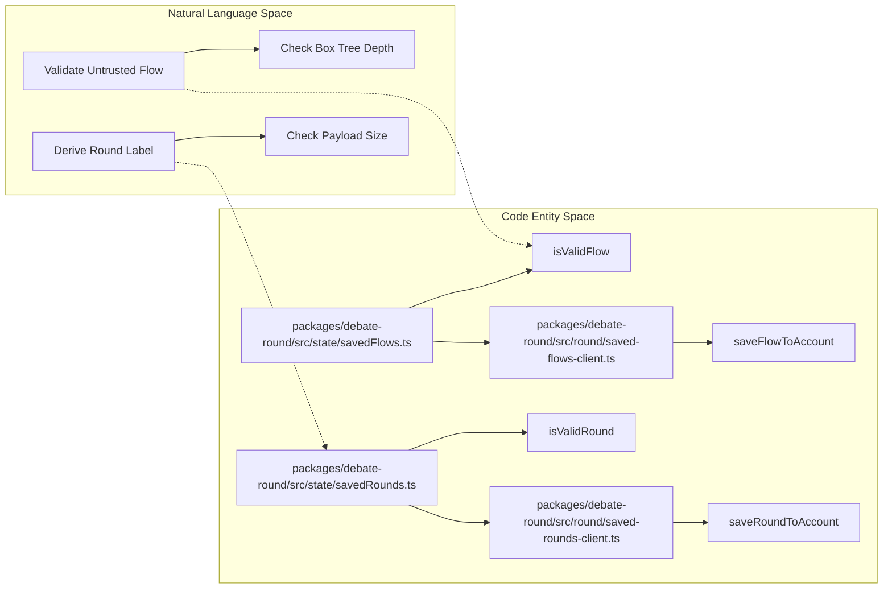
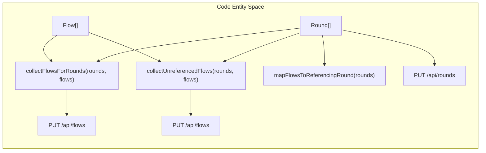

# Round & Flow Cloud Save, Invites and Notifications
Relevant source files
- [apps/debate-ai.com/app/api/flows/[clientId]/route.ts](apps/debate-ai.com/app/api/flows/%5BclientId%5D/route.ts)
- [apps/debate-ai.com/app/api/flows/route.ts](https://github.com/debate/debate-ai.com/blob/34937310/apps/debate-ai.com/app/api/flows/route.ts)
- [apps/debate-ai.com/app/api/notifications/route.ts](https://github.com/debate/debate-ai.com/blob/34937310/apps/debate-ai.com/app/api/notifications/route.ts)
- [apps/debate-ai.com/app/api/rounds/[clientId]/route.ts](apps/debate-ai.com/app/api/rounds/%5BclientId%5D/route.ts)
- [apps/debate-ai.com/app/api/rounds/invite/route.ts](https://github.com/debate/debate-ai.com/blob/34937310/apps/debate-ai.com/app/api/rounds/invite/route.ts)
- [apps/debate-ai.com/app/api/rounds/route.ts](https://github.com/debate/debate-ai.com/blob/34937310/apps/debate-ai.com/app/api/rounds/route.ts)
- [apps/debate-ai.com/app/api/users/search/route.ts](https://github.com/debate/debate-ai.com/blob/34937310/apps/debate-ai.com/app/api/users/search/route.ts)
- [apps/debate-ai.com/drizzle/0008_tough_wolfsbane.sql](https://github.com/debate/debate-ai.com/blob/34937310/apps/debate-ai.com/drizzle/0008_tough_wolfsbane.sql)
- [apps/debate-ai.com/drizzle/0012_add_editor_preferences.sql](https://github.com/debate/debate-ai.com/blob/34937310/apps/debate-ai.com/drizzle/0012_add_editor_preferences.sql)
- [apps/debate-ai.com/drizzle/0025_lonely_wraith.sql](https://github.com/debate/debate-ai.com/blob/34937310/apps/debate-ai.com/drizzle/0025_lonely_wraith.sql)
- [apps/debate-ai.com/drizzle/meta/0008_snapshot.json](https://github.com/debate/debate-ai.com/blob/34937310/apps/debate-ai.com/drizzle/meta/0008_snapshot.json)
- [apps/debate-ai.com/drizzle/meta/0011_snapshot.json](https://github.com/debate/debate-ai.com/blob/34937310/apps/debate-ai.com/drizzle/meta/0011_snapshot.json)
- [apps/debate-ai.com/drizzle/meta/0012_snapshot.json](https://github.com/debate/debate-ai.com/blob/34937310/apps/debate-ai.com/drizzle/meta/0012_snapshot.json)
- [docs/features/flow-cloud-save.md](https://github.com/debate/debate-ai.com/blob/34937310/docs/features/flow-cloud-save.md?plain=1)
- [docs/features/round-cloud-save.md](https://github.com/debate/debate-ai.com/blob/34937310/docs/features/round-cloud-save.md?plain=1)
- [packages/debate-data-sync/src/videos/video-rows.ts](https://github.com/debate/debate-ai.com/blob/34937310/packages/debate-data-sync/src/videos/video-rows.ts)
- [packages/debate-data-sync/test/video-rows.test.ts](https://github.com/debate/debate-ai.com/blob/34937310/packages/debate-data-sync/test/video-rows.test.ts)
- [packages/debate-round/src/dialogs/FlowHistoryDialog.tsx](https://github.com/debate/debate-ai.com/blob/34937310/packages/debate-round/src/dialogs/FlowHistoryDialog.tsx)
- [packages/debate-round/src/round/saved-flows-client.ts](https://github.com/debate/debate-ai.com/blob/34937310/packages/debate-round/src/round/saved-flows-client.ts)
- [packages/debate-round/src/state/bulkRoundSave.ts](https://github.com/debate/debate-ai.com/blob/34937310/packages/debate-round/src/state/bulkRoundSave.ts)
- [packages/debate-round/src/state/savedFlows.ts](https://github.com/debate/debate-ai.com/blob/34937310/packages/debate-round/src/state/savedFlows.ts)
- [packages/debate-round/src/state/store.ts](https://github.com/debate/debate-ai.com/blob/34937310/packages/debate-round/src/state/store.ts)
- [packages/debate-round/test/bulkRoundSave.test.ts](https://github.com/debate/debate-ai.com/blob/34937310/packages/debate-round/test/bulkRoundSave.test.ts)
- [packages/debate-round/test/flowStoreRounds.test.ts](https://github.com/debate/debate-ai.com/blob/34937310/packages/debate-round/test/flowStoreRounds.test.ts)
- [packages/debate-round/test/savedFlows.test.ts](https://github.com/debate/debate-ai.com/blob/34937310/packages/debate-round/test/savedFlows.test.ts)
- [packages/debate-ui/src/layout/footer.tsx](https://github.com/debate/debate-ai.com/blob/34937310/packages/debate-ui/src/layout/footer.tsx)
- [packages/debate-videos/src/components/video-grid/VideoListRows.tsx](https://github.com/debate/debate-ai.com/blob/34937310/packages/debate-videos/src/components/video-grid/VideoListRows.tsx)
- [packages/debate-videos/src/components/video-grid/useResizableColumns.ts](https://github.com/debate/debate-ai.com/blob/34937310/packages/debate-videos/src/components/video-grid/useResizableColumns.ts)
- [packages/debate-videos/src/types/videos.ts](https://github.com/debate/debate-ai.com/blob/34937310/packages/debate-videos/src/types/videos.ts)

## Purpose and Scope

This document details the architecture and implementation of the cloud persistence layer for debate rounds and flows, bulk synchronization strategies, the `FlowHistoryDialog` management interface, round invitations, user search utilities, and account notifications. These components bridge local-first client states (`useFlowStore`) with Cloudflare D1 persistent storage via Next.js API routes in `apps/debate-ai.com` and client-side modules in `packages/debate-round`.

---

## 1. Cloud Save Stores & Client Architectures (`savedFlows`, `savedRounds`, `cloudLibrary`)

The cloud save architecture separates structural validation and client-side fetch wrappers from UI state management. Local storage states in `packages/debate-round` map untrusted payloads to strongly-typed definitions before transmission.

- **Flow Persistence (`savedFlows.ts`)**: Implements strict recursive structural validation via `isValidFlow` (capping `Box` tree traversal at 200 nesting depths) and label extraction via `deriveFlowLabel`[docs/features/flow-cloud-save.md40-46](https://github.com/debate/debate-ai.com/blob/34937310/docs/features/flow-cloud-save.md?plain=1#L40-L46)
- **Round Persistence (`savedRounds.ts`)**: Implements `isValidRound` schema verification and fallback formatting in `deriveRoundLabel`[docs/features/round-cloud-save.md110-116](https://github.com/debate/debate-ai.com/blob/34937310/docs/features/round-cloud-save.md?plain=1#L110-L116) Enforces a 2MB payload ceiling via `MAX_SAVED_ROUND_BYTES`[apps/debate-ai.com/app/api/rounds/[clientId]/route.ts:74-76]().
- **Fetch Clients**: Communication relies on fetch client modules (`saved-flows-client.ts`, `saved-rounds-client.ts`) that execute `GET`, `PUT`, and `DELETE` requests against cloud endpoints, mapping HTTP 401 responses to unauthenticated states [docs/features/flow-cloud-save.md47-51](https://github.com/debate/debate-ai.com/blob/34937310/docs/features/flow-cloud-save.md?plain=1#L47-L51)[docs/features/round-cloud-save.md117-121](https://github.com/debate/debate-ai.com/blob/34937310/docs/features/round-cloud-save.md?plain=1#L117-L121)



Sources: [docs/features/flow-cloud-save.md40-51](https://github.com/debate/debate-ai.com/blob/34937310/docs/features/flow-cloud-save.md?plain=1#L40-L51)[docs/features/round-cloud-save.md110-121](https://github.com/debate/debate-ai.com/blob/34937310/docs/features/round-cloud-save.md?plain=1#L110-L121)[packages/debate-round/src/state/savedFlows.ts](https://github.com/debate/debate-ai.com/blob/34937310/packages/debate-round/src/state/savedFlows.ts)[packages/debate-round/src/state/savedRounds.ts](https://github.com/debate/debate-ai.com/blob/34937310/packages/debate-round/src/state/savedRounds.ts)[packages/debate-round/src/round/saved-flows-client.ts](https://github.com/debate/debate-ai.com/blob/34937310/packages/debate-round/src/round/saved-flows-client.ts)[packages/debate-round/src/round/saved-rounds-client.ts](https://github.com/debate/debate-ai.com/blob/34937310/packages/debate-round/src/round/saved-rounds-client.ts)[apps/debate-ai.com/app/api/rounds/[clientId]/route.ts:74-76]()

---

## 2. Bulk Round Save & Cascade Synchronization (`bulkRoundSave`)

To prevent redundant uploads and maintain consistency between tournaments and individual flow sheets, bulk synchronization operations are centralized in `packages/debate-round/src/state/bulkRoundSave.ts`[packages/debate-round/src/state/bulkRoundSave.ts1-14](https://github.com/debate/debate-ai.com/blob/34937310/packages/debate-round/src/state/bulkRoundSave.ts#L1-L14)

### Core Bulk Functions

- `collectFlowsForRounds(rounds, flows)`: Iterates through an array of `Round` structures, compiling a deduplicated list of referenced local `Flow` instances in first-referencing-round order [packages/debate-round/src/state/bulkRoundSave.ts30-46](https://github.com/debate/debate-ai.com/blob/34937310/packages/debate-round/src/state/bulkRoundSave.ts#L30-L46)
- `collectUnreferencedFlows(rounds, flows)`: Filters out flows whose `id` values are already tracked by any round's `flowIds` vector [packages/debate-round/src/state/bulkRoundSave.ts55-64](https://github.com/debate/debate-ai.com/blob/34937310/packages/debate-round/src/state/bulkRoundSave.ts#L55-L64)
- `mapFlowsToReferencingRound(rounds)`: Builds a mapping from flow ID to its primary referencing `Round`, powering the "via round" metadata badges in UI views [packages/debate-round/src/state/bulkRoundSave.ts75-85](https://github.com/debate/debate-ai.com/blob/34937310/packages/debate-round/src/state/bulkRoundSave.ts#L75-L85)
- `summarizeBulkSaveOutcomes(outcomes)`: Aggregates execution results into structured `savedCount` and `errorCount` metrics [packages/debate-round/src/state/bulkRoundSave.ts91-100](https://github.com/debate/debate-ai.com/blob/34937310/packages/debate-round/src/state/bulkRoundSave.ts#L91-L100)



Sources: [packages/debate-round/src/state/bulkRoundSave.ts1-14](https://github.com/debate/debate-ai.com/blob/34937310/packages/debate-round/src/state/bulkRoundSave.ts#L1-L14)[packages/debate-round/src/state/bulkRoundSave.ts30-46](https://github.com/debate/debate-ai.com/blob/34937310/packages/debate-round/src/state/bulkRoundSave.ts#L30-L46)[packages/debate-round/src/state/bulkRoundSave.ts55-64](https://github.com/debate/debate-ai.com/blob/34937310/packages/debate-round/src/state/bulkRoundSave.ts#L55-L64)[packages/debate-round/src/state/bulkRoundSave.ts75-85](https://github.com/debate/debate-ai.com/blob/34937310/packages/debate-round/src/state/bulkRoundSave.ts#L75-L85)[packages/debate-round/src/state/bulkRoundSave.ts91-100](https://github.com/debate/debate-ai.com/blob/34937310/packages/debate-round/src/state/bulkRoundSave.ts#L91-L100)[packages/debate-round/test/bulkRoundSave.test.ts](https://github.com/debate/debate-ai.com/blob/34937310/packages/debate-round/test/bulkRoundSave.test.ts)

---

## 3. UI Integration & Management (`FlowHistoryDialog`)

The `FlowHistoryDialog` component (`packages/debate-round/src/dialogs/FlowHistoryDialog.tsx`) renders the primary management interface for local history, cloud items, and bulk synchronization triggers [packages/debate-round/src/dialogs/FlowHistoryDialog.tsx140-188](https://github.com/debate/debate-ai.com/blob/34937310/packages/debate-round/src/dialogs/FlowHistoryDialog.tsx#L140-L188)

- **Tabs**: Organizes items into a local "Rounds" history view and a cloud-synced "Saved to account" view [packages/debate-round/src/dialogs/FlowHistoryDialog.tsx159](https://github.com/debate/debate-ai.com/blob/34937310/packages/debate-round/src/dialogs/FlowHistoryDialog.tsx#L159-L159)
- **Cloud Icons & Status Tracking**: Each row maintains localized action states (`saving`, `saved`, `loading`, `removing`, `error`) [packages/debate-round/src/dialogs/FlowHistoryDialog.tsx54](https://github.com/debate/debate-ai.com/blob/34937310/packages/debate-round/src/dialogs/FlowHistoryDialog.tsx#L54-L54)
- **Bulk Action Triggers**: Exposes buttons for "Save all rounds" and "Save flows not in a round", rendering transient outcome counts upon completion [packages/debate-round/src/dialogs/FlowHistoryDialog.tsx165-170](https://github.com/debate/debate-ai.com/blob/34937310/packages/debate-round/src/dialogs/FlowHistoryDialog.tsx#L165-L170)

Sources: [packages/debate-round/src/dialogs/FlowHistoryDialog.tsx140-188](https://github.com/debate/debate-ai.com/blob/34937310/packages/debate-round/src/dialogs/FlowHistoryDialog.tsx#L140-L188)[packages/debate-round/src/dialogs/FlowHistoryDialog.tsx159](https://github.com/debate/debate-ai.com/blob/34937310/packages/debate-round/src/dialogs/FlowHistoryDialog.tsx#L159-L159)[packages/debate-round/src/dialogs/FlowHistoryDialog.tsx54](https://github.com/debate/debate-ai.com/blob/34937310/packages/debate-round/src/dialogs/FlowHistoryDialog.tsx#L54-L54)[packages/debate-round/src/dialogs/FlowHistoryDialog.tsx165-170](https://github.com/debate/debate-ai.com/blob/34937310/packages/debate-round/src/dialogs/FlowHistoryDialog.tsx#L165-L170)

---

## 4. Backend Cloud Persistence APIs (`/api/flows`, `/api/rounds`)

Backend persistence routes handle secure D1 database queries via Drizzle ORM.

### Flow Endpoints

- `GET /api/flows`: Returns summary lists (`clientId`, `label`, `updatedAt`) of saved flows for the active authenticated user, ordered by recency [docs/features/flow-cloud-save.md58-60](https://github.com/debate/debate-ai.com/blob/34937310/docs/features/flow-cloud-save.md?plain=1#L58-L60)
- `GET /api/flows/[clientId]`: Fetches the complete JSON data payload for a specific flow client ID [docs/features/flow-cloud-save.md65](https://github.com/debate/debate-ai.com/blob/34937310/docs/features/flow-cloud-save.md?plain=1#L65-L65)
- `PUT /api/flows/[clientId]`: Validates payloads via `isValidFlow`, checks size boundaries, computes labels, and executes upsert operations via `onConflictDoUpdate`[docs/features/flow-cloud-save.md66-68](https://github.com/debate/debate-ai.com/blob/34937310/docs/features/flow-cloud-save.md?plain=1#L66-L68)
- `DELETE /api/flows/[clientId]`: Removes the specified flow record [docs/features/flow-cloud-save.md69](https://github.com/debate/debate-ai.com/blob/34937310/docs/features/flow-cloud-save.md?plain=1#L69-L69)

### Round Endpoints

- `GET /api/rounds`: Queries `savedRounds` to list summaries for the authorized user [apps/debate-ai.com/app/api/rounds/route.ts19-33](https://github.com/debate/debate-ai.com/blob/34937310/apps/debate-ai.com/app/api/rounds/route.ts#L19-L33)
- `GET /api/rounds/[clientId]` & `PUT /api/rounds/[clientId]`: Handles retrieval and upsert validation for saved rounds (`isValidRound`), ensuring URL identifiers match body parameters [apps/debate-ai.com/app/api/rounds/[clientId]/route.ts:26-91]().
- `DELETE /api/rounds/[clientId]`: Purges a saved round entry [apps/debate-ai.com/app/api/rounds/[clientId]/route.ts:93-107]().

Sources: [apps/debate-ai.com/app/api/rounds/route.ts19-33](https://github.com/debate/debate-ai.com/blob/34937310/apps/debate-ai.com/app/api/rounds/route.ts#L19-L33)[apps/debate-ai.com/app/api/rounds/[clientId]/route.ts:26-91](), [apps/debate-ai.com/app/api/rounds/[clientId]/route.ts:93-107](), [docs/features/flow-cloud-save.md58-69](https://github.com/debate/debate-ai.com/blob/34937310/docs/features/flow-cloud-save.md?plain=1#L58-L69)

---

## 5. Round Invites, User Search & Notifications (`/api/rounds/invite`, `/api/users/search`, `/api/notifications`)

Collaboration and asynchronous alerts depend on dedicated routing endpoints.

- **User Search & Invites (`/api/users/search`, `/api/rounds/invite`)**: Enables debaters to query registered accounts by handle or email and dispatch round collaboration invites.
- **Notifications Route (`apps/debate-ai.com/app/api/notifications/route.ts`)**:

- `GET`: Retrieves up to 50 recent notifications ordered by creation timestamp, evaluating `unreadCount` over the returned page slice [apps/debate-ai.com/app/api/notifications/route.ts40-62](https://github.com/debate/debate-ai.com/blob/34937310/apps/debate-ai.com/app/api/notifications/route.ts#L40-L62) Handles database schema absence gracefully when migration states lag behind deployments (`no such table` warnings) [apps/debate-ai.com/app/api/notifications/route.ts31-38](https://github.com/debate/debate-ai.com/blob/34937310/apps/debate-ai.com/app/api/notifications/route.ts#L31-L38)
- `PATCH`: Updates read states for individual notification records or marks all unread items as read via `{ all: true }` payloads [apps/debate-ai.com/app/api/notifications/route.ts75-120](https://github.com/debate/debate-ai.com/blob/34937310/apps/debate-ai.com/app/api/notifications/route.ts#L75-L120)

```

```

Sources: [apps/debate-ai.com/app/api/notifications/route.ts40-62](https://github.com/debate/debate-ai.com/blob/34937310/apps/debate-ai.com/app/api/notifications/route.ts#L40-L62)[apps/debate-ai.com/app/api/notifications/route.ts31-38](https://github.com/debate/debate-ai.com/blob/34937310/apps/debate-ai.com/app/api/notifications/route.ts#L31-L38)[apps/debate-ai.com/app/api/notifications/route.ts75-120](https://github.com/debate/debate-ai.com/blob/34937310/apps/debate-ai.com/app/api/notifications/route.ts#L75-L120)[apps/debate-ai.com/app/api/rounds/invite/route.ts](https://github.com/debate/debate-ai.com/blob/34937310/apps/debate-ai.com/app/api/rounds/invite/route.ts)[apps/debate-ai.com/app/api/users/search/route.ts](https://github.com/debate/debate-ai.com/blob/34937310/apps/debate-ai.com/app/api/users/search/route.ts)