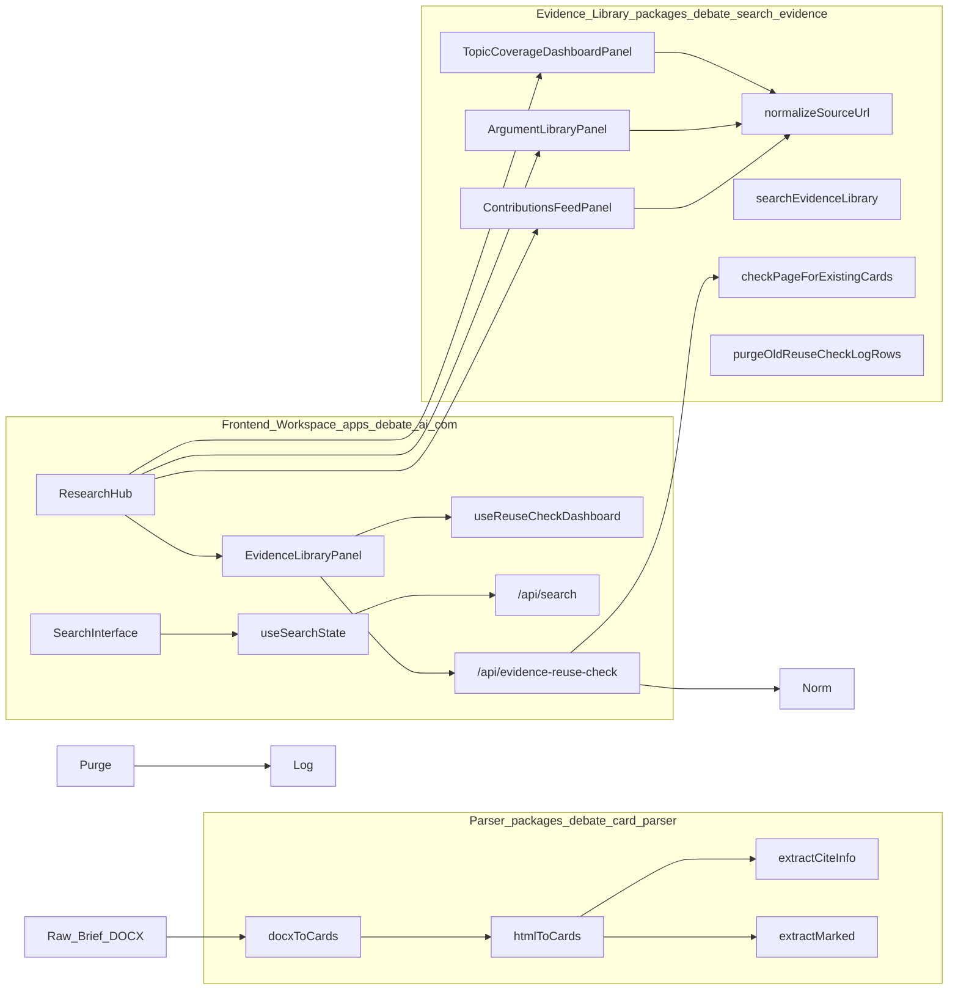
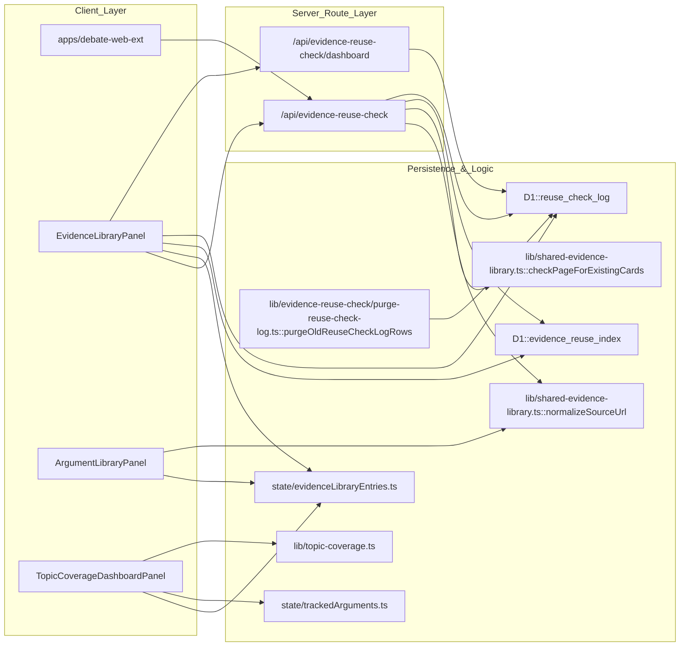

# CARDS Module — Evidence Search & Research Crowdsourcing
Relevant source files
- [apps/debate-ai.com/app/cards/contributions/page.tsx](https://github.com/debate/debate-ai.com/blob/34937310/apps/debate-ai.com/app/cards/contributions/page.tsx)
- [apps/debate-ai.com/app/cards/inbox/page.tsx](https://github.com/debate/debate-ai.com/blob/34937310/apps/debate-ai.com/app/cards/inbox/page.tsx)
- [apps/debate-ai.com/components/research/ContributionsFeedWithIdentity.tsx](https://github.com/debate/debate-ai.com/blob/34937310/apps/debate-ai.com/components/research/ContributionsFeedWithIdentity.tsx)
- [apps/debate-ai.com/components/research/ResearchHub.tsx](https://github.com/debate/debate-ai.com/blob/34937310/apps/debate-ai.com/components/research/ResearchHub.tsx)
- [apps/debate-ai.com/components/research/TaskInboxWithIdentity.tsx](https://github.com/debate/debate-ai.com/blob/34937310/apps/debate-ai.com/components/research/TaskInboxWithIdentity.tsx)
- [apps/debate-web-ext/README.md](https://github.com/debate/debate-ai.com/blob/34937310/apps/debate-web-ext/README.md?plain=1)
- [docs/features/contributions-feed.md](https://github.com/debate/debate-ai.com/blob/34937310/docs/features/contributions-feed.md?plain=1)
- [docs/features/evidence-library.md](https://github.com/debate/debate-ai.com/blob/34937310/docs/features/evidence-library.md?plain=1)
- [docs/features/on-page-card-reuse-search.md](https://github.com/debate/debate-ai.com/blob/34937310/docs/features/on-page-card-reuse-search.md?plain=1)
- [docs/features/topic-coverage-dashboard.md](https://github.com/debate/debate-ai.com/blob/34937310/docs/features/topic-coverage-dashboard.md?plain=1)
- [packages/debate-search-evidence/src/lib/topic-coverage.ts](https://github.com/debate/debate-ai.com/blob/34937310/packages/debate-search-evidence/src/lib/topic-coverage.ts)
- [packages/debate-search-evidence/src/panels/ArgumentLibraryPanel.tsx](https://github.com/debate/debate-ai.com/blob/34937310/packages/debate-search-evidence/src/panels/ArgumentLibraryPanel.tsx)
- [packages/debate-search-evidence/src/panels/EvidenceLibraryPanel.tsx](https://github.com/debate/debate-ai.com/blob/34937310/packages/debate-search-evidence/src/panels/EvidenceLibraryPanel.tsx)
- [packages/debate-search-evidence/src/panels/TopicCoverageDashboardPanel.tsx](https://github.com/debate/debate-ai.com/blob/34937310/packages/debate-search-evidence/src/panels/TopicCoverageDashboardPanel.tsx)
- [packages/debate-search-evidence/src/state/topicCoverageSnapshots.ts](https://github.com/debate/debate-ai.com/blob/34937310/packages/debate-search-evidence/src/state/topicCoverageSnapshots.ts)
- [packages/debate-search-evidence/src/state/trackedArguments.ts](https://github.com/debate/debate-ai.com/blob/34937310/packages/debate-search-evidence/src/state/trackedArguments.ts)
- [packages/debate-search-evidence/test/live-update.test.ts](https://github.com/debate/debate-ai.com/blob/34937310/packages/debate-search-evidence/test/live-update.test.ts)
- [packages/debate-search-evidence/test/topic-coverage.test.ts](https://github.com/debate/debate-ai.com/blob/34937310/packages/debate-search-evidence/test/topic-coverage.test.ts)
- [packages/debate-search-evidence/test/topicCoverageSnapshots.test.ts](https://github.com/debate/debate-ai.com/blob/34937310/packages/debate-search-evidence/test/topicCoverageSnapshots.test.ts)
- [packages/debate-search-evidence/test/trackedArguments.test.ts](https://github.com/debate/debate-ai.com/blob/34937310/packages/debate-search-evidence/test/trackedArguments.test.ts)

The **CARDS** (Crowdsourced Annotated Research for Debating Solutions) module is the evidence management and crowdsourcing engine of the platform. It provides a full-text search interface, DOCX/HTML parsing pipelines, a shared team-wide evidence and argument library with reuse detection, contributor gamification, and AI-assisted card quality scoring.

The module bridges raw research documents and structured, AI-analyzable evidence used across Policy, LD, PF, and College debate formats [packages/debate-card-search/README.md3-6](https://github.com/debate/debate-ai.com/blob/34937310/packages/debate-card-search/README.md?plain=1#L3-L6)

### System Overview

The CARDS architecture integrates client-side search interfaces, parsing toolkits, server-backed evidence reuse logs, and crowdsourcing persistence models. The primary entry point for research workflows is accessible via the `/cards` route [apps/debate-ai.com/components/layout/CategoryDock.tsx43](https://github.com/debate/debate-ai.com/blob/34937310/apps/debate-ai.com/components/layout/CategoryDock.tsx#L43-L43)

Title: CARDS Module Architecture

Sources: [packages/debate-card-search/README.md1-14](https://github.com/debate/debate-ai.com/blob/34937310/packages/debate-card-search/README.md?plain=1#L1-L14)[packages/debate-card-parser/src/index.ts1-32](https://github.com/debate/debate-ai.com/blob/34937310/packages/debate-card-parser/src/index.ts#L1-L32)[packages/debate-search-evidence/src/lib/shared-evidence-library.ts17-30](https://github.com/debate/debate-ai.com/blob/34937310/packages/debate-search-evidence/src/lib/shared-evidence-library.ts#L17-L30)[apps/debate-ai.com/components/research/ResearchHub.tsx99-178](https://github.com/debate/debate-ai.com/blob/34937310/apps/debate-ai.com/components/research/ResearchHub.tsx#L99-L178)

---

### 4.1 Card Search Interface

The Search Interface provides a multi-panel workspace designed for high-density information retrieval. Powered by `SearchInterface` and managed via `useSearchState`, it supports full-text queries across thousands of categorized cards [packages/debate-card-search/src/index.ts1-5](https://github.com/debate/debate-ai.com/blob/34937310/packages/debate-card-search/src/index.ts#L1-L5)

View modes allow users to toggle between normal read mode and underlined highlights, while the `condenseCardHtml` helper powers a Verbatim-style view that hides non-essential prose [packages/debate-card-parser/src/utils/verbatim-shortcuts.ts9-20](https://github.com/debate/debate-ai.com/blob/34937310/packages/debate-card-parser/src/utils/verbatim-shortcuts.ts#L9-L20) Sidebars like `AiAnalysisSidebar` provide one-click warrant breakdowns and flaw detection [packages/debate-card-search/src/index.ts5](https://github.com/debate/debate-ai.com/blob/34937310/packages/debate-card-search/src/index.ts#L5-L5)

For details, see [Card Search Interface](/debate/debate-ai.com/4.1-card-search-interface).

Sources: [packages/debate-card-search/src/index.ts1-5](https://github.com/debate/debate-ai.com/blob/34937310/packages/debate-card-search/src/index.ts#L1-L5)[packages/debate-card-parser/src/utils/verbatim-shortcuts.ts9-20](https://github.com/debate/debate-ai.com/blob/34937310/packages/debate-card-parser/src/utils/verbatim-shortcuts.ts#L9-L20)[apps/debate-ai.com/components/layout/CategoryDock.tsx32-43](https://github.com/debate/debate-ai.com/blob/34937310/apps/debate-ai.com/components/layout/CategoryDock.tsx#L32-L43)

---

### 4.2 debate-card-parser Package

The `debate-card-parser` package functions as an ETL pipeline converting raw DOCX or HTML briefs into structured JSON `Card` objects [packages/debate-card-parser/src/index.ts1-20](https://github.com/debate/debate-ai.com/blob/34937310/packages/debate-card-parser/src/index.ts#L1-L20) It handles semantic style mapping, citation parsing via `extractCiteInfo`, text highlighting markers via `extractMarked`, and outline node reordering [packages/debate-card-parser/src/index.ts3-10](https://github.com/debate/debate-ai.com/blob/34937310/packages/debate-card-parser/src/index.ts#L3-L10)

For details, see [debate-card-parser Package](/debate/debate-ai.com/4.2-debate-card-parser-package).

Sources: [packages/debate-card-parser/src/index.ts1-32](https://github.com/debate/debate-ai.com/blob/34937310/packages/debate-card-parser/src/index.ts#L1-L32)[packages/debate-card-parser/src/utils/verbatim-shortcuts.ts9-55](https://github.com/debate/debate-ai.com/blob/34937310/packages/debate-card-parser/src/utils/verbatim-shortcuts.ts#L9-L55)

---

### 4.3 Evidence Library, Argument Library & Reuse Check

The Evidence Library (`EvidenceLibraryPanel`) provides a team-wide repository for cut cards and reusable analytic blocks [docs/features/evidence-library.md3-6](https://github.com/debate/debate-ai.com/blob/34937310/docs/features/evidence-library.md?plain=1#L3-L6) It incorporates `searchEvidenceLibrary` for relevance ranking and tag filtering, alongside an on-page card reuse check powered by `normalizeSourceUrl`[packages/debate-search-evidence/src/lib/shared-evidence-library.ts17-30](https://github.com/debate/debate-ai.com/blob/34937310/packages/debate-search-evidence/src/lib/shared-evidence-library.ts#L17-L30) The `ArgumentLibraryPanel` renders a browsable view of these entries, organized by topic and tags [packages/debate-search-evidence/src/panels/ArgumentLibraryPanel.tsx72-74](https://github.com/debate/debate-ai.com/blob/34937310/packages/debate-search-evidence/src/panels/ArgumentLibraryPanel.tsx#L72-L74)

Lookups against `/api/evidence-reuse-check` log to a persistent `reuse_check_log` table, which is maintained by a weekly scheduled retention worker (`purgeOldReuseCheckLogRows`) [docs/features/on-page-card-reuse-search.md110-122](https://github.com/debate/debate-ai.com/blob/34937310/docs/features/on-page-card-reuse-search.md?plain=1#L110-L122) The `TopicCoverageDashboardPanel` tracks argument coverage based on submitted cards and tracked arguments [packages/debate-search-evidence/src/panels/TopicCoverageDashboardPanel.tsx1-17](https://github.com/debate/debate-ai.com/blob/34937310/packages/debate-search-evidence/src/panels/TopicCoverageDashboardPanel.tsx#L1-L17)

Title: Evidence Reuse Check and Library Management Pipeline

Sources: [docs/features/on-page-card-reuse-search.md1-122](https://github.com/debate/debate-ai.com/blob/34937310/docs/features/on-page-card-reuse-search.md?plain=1#L1-L122)[packages/debate-search-evidence/src/lib/shared-evidence-library.ts17-30](https://github.com/debate/debate-ai.com/blob/34937310/packages/debate-search-evidence/src/lib/shared-evidence-library.ts#L17-L30)[packages/debate-search-evidence/src/panels/EvidenceLibraryPanel.tsx1-111](https://github.com/debate/debate-ai.com/blob/34937310/packages/debate-search-evidence/src/panels/EvidenceLibraryPanel.tsx#L1-L111)[packages/debate-search-evidence/src/panels/ArgumentLibraryPanel.tsx1-143](https://github.com/debate/debate-ai.com/blob/34937310/packages/debate-search-evidence/src/panels/ArgumentLibraryPanel.tsx#L1-L143)[packages/debate-search-evidence/src/panels/TopicCoverageDashboardPanel.tsx1-176](https://github.com/debate/debate-ai.com/blob/34937310/packages/debate-search-evidence/src/panels/TopicCoverageDashboardPanel.tsx#L1-L176)[packages/debate-search-evidence/src/lib/topic-coverage.ts1-212](https://github.com/debate/debate-ai.com/blob/34937310/packages/debate-search-evidence/src/lib/topic-coverage.ts#L1-L212)

For details, see [Evidence Library, Argument Library & Reuse Check](/debate/debate-ai.com/4.3-evidence-library-argument-library-and-reuse-check).

Sources: [docs/features/evidence-library.md1-29](https://github.com/debate/debate-ai.com/blob/34937310/docs/features/evidence-library.md?plain=1#L1-L29)[packages/debate-search-evidence/src/lib/shared-evidence-library.ts1-46](https://github.com/debate/debate-ai.com/blob/34937310/packages/debate-search-evidence/src/lib/shared-evidence-library.ts#L1-L46)[apps/debate-ai.com/lib/evidence-reuse-check/purge-reuse-check-log.ts1-37](https://github.com/debate/debate-ai.com/blob/34937310/apps/debate-ai.com/lib/evidence-reuse-check/purge-reuse-check-log.ts#L1-L37)

---

### 4.4 Crowdsourcing, Contributions & Peer Review

The crowdsourcing subsystem manages the lifecycle of community-submitted evidence through the `AttributedContribution` model [docs/features/contributions-feed.md3-6](https://github.com/debate/debate-ai.com/blob/34937310/docs/features/contributions-feed.md?plain=1#L3-L6) Contributions are displayed in the `ContributionsFeedPanel`[docs/features/contributions-feed.md1-130](https://github.com/debate/debate-ai.com/blob/34937310/docs/features/contributions-feed.md?plain=1#L1-L130) This panel also includes a moderator view to filter flagged entries based on `isPopularityOnlyOutlier` status [docs/features/contributions-feed.md29-38](https://github.com/debate/debate-ai.com/blob/34937310/docs/features/contributions-feed.md?plain=1#L29-L38) Contributions flow through a peer-review queue and `CardRevisionRecord` trackers, incentivizing editors to maintain accurate citations while calculating reviewer credibility weights [packages/debate-card-search/src/state/evidenceLibraryEntries.ts124-154](https://github.com/debate/debate-ai.com/blob/34937310/packages/debate-card-search/src/state/evidenceLibraryEntries.ts#L124-L154) Endorsements are guarded against self-endorsement via `SelfEndorsementNotAllowedError`[docs/features/contributions-feed.md114-118](https://github.com/debate/debate-ai.com/blob/34937310/docs/features/contributions-feed.md?plain=1#L114-L118)

For details, see [Crowdsourcing, Contributions & Peer Review](/debate/debate-ai.com/4.4-crowdsourcing-contributions-and-peer-review).

Sources: [packages/debate-card-search/src/state/evidenceLibraryEntries.ts124-154](https://github.com/debate/debate-ai.com/blob/34937310/packages/debate-card-search/src/state/evidenceLibraryEntries.ts#L124-L154)[packages/debate-card-search/src/state/contributions.ts100-160](https://github.com/debate/debate-ai.com/blob/34937310/packages/debate-card-search/src/state/contributions.ts#L100-L160)[docs/features/contributions-feed.md1-130](https://github.com/debate/debate-ai.com/blob/34937310/docs/features/contributions-feed.md?plain=1#L1-L130)

---

### 4.5 Gamification — Quests, Awards & Progress

The `debate-contributor-progress` sub-module drives engagement via `DailyQuestsPanel`, quest streaks, unlockable contributor awards, and community ratings [packages/debate-card-search/README.md25-28](https://github.com/debate/debate-ai.com/blob/34937310/packages/debate-card-search/README.md?plain=1#L25-L28) It coordinates group challenges and tracks ongoing research progress metrics. These panels are integrated into the `ResearchHub`[apps/debate-ai.com/components/research/ResearchHub.tsx148-177](https://github.com/debate/debate-ai.com/blob/34937310/apps/debate-ai.com/components/research/ResearchHub.tsx#L148-L177)

For details, see [Gamification — Quests, Awards & Progress](/debate/debate-ai.com/4.5-gamification-quests-awards-and-progress).

Sources: [packages/debate-card-search/README.md20-35](https://github.com/debate/debate-ai.com/blob/34937310/packages/debate-card-search/README.md?plain=1#L20-L35)[apps/debate-ai.com/components/research/ResearchHub.tsx148-177](https://github.com/debate/debate-ai.com/blob/34937310/apps/debate-ai.com/components/research/ResearchHub.tsx#L148-L177)

---

### 4.6 Research Collaboration & Task Management

The `debate-team-collaboration` layer organizes collective research workflows through `TaskInboxPanel`, routed task queues, the `PrepRoomPanel` checklist, topic sprints, and the community research hub dashboard [packages/debate-card-search/README.md25-28](https://github.com/debate/debate-ai.com/blob/34937310/packages/debate-card-search/README.md?plain=1#L25-L28) These collaboration tools are accessible via the `ResearchHub`[apps/debate-ai.com/components/research/ResearchHub.tsx125-144](https://github.com/debate/debate-ai.com/blob/34937310/apps/debate-ai.com/components/research/ResearchHub.tsx#L125-L144)

For details, see [Research Collaboration & Task Management](/debate/debate-ai.com/4.6-research-collaboration-and-task-management).

Sources: [packages/debate-card-search/README.md20-35](https://github.com/debate/debate-ai.com/blob/34937310/packages/debate-card-search/README.md?plain=1#L20-L35)[apps/debate-ai.com/components/research/ResearchHub.tsx125-144](https://github.com/debate/debate-ai.com/blob/34937310/apps/debate-ai.com/components/research/ResearchHub.tsx#L125-L144)

---

### 4.7 LLM Card Scoring & AI Assessment

Automated evidence quality is governed by `llm-card-scoring.ts` and rendered via `CardScoringPanel`[packages/debate-search-evidence/src/lib/shared-evidence-library.ts42-43](https://github.com/debate/debate-ai.com/blob/34937310/packages/debate-search-evidence/src/lib/shared-evidence-library.ts#L42-L43) The module utilizes an Anthropic proxy client to evaluate card clarity, relevance, and usability, persisting assessments in `cardScores` state [packages/debate-card-search/README.md20-35](https://github.com/debate/debate-ai.com/blob/34937310/packages/debate-card-search/README.md?plain=1#L20-L35) The `CardScoringPanel` is also integrated into the `ResearchHub`[apps/debate-ai.com/components/research/ResearchHub.tsx179-185](https://github.com/debate/debate-ai.com/blob/34937310/apps/debate-ai.com/components/research/ResearchHub.tsx#L179-L185)

For details, see [LLM Card Scoring & AI Assessment](/debate/debate-ai.com/4.7-llm-card-scoring-and-ai-assessment).

Sources: [packages/debate-card-search/README.md20-35](https://github.com/debate/debate-ai.com/blob/34937310/packages/debate-card-search/README.md?plain=1#L20-L35)[packages/debate-search-evidence/src/lib/shared-evidence-library.ts41-43](https://github.com/debate/debate-ai.com/blob/34937310/packages/debate-search-evidence/src/lib/shared-evidence-library.ts#L41-L43)[apps/debate-ai.com/components/research/ResearchHub.tsx179-185](https://github.com/debate/debate-ai.com/blob/34937310/apps/debate-ai.com/components/research/ResearchHub.tsx#L179-L185)