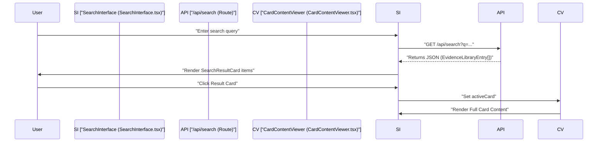
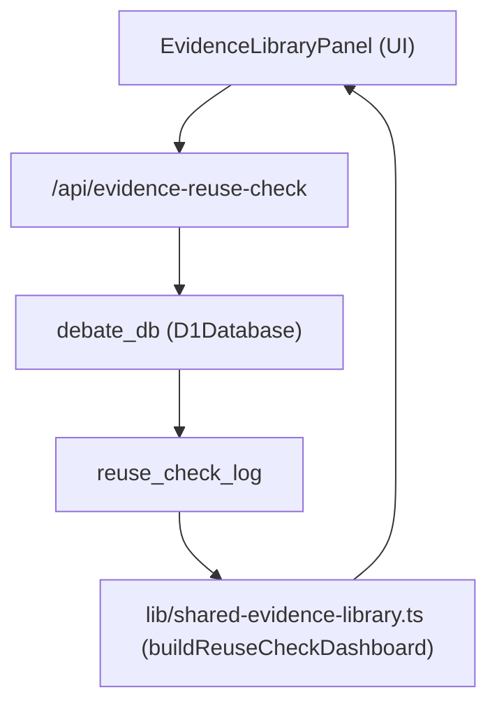
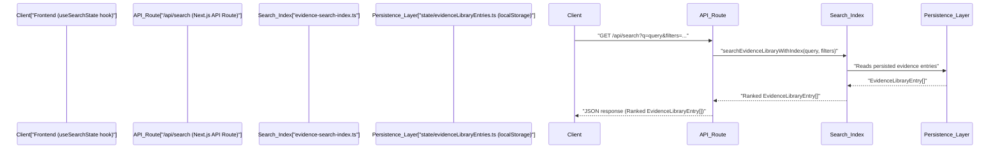

# Card Search Interface
Relevant source files
- [apps/debate-ai.com/app/api/admin/topic-starters/route.ts](https://github.com/debate/debate-ai.com/blob/34937310/apps/debate-ai.com/app/api/admin/topic-starters/route.ts)
- [apps/debate-ai.com/components/admin/TopicStarterUpload.tsx](https://github.com/debate/debate-ai.com/blob/34937310/apps/debate-ai.com/components/admin/TopicStarterUpload.tsx)
- [apps/debate-ai.com/lib/admin/import-log.ts](https://github.com/debate/debate-ai.com/blob/34937310/apps/debate-ai.com/lib/admin/import-log.ts)
- [apps/debate-web-ext/README.md](https://github.com/debate/debate-ai.com/blob/34937310/apps/debate-web-ext/README.md?plain=1)
- [docs/features/evidence-library.md](https://github.com/debate/debate-ai.com/blob/34937310/docs/features/evidence-library.md?plain=1)
- [docs/features/on-page-card-reuse-search.md](https://github.com/debate/debate-ai.com/blob/34937310/docs/features/on-page-card-reuse-search.md?plain=1)
- [docs/features/topic-coverage-dashboard.md](https://github.com/debate/debate-ai.com/blob/34937310/docs/features/topic-coverage-dashboard.md?plain=1)
- [packages/debate-card-parser/src/parsers/docx-import.ts](https://github.com/debate/debate-ai.com/blob/34937310/packages/debate-card-parser/src/parsers/docx-import.ts)
- [packages/debate-card-parser/test/docx-import.test.ts](https://github.com/debate/debate-ai.com/blob/34937310/packages/debate-card-parser/test/docx-import.test.ts)
- [packages/debate-search-evidence/src/components/ResearchSearchSidebar.tsx](https://github.com/debate/debate-ai.com/blob/34937310/packages/debate-search-evidence/src/components/ResearchSearchSidebar.tsx)
- [packages/debate-search-evidence/src/components/SearchResultCard.tsx](https://github.com/debate/debate-ai.com/blob/34937310/packages/debate-search-evidence/src/components/SearchResultCard.tsx)
- [packages/debate-search-evidence/src/hooks/useSearchState.ts](https://github.com/debate/debate-ai.com/blob/34937310/packages/debate-search-evidence/src/hooks/useSearchState.ts)
- [packages/debate-search-evidence/src/lib/card-display.ts](https://github.com/debate/debate-ai.com/blob/34937310/packages/debate-search-evidence/src/lib/card-display.ts)
- [packages/debate-search-evidence/src/lib/result-navigation.ts](https://github.com/debate/debate-ai.com/blob/34937310/packages/debate-search-evidence/src/lib/result-navigation.ts)
- [packages/debate-search-evidence/src/lib/topic-coverage.ts](https://github.com/debate/debate-ai.com/blob/34937310/packages/debate-search-evidence/src/lib/topic-coverage.ts)
- [packages/debate-search-evidence/src/panels/ArgumentLibraryPanel.tsx](https://github.com/debate/debate-ai.com/blob/34937310/packages/debate-search-evidence/src/panels/ArgumentLibraryPanel.tsx)
- [packages/debate-search-evidence/src/panels/EvidenceLibraryPanel.tsx](https://github.com/debate/debate-ai.com/blob/34937310/packages/debate-search-evidence/src/panels/EvidenceLibraryPanel.tsx)
- [packages/debate-search-evidence/src/panels/TopicCoverageDashboardPanel.tsx](https://github.com/debate/debate-ai.com/blob/34937310/packages/debate-search-evidence/src/panels/TopicCoverageDashboardPanel.tsx)
- [packages/debate-search-evidence/src/state/topicCoverageSnapshots.ts](https://github.com/debate/debate-ai.com/blob/34937310/packages/debate-search-evidence/src/state/topicCoverageSnapshots.ts)
- [packages/debate-search-evidence/src/state/trackedArguments.ts](https://github.com/debate/debate-ai.com/blob/34937310/packages/debate-search-evidence/src/state/trackedArguments.ts)
- [packages/debate-search-evidence/test/live-update.test.ts](https://github.com/debate/debate-ai.com/blob/34937310/packages/debate-search-evidence/test/live-update.test.ts)
- [packages/debate-search-evidence/test/topic-coverage.test.ts](https://github.com/debate/debate-ai.com/blob/34937310/packages/debate-search-evidence/test/topic-coverage.test.ts)
- [packages/debate-search-evidence/test/topicCoverageSnapshots.test.ts](https://github.com/debate/debate-ai.com/blob/34937310/packages/debate-search-evidence/test/topicCoverageSnapshots.test.ts)
- [packages/debate-search-evidence/test/trackedArguments.test.ts](https://github.com/debate/debate-ai.com/blob/34937310/packages/debate-search-evidence/test/trackedArguments.test.ts)

The **Card Search Interface** is the primary entry point for the **CARDS** (Crowdsourced Annotated Research for Debating Solutions) module. It provides a high-performance, responsive UI for searching through debate evidence, analyzing card quality with AI, and managing different viewing modes for highlighted and underlined text. It also serves as the foundation for the community-driven research ecosystem, including peer review, automated scoring, and reuse checks.

## Component Architecture

The interface is built around the `SearchInterface` component, which orchestrates several sub-components and hooks to manage search state, UI layout, and AI interactions. The package `debate-card-search` serves as the primary container for these components [packages/debate-search-evidence/src/index.ts1-7](https://github.com/debate/debate-ai.com/blob/34937310/packages/debate-search-evidence/src/index.ts#L1-L7)

### Three-Panel Layout

On desktop, the interface utilizes a three-panel resizable layout:

1. **Search & Results (Left/Center):** Contains the search input and the list of search results using `SearchResultCard`[packages/debate-search-evidence/src/index.ts2](https://github.com/debate/debate-ai.com/blob/34937310/packages/debate-search-evidence/src/index.ts#L2-L2)
2. **Card Viewer (Center/Right):** Displays the full content of the selected card via `CardContentViewer` with specialized rendering for highlights and underlines [packages/debate-search-evidence/src/index.ts3](https://github.com/debate/debate-ai.com/blob/34937310/packages/debate-search-evidence/src/index.ts#L3-L3)
3. **AI Analysis Sidebar (Far Right):** Provides an AI-generated critique of the evidence via `AiAnalysisSidebar`[packages/debate-search-evidence/src/index.ts5](https://github.com/debate/debate-ai.com/blob/34937310/packages/debate-search-evidence/src/index.ts#L5-L5)

### State Management & Data Flow

State is managed via search hooks and stores that coordinate local client interactions with the server-side search and shared evidence routes.

**Search Execution and Rendering Flow**



Sources: [packages/debate-search-evidence/src/index.ts1-7](https://github.com/debate/debate-ai.com/blob/34937310/packages/debate-search-evidence/src/index.ts#L1-L7)[packages/debate-search-evidence/src/lib/shared-evidence-library.ts124-127](https://github.com/debate/debate-ai.com/blob/34937310/packages/debate-search-evidence/src/lib/shared-evidence-library.ts#L124-L127)

## Card View Modes & Verbatim Shortcuts

The interface supports distinct viewing modes to accommodate different debating styles. These modes are applied dynamically using utilities from the parsing and search layers.

| Mode | Description | Implementation Detail |
| --- | --- | --- |
| **Read** | Shows the full text of the card without any special emphasis. | Standard text rendering. |
| **Highlight** | Emphasizes portions the debater would read in a round. | Extracts marked or tagged text spans. |
| **Underline** | Shows full text but underlines specific warrants. | Renders underlined node ranges. |
| **Condense** | Hides all non-underlined text, joining runs with ellipses. | Uses verbatim condensation utilities. |

Sources: [packages/debate-search-evidence/src/lib/card-display.ts1-10](https://github.com/debate/debate-ai.com/blob/34937310/packages/debate-search-evidence/src/lib/card-display.ts#L1-L10)

## LLM Card Scoring & Assessment

The search interface integrates a scoring system to evaluate evidence quality across multiple dimensions, such as relevance, clarity, and usability, backed by automated heuristics and AI analysis prompts.

**Card Scoring and Reuse Architecture**



Sources: [docs/features/on-page-card-reuse-search.md43-77](https://github.com/debate/debate-ai.com/blob/34937310/docs/features/on-page-card-reuse-search.md?plain=1#L43-L77)[packages/debate-search-evidence/src/panels/EvidenceLibraryPanel.tsx1-114](https://github.com/debate/debate-ai.com/blob/34937310/packages/debate-search-evidence/src/panels/EvidenceLibraryPanel.tsx#L1-L114)

## Research Crowdsourcing & Quality Signals

The search interface supports a peer-reviewed research ecosystem. Cards and analytic blocks are indexed in the Shared Evidence Library, enabling debaters to search full-text entries (`text`), citations (`cite`), and tags with relevance ranking (`searchEvidenceLibrary`) [packages/debate-search-evidence/src/lib/shared-evidence-library.ts124-127](https://github.com/debate/debate-ai.com/blob/34937310/packages/debate-search-evidence/src/lib/shared-evidence-library.ts#L124-L127)

### Topic Coverage Dashboard

The `TopicCoverageDashboardPanel`[packages/debate-search-evidence/src/panels/TopicCoverageDashboardPanel.tsx81](https://github.com/debate/debate-ai.com/blob/34937310/packages/debate-search-evidence/src/panels/TopicCoverageDashboardPanel.tsx#L81-L81) provides a UI for tracking a topic's argument checklist and visualizing the coverage of arguments based on submitted cards. It classifies arguments as `missing`, `thin`, or `covered` using thresholds defined in `lib/topic-coverage.ts`[packages/debate-search-evidence/src/lib/topic-coverage.ts36-44](https://github.com/debate/debate-ai.com/blob/34937310/packages/debate-search-evidence/src/lib/topic-coverage.ts#L36-L44)

**Topic Coverage Data Flow**

```

```

The `TopicCoverageDashboardPanel`[packages/debate-search-evidence/src/panels/TopicCoverageDashboardPanel.tsx81](https://github.com/debate/debate-ai.com/blob/34937310/packages/debate-search-evidence/src/panels/TopicCoverageDashboardPanel.tsx#L81-L81) reads from `state/trackedArguments.ts` for the topic checklist, `state/evidenceLibraryEntries.ts` for submitted cards, and `state/contributions.ts` for contributions feed submissions. These are composed by `buildPersistedTopicCoverageReport`[packages/debate-search-evidence/src/state/trackedArguments.ts1](https://github.com/debate/debate-ai.com/blob/34937310/packages/debate-search-evidence/src/state/trackedArguments.ts#L1-L1) and `buildPersistedCrossTopicCoverageComparison`[packages/debate-search-evidence/src/state/trackedArguments.ts38-39](https://github.com/debate/debate-ai.com/blob/34937310/packages/debate-search-evidence/src/state/trackedArguments.ts#L38-L39) to generate the report. User actions like adding/removing arguments or recording snapshots update the respective `localStorage` stores [packages/debate-search-evidence/src/panels/TopicCoverageDashboardPanel.tsx142-167](https://github.com/debate/debate-ai.com/blob/34937310/packages/debate-search-evidence/src/panels/TopicCoverageDashboardPanel.tsx#L142-L167)

The panel also implements cross-tab live updates using the browser's `storage` event, refreshing its state when changes occur in other tabs [packages/debate-search-evidence/src/panels/TopicCoverageDashboardPanel.tsx118-126](https://github.com/debate/debate-ai.com/blob/34937310/packages/debate-search-evidence/src/panels/TopicCoverageDashboardPanel.tsx#L118-L126)[packages/debate-search-evidence/src/state/live-update.ts37-38](https://github.com/debate/debate-ai.com/blob/34937310/packages/debate-search-evidence/src/state/live-update.ts#L37-L38)

Sources: [docs/features/topic-coverage-dashboard.md1-123](https://github.com/debate/debate-ai.com/blob/34937310/docs/features/topic-coverage-dashboard.md?plain=1#L1-L123)[packages/debate-search-evidence/src/panels/TopicCoverageDashboardPanel.tsx1-409](https://github.com/debate/debate-ai.com/blob/34937310/packages/debate-search-evidence/src/panels/TopicCoverageDashboardPanel.tsx#L1-L409)[packages/debate-search-evidence/src/lib/topic-coverage.ts1-212](https://github.com/debate/debate-ai.com/blob/34937310/packages/debate-search-evidence/src/lib/topic-coverage.ts#L1-L212)[packages/debate-search-evidence/test/topic-coverage.test.ts1-163](https://github.com/debate/debate-ai.com/blob/34937310/packages/debate-search-evidence/test/topic-coverage.test.ts#L1-L163)

### Argument Library Browser

The `ArgumentLibraryPanel`[packages/debate-search-evidence/src/panels/ArgumentLibraryPanel.tsx79](https://github.com/debate/debate-ai.com/blob/34937310/packages/debate-search-evidence/src/panels/ArgumentLibraryPanel.tsx#L79-L79) provides a browsable interface for the Common Argument Library. It organizes persisted evidence entries and tagged Contributions Feed submissions into topic folders, case-area subgroups, and cross-cutting tag collections. This is achieved by `buildCombinedPersistedArgumentLibrary`[packages/debate-search-evidence/src/state/evidenceLibraryEntries.ts1](https://github.com/debate/debate-ai.com/blob/34937310/packages/debate-search-evidence/src/state/evidenceLibraryEntries.ts#L1-L1) which combines data from `state/evidenceLibraryEntries.ts` and `state/contributions.ts`.

The panel includes features for renaming and merging tags across both evidence entries and contributions [packages/debate-search-evidence/src/panels/ArgumentLibraryPanel.tsx110-134](https://github.com/debate/debate-ai.com/blob/34937310/packages/debate-search-evidence/src/panels/ArgumentLibraryPanel.tsx#L110-L134) and identifies possible duplicate tags that differ only by casing [packages/debate-search-evidence/src/lib/argument-library.ts1](https://github.com/debate/debate-ai.com/blob/34937310/packages/debate-search-evidence/src/lib/argument-library.ts#L1-L1) Users can also save custom tag-filter selections as "Saved collections" [packages/debate-search-evidence/src/hooks/useSavedArgumentCollections.ts1](https://github.com/debate/debate-ai.com/blob/34937310/packages/debate-search-evidence/src/hooks/useSavedArgumentCollections.ts#L1-L1) Similar to the Topic Coverage Dashboard, it supports cross-tab live updates via the `storage` event [packages/debate-search-evidence/src/panels/ArgumentLibraryPanel.tsx101-108](https://github.com/debate/debate-ai.com/blob/34937310/packages/debate-search-evidence/src/panels/ArgumentLibraryPanel.tsx#L101-L108)[packages/debate-search-evidence/src/state/live-update.ts21-22](https://github.com/debate/debate-ai.com/blob/34937310/packages/debate-search-evidence/src/state/live-update.ts#L21-L22)

Sources: [packages/debate-search-evidence/src/panels/ArgumentLibraryPanel.tsx1-488](https://github.com/debate/debate-ai.com/blob/34937310/packages/debate-search-evidence/src/panels/ArgumentLibraryPanel.tsx#L1-L488)

### On-Page Card Reuse Search

The "On-Page Card Reuse Search" feature helps contributors avoid duplicate research by checking if a page URL has already been cut into the Shared Evidence Library. This is implemented through:

- **Local Check:**`checkPersistedPageForExistingCards`[packages/debate-search-evidence/src/state/evidenceLibraryEntries.ts1](https://github.com/debate/debate-ai.com/blob/34937310/packages/debate-search-evidence/src/state/evidenceLibraryEntries.ts#L1-L1) checks against the current browser's `localStorage` repository.
- **Team-wide Check:**`GET /api/evidence-reuse-check?url=`[apps/debate-ai.com/app/api/evidence-reuse-check/route.ts107-109](https://github.com/debate/debate-ai.com/blob/34937310/apps/debate-ai.com/app/api/evidence-reuse-check/route.ts#L107-L109) queries a D1-backed server-side index (`evidence_reuse_index` table) to see if anyone on the team has cut a card from the URL. This API is consumed by `lib/evidence-reuse-check-client.ts`[packages/debate-search-evidence/src/lib/evidence-reuse-check-client.ts1](https://github.com/debate/debate-ai.com/blob/34937310/packages/debate-search-evidence/src/lib/evidence-reuse-check-client.ts#L1-L1) and the `apps/debate-web-ext` browser extension [apps/debate-web-ext/README.md8-13](https://github.com/debate/debate-ai.com/blob/34937310/apps/debate-web-ext/README.md?plain=1#L8-L13)

The `EvidenceLibraryPanel`[packages/debate-search-evidence/src/panels/EvidenceLibraryPanel.tsx26-35](https://github.com/debate/debate-ai.com/blob/34937310/packages/debate-search-evidence/src/panels/EvidenceLibraryPanel.tsx#L26-L35) on `/cards/library` provides a "Check this page" box for manual URL input and displays a "Recent checks" history [packages/debate-search-evidence/src/panels/EvidenceLibraryPanel.tsx90-97](https://github.com/debate/debate-ai.com/blob/34937310/packages/debate-search-evidence/src/panels/EvidenceLibraryPanel.tsx#L90-L97) A "Team reuse dashboard" section [packages/debate-search-evidence/src/panels/EvidenceLibraryPanel.tsx99-110](https://github.com/debate/debate-ai.com/blob/34937310/packages/debate-search-evidence/src/panels/EvidenceLibraryPanel.tsx#L99-L110) aggregates data from the `reuse_check_log` D1 table, showing frequently flagged pages across the team.

**Browser Extension Integration**
The `apps/debate-web-ext`[apps/debate-web-ext/README.md1-146](https://github.com/debate/debate-ai.com/blob/34937310/apps/debate-web-ext/README.md?plain=1#L1-L146) is a Manifest V3 browser extension that includes the on-page card reuse check. It calls the same `GET /api/evidence-reuse-check` route against the active tab's URL. The extension's options page allows configuring the API base URL and a skip-check whitelist for domains [apps/debate-web-ext/README.md83-105](https://github.com/debate/debate-ai.com/blob/34937310/apps/debate-web-ext/README.md?plain=1#L83-L105)

**Retention Policy**
The `reuse_check_log` has a retention policy, with old entries purged automatically by a scheduled worker or manually via an admin endpoint [docs/features/on-page-card-reuse-search.md108-122](https://github.com/debate/debate-ai.com/blob/34937310/docs/features/on-page-card-reuse-search.md?plain=1#L108-L122)

Sources: [docs/features/on-page-card-reuse-search.md1-134](https://github.com/debate/debate-ai.com/blob/34937310/docs/features/on-page-card-reuse-search.md?plain=1#L1-L134)[packages/debate-search-evidence/src/panels/EvidenceLibraryPanel.tsx1-111](https://github.com/debate/debate-ai.com/blob/34937310/packages/debate-search-evidence/src/panels/EvidenceLibraryPanel.tsx#L1-L111)[apps/debate-web-ext/README.md1-146](https://github.com/debate/debate-ai.com/blob/34937310/apps/debate-web-ext/README.md?plain=1#L1-L146)

## `/api/search` Route

The `/api/search` route is the backend endpoint responsible for handling card search queries. It receives search parameters (e.g., query string, filters) and returns a list of `EvidenceLibraryEntry` objects. This route leverages the underlying search index and persistence layer to efficiently retrieve and rank relevant evidence.

**Search Request and Response Flow**



The `useSearchState` hook [packages/debate-search-evidence/src/hooks/useSearchState.ts1](https://github.com/debate/debate-ai.com/blob/34937310/packages/debate-search-evidence/src/hooks/useSearchState.ts#L1-L1) on the frontend initiates requests to `/api/search`. The API route then calls `searchEvidenceLibraryWithIndex`[packages/debate-search-evidence/src/lib/shared-evidence-library.ts124-127](https://github.com/debate/debate-ai.com/blob/34937310/packages/debate-search-evidence/src/lib/shared-evidence-library.ts#L124-L127) which interacts with the `state/evidenceLibraryEntries.ts`[packages/debate-search-evidence/src/state/evidenceLibraryEntries.ts1](https://github.com/debate/debate-ai.com/blob/34937310/packages/debate-search-evidence/src/state/evidenceLibraryEntries.ts#L1-L1) to retrieve and filter evidence.

Sources: [packages/debate-search-evidence/src/lib/shared-evidence-library.ts124-127](https://github.com/debate/debate-ai.com/blob/34937310/packages/debate-search-evidence/src/lib/shared-evidence-library.ts#L124-L127)[packages/debate-search-evidence/src/hooks/useSearchState.ts1](https://github.com/debate/debate-ai.com/blob/34937310/packages/debate-search-evidence/src/hooks/useSearchState.ts#L1-L1)