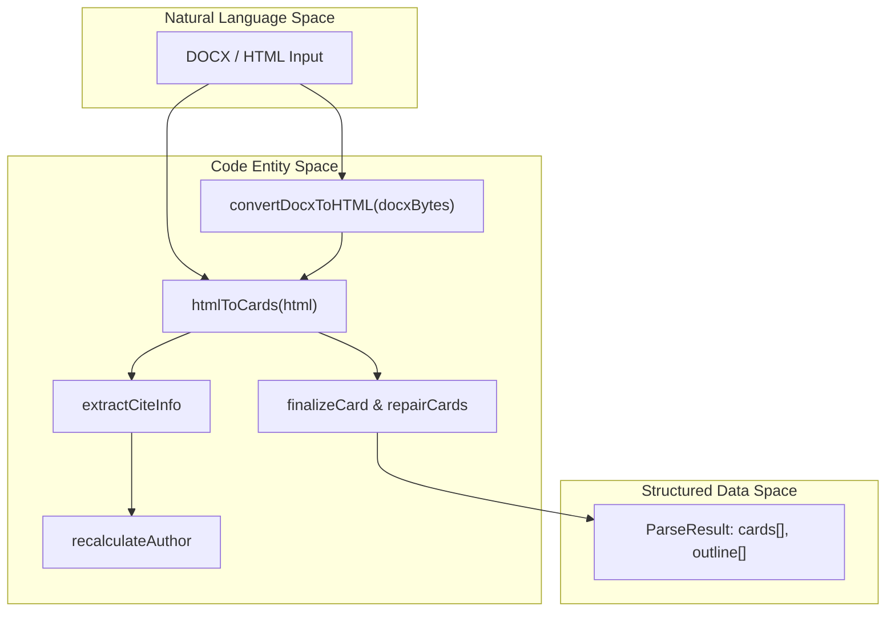
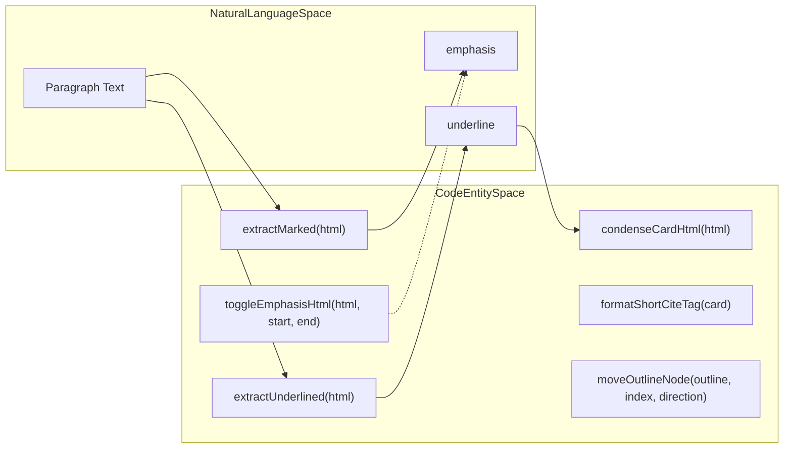
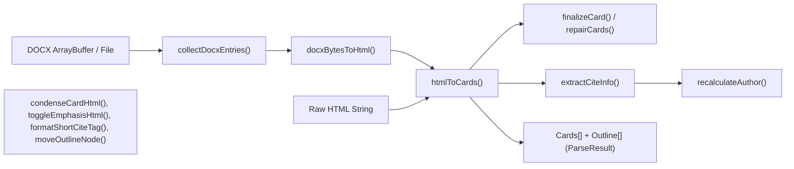

# debate-card-parser Package
Relevant source files
- [apps/debate-ai.com/app/api/admin/topic-starters/route.ts](https://github.com/debate/debate-ai.com/blob/34937310/apps/debate-ai.com/app/api/admin/topic-starters/route.ts)
- [apps/debate-ai.com/components/admin/TopicStarterUpload.tsx](https://github.com/debate/debate-ai.com/blob/34937310/apps/debate-ai.com/components/admin/TopicStarterUpload.tsx)
- [apps/debate-ai.com/lib/admin/import-log.ts](https://github.com/debate/debate-ai.com/blob/34937310/apps/debate-ai.com/lib/admin/import-log.ts)
- [packages/debate-card-parser/src/index.ts](https://github.com/debate/debate-ai.com/blob/34937310/packages/debate-card-parser/src/index.ts)
- [packages/debate-card-parser/src/parsers/docx-import.ts](https://github.com/debate/debate-ai.com/blob/34937310/packages/debate-card-parser/src/parsers/docx-import.ts)
- [packages/debate-card-parser/src/utils/verbatim-shortcuts.ts](https://github.com/debate/debate-ai.com/blob/34937310/packages/debate-card-parser/src/utils/verbatim-shortcuts.ts)
- [packages/debate-card-parser/test/docx-import.test.ts](https://github.com/debate/debate-ai.com/blob/34937310/packages/debate-card-parser/test/docx-import.test.ts)
- [packages/debate-card-parser/test/verbatim-shortcuts.test.ts](https://github.com/debate/debate-ai.com/blob/34937310/packages/debate-card-parser/test/verbatim-shortcuts.test.ts)
- [packages/debate-search-evidence/src/components/ResearchSearchSidebar.tsx](https://github.com/debate/debate-ai.com/blob/34937310/packages/debate-search-evidence/src/components/ResearchSearchSidebar.tsx)
- [packages/debate-search-evidence/src/components/SearchResultCard.tsx](https://github.com/debate/debate-ai.com/blob/34937310/packages/debate-search-evidence/src/components/SearchResultCard.tsx)
- [packages/debate-search-evidence/src/hooks/useSearchState.ts](https://github.com/debate/debate-ai.com/blob/34937310/packages/debate-search-evidence/src/hooks/useSearchState.ts)
- [packages/debate-search-evidence/src/lib/card-display.ts](https://github.com/debate/debate-ai.com/blob/34937310/packages/debate-search-evidence/src/lib/card-display.ts)
- [packages/debate-search-evidence/src/lib/result-navigation.ts](https://github.com/debate/debate-ai.com/blob/34937310/packages/debate-search-evidence/src/lib/result-navigation.ts)

The `debate-card-parser` package is a comprehensive toolkit designed to transform debate research documents (DOCX or HTML) into structured JSON objects known as "Cards." This package supports an ETL (Extract, Transform, Load) pipeline that parses DOCX and HTML inputs to produce a machine-readable representation of debate evidence. Key features include DOCX import handling, citation extraction, text marking processing, verbatim shortcut helpers, format profile definitions, and core Card and ParseResult types.

Sources: [packages/debate-card-parser/src/index.ts1-55](https://github.com/debate/debate-ai.com/blob/34937310/packages/debate-card-parser/src/index.ts#L1-L55)

---

## ETL Pipeline Overview

The main functionality of `debate-card-parser` is an ETL pipeline that ingests raw DOCX or HTML files and emits structurally rich Card objects suitable for indexing and AI processing.

### Pipeline Data Flow

The pipeline consists of these core steps:

1. **DOCX / HTML Input**
Incoming debate research is provided as either a DOCX binary buffer, or an HTML string extracted separately.
2. **DOCX → HTML Conversion**
For DOCX inputs, `convertDocxToHTML` converts the OOXML inside the DOCX ZIP archive into HTML that preserves styles important to debate evidence (headings, underlines, highlights). This step includes detecting and normalizing paragraph styles to meaningful HTML tags.
Functions: `docxBytesToHtml`, `documentXmlToHtml`, and `convertDocxToHTML` serve this role.
3. **HTML Parsing → Cards**
The standardized HTML is then streamed through `htmlToCards`, which identifies hierarchical structure (outline/headings), separates card metadata (tags, citations), and extracts body text. Citations are heuristically identified by bold formatting within paragraphs.
4. **Citation Extraction & Refinement**
Metadata associated with citations is analyzed by `extractCiteInfo` and post-processed by `recalculateAuthor` to correct author strings.
5. **Card Finalization**
Cards undergo additional processing by `finalizeCard` and `repairCards` to clean any inconsistencies or missing fields before being returned.
6. **Output**
The final output is a `ParseResult` containing an array of `Card` objects and the overall document outline.

### Diagram: ETL Pipeline from Document to Cards



Sources: [packages/debate-card-parser/src/index.ts2-14](https://github.com/debate/debate-ai.com/blob/34937310/packages/debate-card-parser/src/index.ts#L2-L14)[packages/debate-card-parser/src/parsers/docx-import.ts1-198](https://github.com/debate/debate-ai.com/blob/34937310/packages/debate-card-parser/src/parsers/docx-import.ts#L1-L198)

---

## Entry Points and Core Types

The module exports key functions and types accessible at the package root:

| Function / Type | Purpose |
| --- | --- |
| `docxToCards` | Complete pipeline to convert DOCX (binary or URL) → Cards |
| `htmlToCards` | Parses HTML string stream into Cards and Outline |
| `convertDocxToHTML` | Converts DOCX binary to HTML preserving highlighting and styles |
| Docx import utilities | `collectDocxEntries`, `docxBytesToHtml`, `assertReadableDocxBytes` etc. |
| Citation extraction | `extractCiteInfo`, `recalculateAuthor`, `cleanUrl` |
| Text marking extractors | `extractMarked`, `extractUnderlined` |
| Card finalization | `finalizeCard`, `repairCards` |
| Verbatim helpers | `condenseCardHtml`, `formatShortCiteTag`, `moveOutlineNode`, `toggleEmphasisHtml` |
| Format profiles | `FORMAT_PROFILES` — various preconfigured profiles for DOCX variant handling |
| Types | `Card`, `ParseResult`, `CitationInfo`, `FormatProfile`, `OutlineNode` |

Sources: [packages/debate-card-parser/src/index.ts1-55](https://github.com/debate/debate-ai.com/blob/34937310/packages/debate-card-parser/src/index.ts#L1-L55)

---

## DOCX Import and Parsing

DOCX import is a critical element of the package, dealing with raw `.docx` files or ZIP archives containing many DOCX files:

- The `DOCX_IMPORT_LIMITS` enforce strict ceilings on file size, number of files, and total upload size to avoid server overloads.
- `collectDocxEntries` unpacks DOCX files from a ZIP or raw binary, filtering out unwanted/unsupported files (macOS forks, legacy `.doc`, etc.).
- Files are normalized with `normalizeImportPath` to guard against directory traversal attacks.
- For each DOCX file, the core XML is converted to HTML with formatting preserved.
- Errors originating from corrupt or unsupported formats throw diagnostic `DocxImportError` exceptions with stable, machine-readable error codes.
- The HTML is finally passed to the `htmlToCards` parser.

### DOCX Import Flow Diagram

```

```

Sources: [packages/debate-card-parser/src/parsers/docx-import.ts19-198](https://github.com/debate/debate-ai.com/blob/34937310/packages/debate-card-parser/src/parsers/docx-import.ts#L19-L198)[apps/debate-ai.com/app/api/admin/topic-starters/route.ts1-197](https://github.com/debate/debate-ai.com/blob/34937310/apps/debate-ai.com/app/api/admin/topic-starters/route.ts#L1-L197)

---

## Citation Extraction and Author Parsing

Citation extraction is essential for organizing evidence metadata:

- The `extractCiteInfo` function parses author names, citation years, author types, and URLs from formatted text snippets within cards.
- `recalculateAuthor` corrects or reforms author fields to canonical forms.
- `cleanUrl` sanitizes URLs in citations.
- Citations are commonly indicated by bold text in DOCX and become embedded in the card JSON objects for later referencing.

---

## Text Marking Utilities and Verbatim Shortcuts

Debate evidence documents use formatting to mark which parts of a card are "read" aloud or emphasize key text:

- `extractMarked` pulls out `<mark>` tags content, and `extractUnderlined` extracts `<u>` underlined fragments.
- The `condenseCardHtml` function condenses card HTML down to just the underlined ("read") segments. It preserves nested `<mark>` emphasis and appropriately joins adjacent or disjoint underlines, inserting an ellipsis (`…`) when there is skipped text between runs.
- `toggleEmphasisHtml` supports toggling `<mark>` emphasis over visible text selections in an HTML string, handling merged or overlapping markers.
- `formatShortCiteTag` formats citation author+year tags like `"Smith 24"` or `"Smith ND"` for UI shortcuts.
- `moveOutlineNode` enables moving outline nodes (headings or cards) up/down in the outline order.

### Verbatim Helper Workflow Diagram



Sources: [packages/debate-card-parser/src/utils/verbatim-shortcuts.ts1-160](https://github.com/debate/debate-ai.com/blob/34937310/packages/debate-card-parser/src/utils/verbatim-shortcuts.ts#L1-L160)[packages/debate-card-parser/src/index.ts23-36](https://github.com/debate/debate-ai.com/blob/34937310/packages/debate-card-parser/src/index.ts#L23-L36)

---

## Document Outline and File Naming Heuristics

The parser constructs an outline of a document from the HTML headings (H1-H6):

- The function `parseFileNameParts` extracts meta-information such as category, topic, and organization from filenames using regex patterns.
- This metadata and the heading structure together build the final hierarchical outline exposed on the cards.

---

# Summary

The `debate-card-parser` package is the critical engine that parses raw debate research documents into structured, queryable evidence cards. It provides:

- Robust DOCX import with ZIP handling, error reporting, and normalization
- HTML to Card parsing tracking document structure and citations
- Citation extraction utilities for author and year meta
- Text marking extraction and manipulation consistent with debate annotation styles
- Outline node management and file name parsing for metadata

This package underpins the research ingestion and indexing capability of the Debate AI platform.

---

# Code Entity to System Overview Diagram



Sources: [packages/debate-card-parser/src/index.ts2-29](https://github.com/debate/debate-ai.com/blob/34937310/packages/debate-card-parser/src/index.ts#L2-L29)[packages/debate-card-parser/src/parsers/docx-import.ts19-198](https://github.com/debate/debate-ai.com/blob/34937310/packages/debate-card-parser/src/parsers/docx-import.ts#L19-L198)[packages/debate-card-parser/src/utils/verbatim-shortcuts.ts1-160](https://github.com/debate/debate-ai.com/blob/34937310/packages/debate-card-parser/src/utils/verbatim-shortcuts.ts#L1-L160)

# References

- `apps/debate-ai.com/app/api/admin/topic-starters/route.ts` shows server API usage of DOCX importing and card parsing integration.
- `packages/debate-card-parser/test/verbatim-shortcuts.test.ts` contains tests verifying verbatim shortcut helpers like `condenseCardHtml`.
- Core types (`Card`, `ParseResult`, `CitationInfo`, etc.) and utility functions are defined and re-exported in `src/index.ts`.

---

This completes the technical overview of the `debate-card-parser` package, its data flow, key components, and supporting utilities.